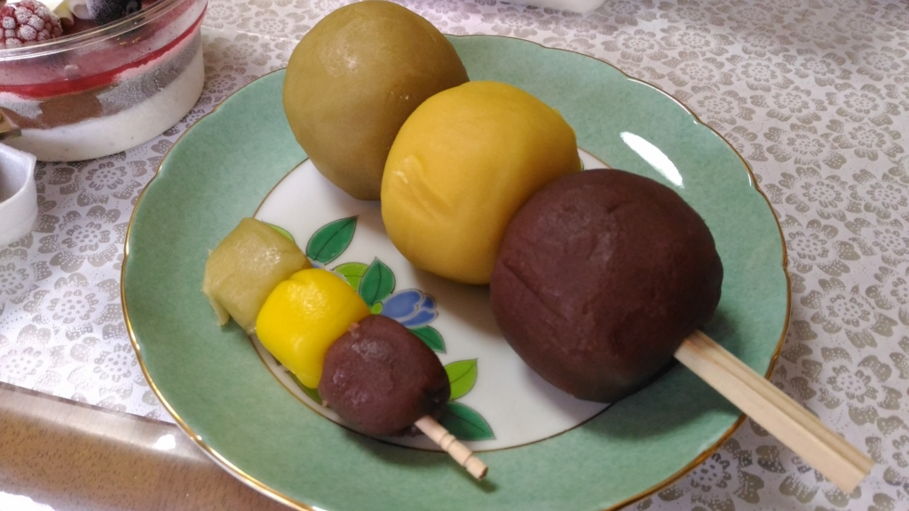
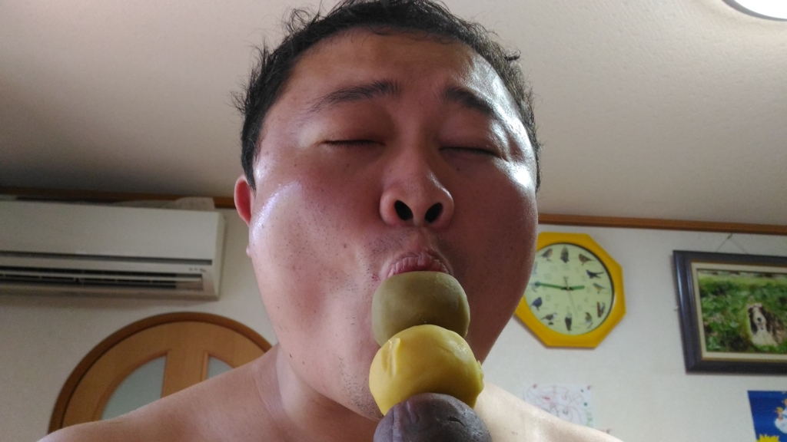

お盆に関西へ帰るとき、奈良の友人がやたらデカい「坊ちゃん団子」をほしがっていたので、道後温泉（電車で10分～15分ぐらい）に寄って買ってきた。

<iframe src="//hatenablog-parts.com/embed?url=http%3A%2F%2Fnttbj.itp.ne.jp%2F0899413452%2Findex.html" title="松山市 道後温泉 タルト坊ちゃん団子 醤油餅 和菓子店 巴堂本舗" class="embed-card embed-webcard" scrolling="no" frameborder="0" style="display: block; width: 100%; height: 155px; max-width: 500px; margin: 10px 0px;"></iframe>

道後温泉のお土産を売ってる商店街にある「巴堂本舗」というところで売ってる。デカデカとディスプレイされているので、ちょっと注意しながら歩いていたらすぐに見つかるはず。

この「ジャンボ坊ちゃん団子」は、普通の「坊ちゃん団子」の9つ分ある。「ジャンボ坊ちゃん団子」と「坊ちゃん団子」×8個のセットを買ったのだが、付属の「坊ちゃん団子」×8個よりも「ジャンボ坊ちゃん団子」一つの方がデカいわけだ。夏目漱石もびっくりだろうな。

これだけデカいと、さすがに食べてるうちに飽きてしまうのだけど、ネタとしては面白い。

――というわけで、友人に実際に食べてもらった。

美味しいと言ってたので、たぶんおいしいんだろうと思う。

ちなみに、「坊ちゃん団子」の色は 緑、黄、茶色 の三色だけど、原料は 抹茶、卵、小豆 なのかな（？）。チビたちにも小さい団子をあげたのだけど、気に入らない味があるのか一部残していた。僕みたいな味音痴には餡の味ぐらいしかわからないのだけど、色によって微妙な風味の違いがあるのかもね。

