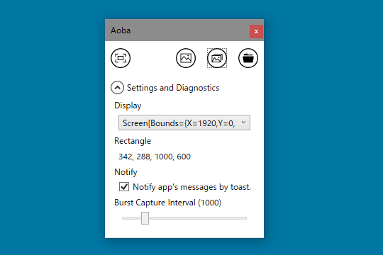
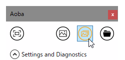
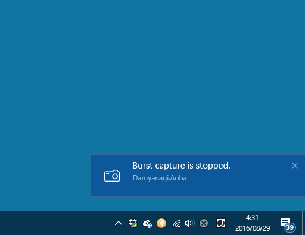
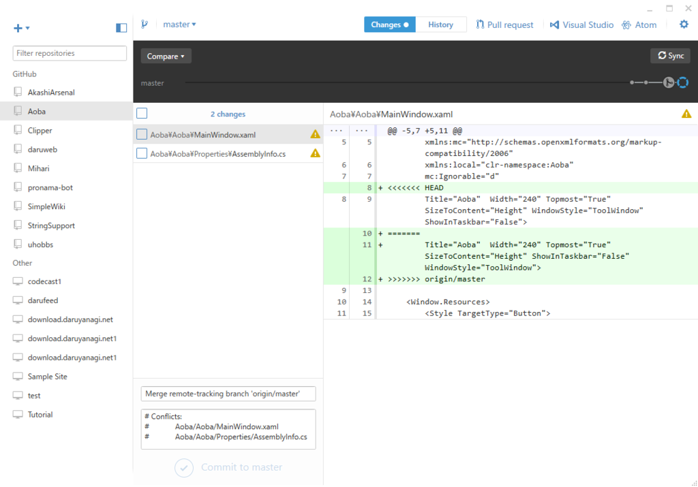

連射モードを追加。指定したインターバルでタイマーが動き、取得済みのゲームエリアをパシャパシャするヤツ。タイマーが動いていることを示すインジケーターがいいの思いつかなかったので、とりあえずアイコンをオレンジにしておいた。この辺りは永遠に適当。

ビューに Brush をバインドしたつもりが動かずに悩んだけど、System.Windows.Media ではなく System.Drawing になっていた orz

通知もいい感じにしておいた。通知は切ることもできるけど、ゲームエリアの取得に失敗したときだけはでるようにしている。

<iframe src="//hatenablog-parts.com/embed?url=https%3A%2F%2Fgithub.com%2Fdaruyanagi%2FAoba%2Freleases%2Ftag%2Fv1.2.0" title="daruyanagi/Aoba" class="embed-card embed-webcard" scrolling="no" frameborder="0" style="display: block; width: 100%; height: 155px; max-width: 500px; margin: 10px 0px;"></iframe> 

<h4>Git の使い方わからん</h4>

GitHub の Visual Studio 拡張機能を使っていたのだけど、操作をミスって Pull Request を Merge できなくなった。GitHub で「コマンドラインでコンフリクトをなんとかしろやボケ」と言われてしまう（スクショとり忘れた）。

とりあえず閉じておいた。ローカルの master とリモートの master に齟齬ができたみたいだなぁ。

直したいのだけど、やり方がさっぱりわからなかったのだが、「GitHub for Windows」を起動してごちゃごちゃしていると……

なんかコンフリクトのあるファイルが表示されたので、当該部分を消してコミットして Sync しておいた（Sync がなにやってんのかはイマイチよくわからんが）。なんかよくわからんけど助かった……。

Visual Studio 拡張機能にもいいところがあるんだろうけど、<i>ブランチ切って<a href="#f-c3e131e4" name="fn-c3e131e4" title="今回はここで間違ったみたい。remote と local が同期されていないのに remote からブランチをきって local にコミットしたのか？">*1</a>、コードをしこしこ書いて、終わったらプルリクエスト作って、GitHub で Merge して、Release を作成する（、ブランチを削除する）</i>っていうのがシームレスにできる「GitHub for Windows」の方が自分はいいかも。手を動かしてるうちに、いろいろ分かってくるかもだし（ただし、Sync はイマイチよくわからん）。

<a href="#fn-c3e131e4" name="f-c3e131e4" class="footnote-number">*1</a>:今回はここで間違ったみたい。remote と local が同期されていないのに remote からブランチをきって local にコミットしたのか？

