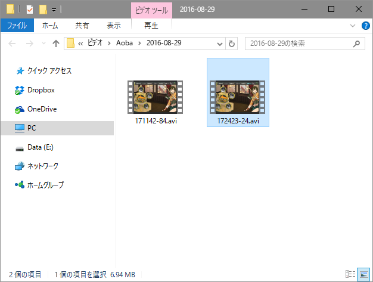

艦これの画面を音声付きで動画キャプチャーできるようにしたよ。それに伴い、UI をいろいろ変更。

動画は My Video\Aoba に保存される。もちろん、ボタン一発で開けるようにしてある。フレームレートは弄れるけど、今のところフォーマットは AVI（MotionJPEG）で固定。 設定画面作るのめんどいからね、しょうがないね。

<iframe src="//hatenablog-parts.com/embed?url=https%3A%2F%2Fgithub.com%2Fdaruyanagi%2FAoba%2Freleases%2Ftag%2Fv1.3.0" title="daruyanagi/Aoba" class="embed-card embed-webcard" scrolling="no" frameborder="0" style="display: block; width: 100%; height: 155px; max-width: 500px; margin: 10px 0px;"></iframe> 

<h4>スクリーンキャプチャー用のライブラリ Screna</h4>

今回は Screna というライブラリのお世話になった。

<iframe src="//hatenablog-parts.com/embed?url=https%3A%2F%2Fgithub.com%2FMathewSachin%2FScrena" title="MathewSachin/Screna" class="embed-card embed-webcard" scrolling="no" frameborder="0" style="display: block; width: 100%; height: 155px; max-width: 500px; margin: 10px 0px;"></iframe>

NuGet で簡単にインストールできる点、動画キャプチャーをサポートしている点などがいい感じ。C# でキャプチャーする方法はいろいろ紹介されてるけど、現時点ではこれが割とモダンだと思った。FFmpeg で MP4 圧縮もできるみたいだけど、今回はそこまでは試していない。

基本的な使い方はこんな感じ（公式のサンプルそのまま）。

まず AVI サポートのために Screna.SharpAvi を NuGet でインストール。

<pre class="code" data-lang="" data-unlink>Install-Package Screna.SharpAvi</pre>
次にネームスペースを追加。

<pre class="code lang-cs" data-lang="cs" data-unlink>using Screna;
using Screna.Avi;
</pre>
あとはコードをゴリゴリ書いていくだけ。

<pre class="code lang-cs" data-lang="cs" data-unlink>
// どの画像をとってくるかを決める IImageProvider を初期化
var provider = new ScreenProvider(); // デスクトップ全体をキャプチャー

// 動画を書き込む AviWriter を初期化
var VideoWriter = new AviWriter(&quot;output.avi&quot;, AviCodec.MotionJpeg);

// レコーダーを作って録画開始
var Recorder = new Recorder(VideoWriter, provider, 10);

Recorder.Start();

// なにかの処理

Recorder.Stop();
</pre>
これだと音声は録音できないけど、こうすればループバックも記録できる。Screna.NAudio だか何だかのパッケージを追加する必要があると思う。 

<pre class="code lang-cs" data-lang="cs" data-unlink>
// IImageProvider を初期化
// 今回は矩形をキャプチャーするやで
// ほかにも Active Window のプロバイダーがあるんかな？
// Overlay も付けられる。透かしみたいなもんやろか。試してない
var imageProvider = new RegeionProvider(rect);

// AudioProvider を用意（デスクトップで再生されてる音）
var audioProvider = new LoopbackProvider();

var videoWriter = new AviWriter(
&quot;output.avi&quot;, AviCodec.MotionJpeg, audioProvider );

var Recorder = new Recorder(videoWriter, imageProvider , 10);

Recorder.Start();

// なにかの処理

Recorder.Stop();
</pre>
ほかにも Gif キャプチャーなんかもできるみたいなので、取り込んでいこうと思う。

