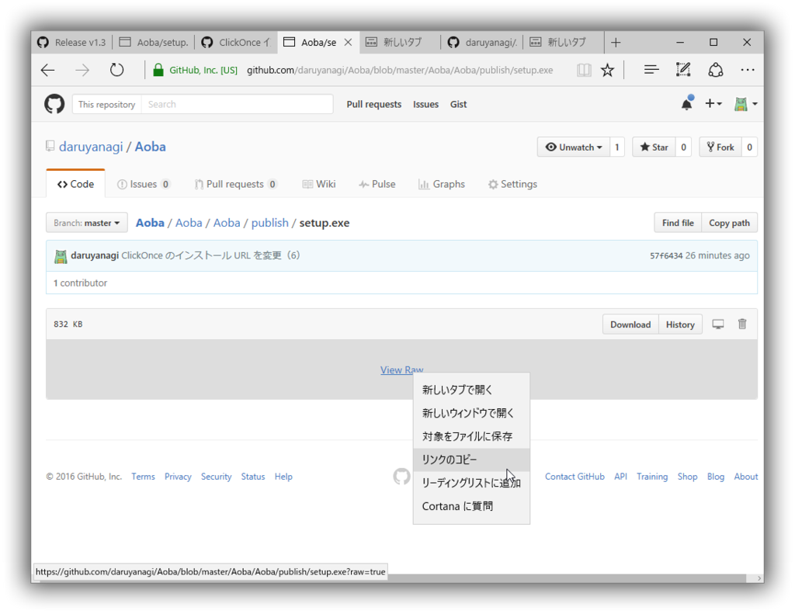
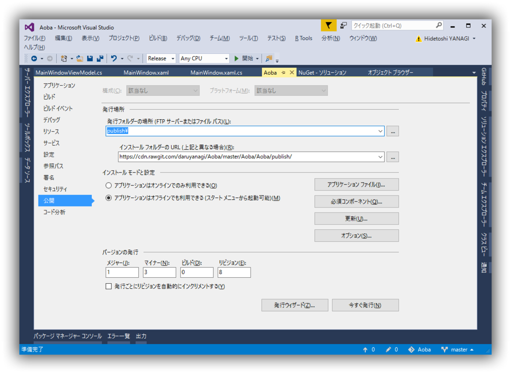
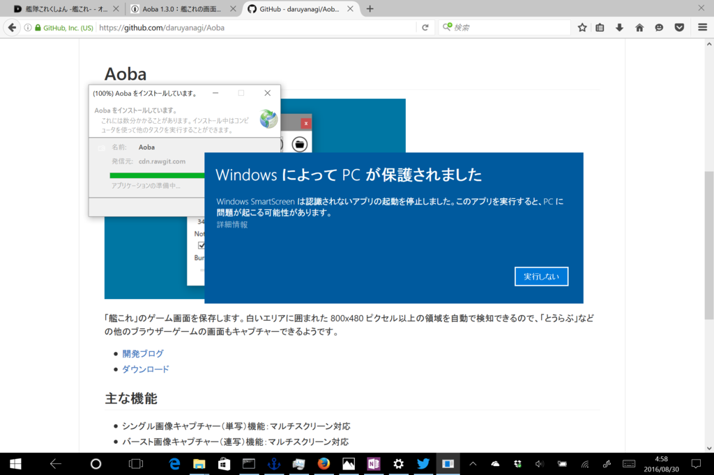

せっかく作ったツールだけど、アップデートのたびに毎回 ZIP ファイルをダウンロードして展開してユーティリティフォルダーにコピーして……という作業が面倒だったので、ClickOnce で配布することにした。

<iframe src="https://hatenablog-parts.com/embed?url=https%3A%2F%2Fblog.daruyanagi.jp%2Fentry%2F2016%2F08%2F29%2F175526" title="Aoba 1.3.0：艦これの画面をビデオキャプチャーできるようにした / Screna っていうライブラリが超便利 - だるろぐ" class="embed-card embed-blogcard" scrolling="no" frameborder="0" style="display: block; width: 100%; height: 190px; max-width: 500px; margin: 10px 0px;"></iframe>

自分で ClickOnce の公開用サーバーを用意するのは面倒なので、できれば ClickOnce のセットアップファイルも GitHub に置きたい。やり方がわかんないので StackOverFlow さまにお伺いを立ててみた。

<iframe src="https://hatenablog-parts.com/embed?url=http%3A%2F%2Fstackoverflow.com%2Fquestions%2F13512029%2Fis-it-possible-to-offer-a-clickonce-installer-on-github" title="Is it possible to offer a ClickOnce installer on Github?" class="embed-card embed-webcard" scrolling="no" frameborder="0" style="display: block; width: 100%; height: 155px; max-width: 500px; margin: 10px 0px;"></iframe>

さすがやでぇ。以下はそれを試してみたよっていう話。

<h4>1. とりあえずローカルに発行してコミットする</h4>

まず、プロジェクトプロパティの［公開］タブで、ClickOnce の発行を行う。発行先は初期設定の publish\ でいいかと。

Visual Studio 向けの .gitignore を利用している場合は、あらかじめ Click-Once 関連の設定をコメントアウトしておくとよい。

<pre class="code" data-lang="" data-unlink># Click-Once directory
# publish/</pre>
ついでに .gitattributes も編集しておく。

<pre class="code" data-lang="" data-unlink>*.manifest binary
*.application binary
*.deploy binary</pre>
これをコミットして GitHub にプッシュしておく。

<h4>2. ClickOnce のインストール フォルダーの URL を変更</h4>

GitHub に publish フォルダーがちゃんとアップロードされているのを確認。

ここからセットアップファイルの Raw URL を取得しておく。今回は

<ul>
<li><a href="https://github.com/daruyanagi/Aoba/blob/master/Aoba/Aoba/publish/setup.exe?raw=true">https://github.com/daruyanagi/Aoba/blob/master/Aoba/Aoba/publish/setup.exe?raw=true</a></li>
</ul>
だった。

次にプロジェクトのプロパティ画面の［公開］タブに戻り、ClickOnce のインストール フォルダーの URL を変更する。

先ほど取得した Raw URL を cdn.rawgit.com に書き換えたり、blob を消したりごにょごにょ。

<ul>
<li><a href="https://cdn.rawgit.com/daruyanagi/Aoba/master/Aoba/Aoba/publish/">https://cdn.rawgit.com/daruyanagi/Aoba/master/Aoba/Aoba/publish/</a></li>
</ul>
cdn.rawgit.com だと ClickOnce 関連のファイルの Content-Type が適切に設定されているみたいで、インストールがうまくいく。

これを保存、発行、コミット、プッシュして、GitHub からセットアップファイルをダウンロード・実行すると、ちゃんとインストール処理が始まるはず。

インストール フォルダーの URL を設定すれば、アップデートの自動チェックも利用できるようになる(/・ω・)/

<h4>追記（2016/08/31）</h4>

cdn.rawgit.com は一度キャッシュした URL を更新しないようなので、実際には branch や tag を使って新しい URL を生成し、それをインストール フォルダーの URL にする必要があるみたい。コツをつかんだら自動化したいな……。

<iframe src="https://hatenablog-parts.com/embed?url=https%3A%2F%2Fblog.daruyanagi.jp%2Fentry%2F2016%2F09%2F01%2F060000" title="GitHub にホストしている Windows デスクトップアプリを ClickOnce で配布する（2） - だるろぐ" class="embed-card embed-blogcard" scrolling="no" frameborder="0" style="display: block; width: 100%; height: 190px; max-width: 500px; margin: 10px 0px;"></iframe> 

<h4>追伸</h4>

Aoba の ClickOnce 発行でエラーが出るのでぐぐったら、昔の自分のブログを発見。

<iframe src="https://hatenablog-parts.com/embed?url=https%3A%2F%2Fblog.daruyanagi.jp%2Fentry%2F2014%2F10%2F12%2F135537" title="winmd を参照していると ClickOnce で配置できない - だるろぐ" class="embed-card embed-blogcard" scrolling="no" frameborder="0" style="display: block; width: 100%; height: 190px; max-width: 500px; margin: 10px 0px;"></iframe>

メモは大事。

