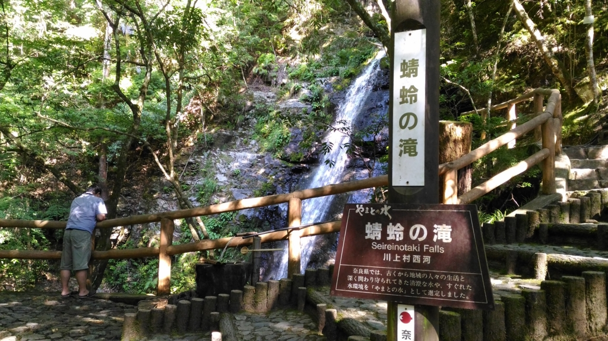
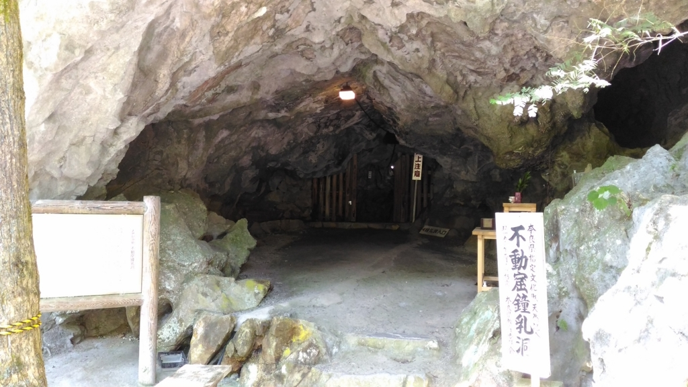
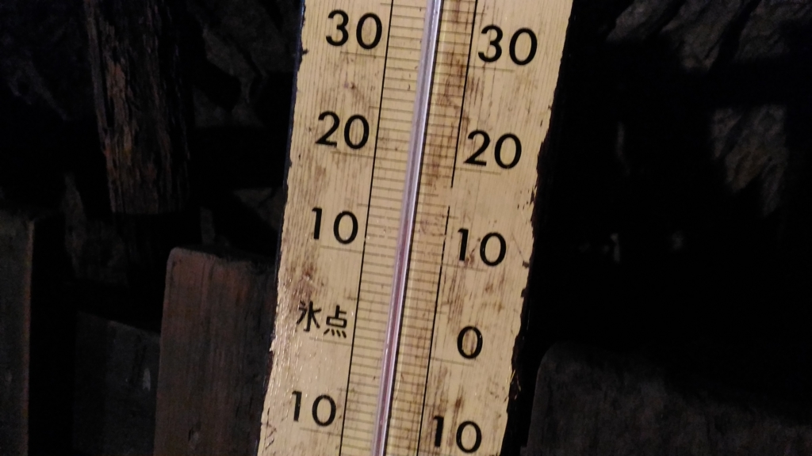
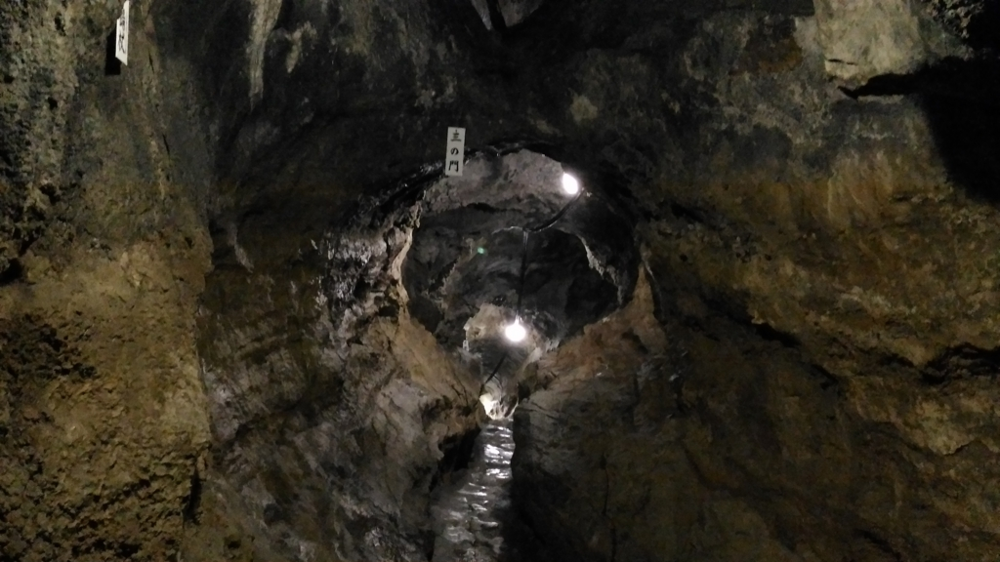
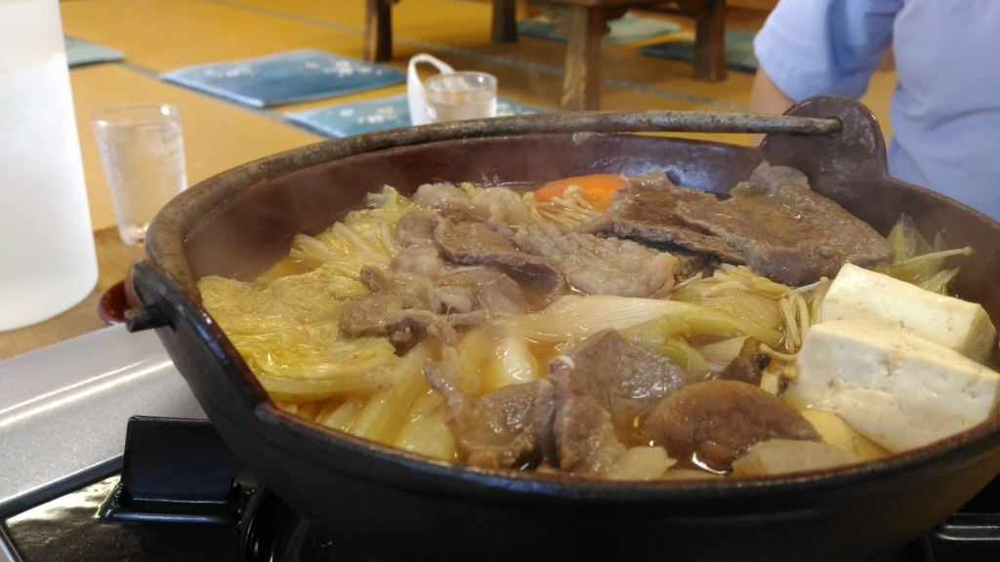
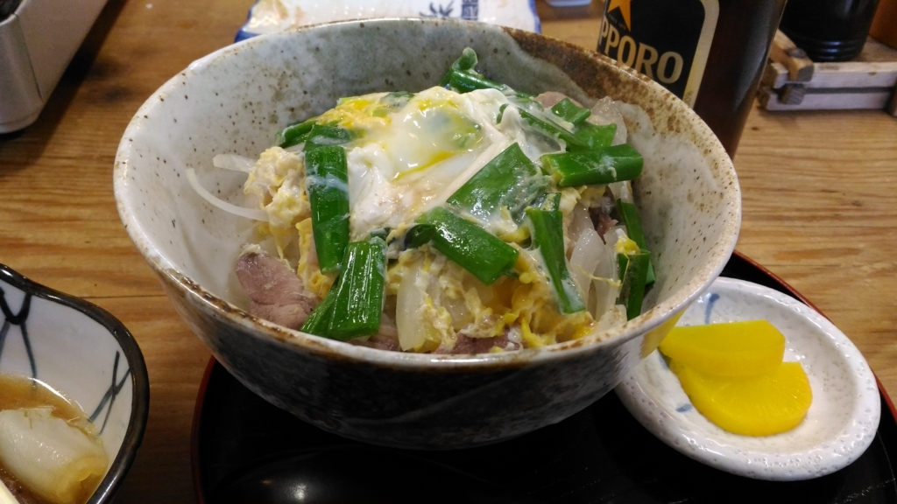
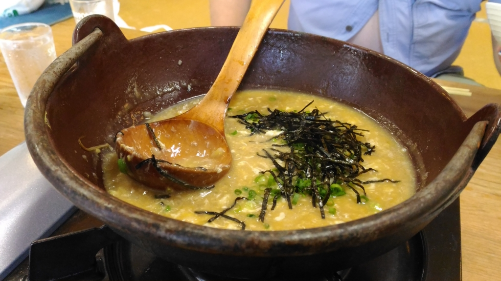

お盆は墓参りとばあちゃんの見舞いに行ってきた。奈良で泊めてくれた N 氏に感謝。おっちゃんとおばちゃんにもよくしていただいた。奈良のちょっと南の方にも連れてってもらったで<a href="#f-a3f4d1cf" name="fn-a3f4d1cf" title="南の方って言っても、半分よりだいぶ北だと思うけど。奈良って上の方のごく一部しか栄えてないんだよなぁ">*1</a>。

<h3>蜻蛉（せいれい）の滝</h3>

奈良県川上村（ぶっちゃけ、この辺りは吉野とかしか知らんわ……）にある滝。高さ約50メートル。

第21代雄略天皇がこの地へ狩りに訪れたとき、恐れ多くも天皇のヒジにアブが食いついた。それをたまたまみていた蜻蛉（とんぼ）さんが激怒し、スーパーサイヤ人化。強襲して、この不埒なアブを噛み殺したのだそうな。それを嘉して「蜻蛉の滝」と名づけられたのだそう。また、この地を“蜻蛉野（あきつの）”と呼ぶようになった。以来、歴史上の著名人が数多く訪れているという。わしもこれでその列の端くれに加わったというわけやな。

ちなみに、わいはここで蚊に噛まれた。略して、カニカマ。とんぼ氏は助けに来てくれなかった。

<h3>不動窟鍾乳洞</h3>

同じく川上村にある。

ここのいいところは、なんといってもバリ<b>涼しい</b>ことやな。わいが行ったときで10度ぐらい。今年のお盆はクソ暑かったけれど、ここは本当に天国。

なかはとても狭くて滑りやすく、ところどころ四つん這いにならないと通れない。ちょっとしたアドベンチャー気分が味わえる。子どもなんかは喜びそうだけど、十分気をつけなければならない。

奥には不動明王が鎮座していて、ご利益ありそう。とくにこれといった願望もなかったけれど、表のお堂でお賽銭を投げて、三跪九叩頭の礼（いや、実際には二拝二拍手一礼ぐらいだけど）。割と何でもかなえてくれるらしいよ。

<h3>入之波温泉（しおのはおんせん）</h3>

これも川上村。褐色のぬるい炭酸重曹銭で、割となんにでも効くとのこと。効用が書かれた看板によると、ヒステリーなんかにも効くらしい。マジかよ。ぬるいので冬はちょっと寒いかもしれない（大事なことなので2度言った）。

山鳩湯という宿でお湯をいただいたのだけど、今回の目的はそれよりもコレ。しし鍋さんですな。真昼間から温泉入ってビール飲んで、サイコー！<a href="#f-916ae3a1" name="fn-916ae3a1" title="運転はお酒が飲めない N 氏がしてくれる。サイコー！">*2</a>

ついでに鹿肉もお刺身でいただいた。奈良ならでは。奈良ならでは。

調子に乗って鴨肉の丼に……

先ほどのしし鍋の雑炊まで食べた。さすがに食いすぎて眠くなったので、お昼過ぎにさっさと N 氏宅へ帰り、涼しい部屋でアニメ見ながらゴロゴロと過ごした。サイコー！

<a href="#fn-a3f4d1cf" name="f-a3f4d1cf" class="footnote-number">*1</a>:南の方って言っても、半分よりだいぶ北だと思うけど。奈良って上の方のごく一部しか栄えてないんだよなぁ

<a href="#fn-916ae3a1" name="f-916ae3a1" class="footnote-number">*2</a>:運転はお酒が飲めない N 氏がしてくれる。サイコー！

