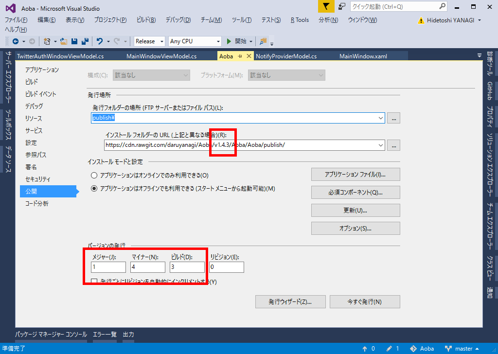
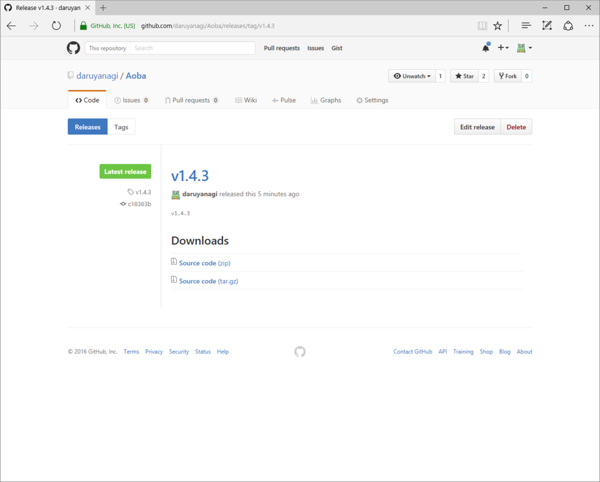
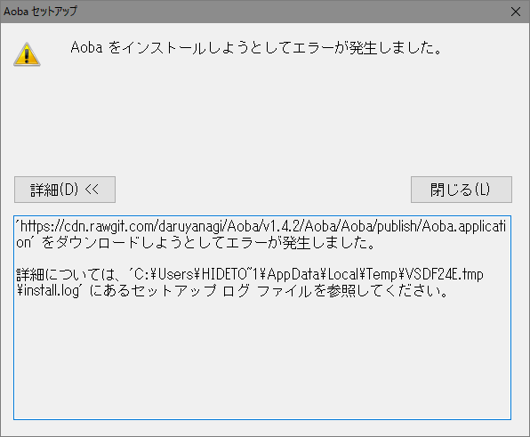
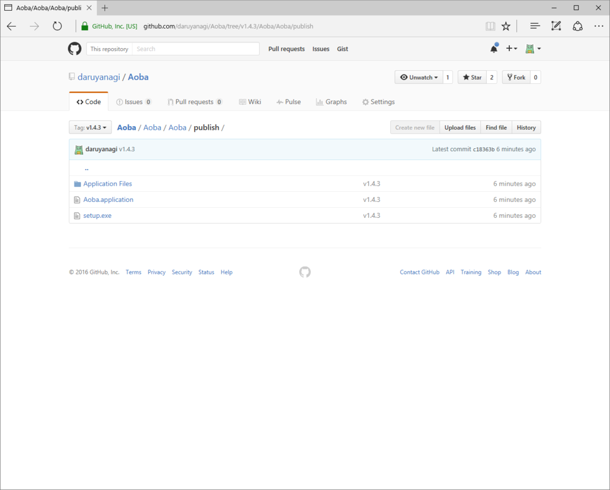

<iframe src="https://hatenablog-parts.com/embed?url=https%3A%2F%2Fblog.daruyanagi.jp%2Fentry%2F2016%2F08%2F30%2F051929" title="GitHub にホストしている Windows デスクトップアプリを ClickOnce で配布する - だるろぐ" class="embed-card embed-blogcard" scrolling="no" frameborder="0" style="display: block; width: 100%; height: 190px; max-width: 500px; margin: 10px 0px;"></iframe>

この前、GitHub にホストしている Windows デスクトップアプリを ClickOnce で配布してみたが、実は不完全だった。

<blockquote cite="https://github.com/rgrove/rawgit/wiki/Frequently-Asked-Questions">

<h3>How long does the CDN cache files? How can I make it refresh my file?</h3>

The CDN caches files permanently based on their path. It ignores query strings. This is done to improve performance and to make it possible for the CDN to handle massive amounts of traffic without causing excessive load on RawGit or GitHub's servers.

To ensure that the CDN always serves the version of the file you want, use a git tag or commit hash in the file's path instead of a branch name, and update the URL if you push a new version of the file.

So, instead of a URL like <a href="https://cdn.rawgit.com/user/repo/branch/file,">https://cdn.rawgit.com/user/repo/branch/file,</a> use a URL like <a href="https://cdn.rawgit.com/user/repo/tag/file">https://cdn.rawgit.com/user/repo/tag/file</a> or <a href="https://cdn.rawgit.com/user/repo/commit/file.">https://cdn.rawgit.com/user/repo/commit/file.</a>

<cite><a href="https://github.com/rgrove/rawgit/wiki/Frequently-Asked-Questions">Frequently Asked Questions &middot; rgrove/rawgit Wiki &middot; GitHub</a></cite>
</blockquote>

つまり、一度 cdn.rawgit.com にキャッシュされてしまうと、その URL の内容は書き換えることができなくなる。

うちの場合、v1.3.0.7 を github の master にマージした時点でその内容が cdn.rawgit.com にキャッシュされたので、そのあといくら github の master のバージョンをあげても、cdn.rawgit.com からダウンロードできるのは v1.3.0.7 のままだ。これではアップデートを配布することができない。しまったしまった、島倉千代子。

というわけで、一工夫必要。今回は tag を使って新しい URL を作成し、それを ClickOnce のインストール フォルダーの URL に割り当ててみた。

まず、公開予定のバージョンを決める。そして、ClickOnce のインストール フォルダーの URL を master ではなくそのバージョン名にする。

旧：

<ul>
<li><a href="https://cdn.rawgit.com/daruyanagi/Aoba/master/Aoba/Aoba/publish/">https://cdn.rawgit.com/daruyanagi/Aoba/master/Aoba/Aoba/publish/</a></li>
</ul>
新：

<ul>
<li><a href="https://cdn.rawgit.com/daruyanagi/Aoba/v1.4.3/Aoba/Aoba/publish/">https://cdn.rawgit.com/daruyanagi/Aoba/v1.4.3/Aoba/Aoba/publish/</a></li>
</ul>
この状態で ClickOnce を発行し、git にコミットして、GitHub と同期する。

次に、GitHub でリリースを作成する。このとき、タグはさっき決めた公開バージョン（v1.4.3）にしておく。

これで完成(/・ω・)/

すると、ClickOnce の setup.exe が新しく CDN にキャッシュされた .Application を読みに行くため、最新版がダウンロードされる。

誰かが .Application を読む前に tag を作っておかないと、404 Not found でキャッシュされてしまう（？）ので最初からやり直しになるorz

ちなみに、外部に公開するダウンロード URL は GitHub の raw ファイルにしておけば、毎回変更する必要がなくていい。インストール フォルダーの URL を書き換えるたびに setup.exe も新しくなるので。

<ul>
<li><a href="https://github.com/daruyanagi/Aoba/blob/master/Aoba/Aoba/publish/setup.exe?raw=true">https://github.com/daruyanagi/Aoba/blob/master/Aoba/Aoba/publish/setup.exe?raw=true</a></li>
</ul>
アップデートはうまくいかないかもだけど、ダウンロード・インストールによる手動更新は一応うまくいった感じなので、この状態で運用してみることにする。

