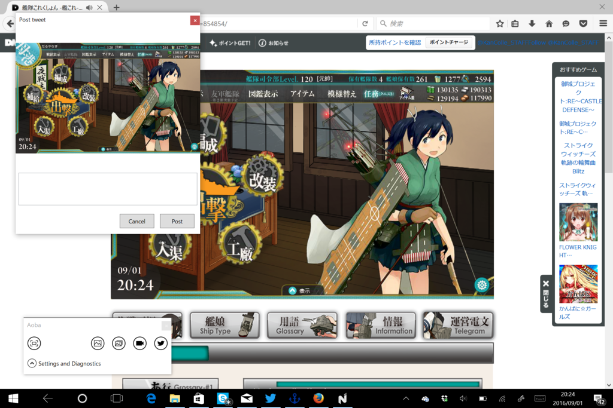

おじさんでも簡単に Twitter を組み込めると人気の CoreTweet で投稿機能を組み込んだよ。メッセージの文字数制限チェックが甘いとか、細部でダメなところも多いけど、気を付けていれば問題ない（ぁ

CoreTweet については酢酸先生のまとめを参考にするとよいかも。

<iframe src="https://hatenablog-parts.com/embed?url=https%3A%2F%2Fblog.ch3cooh.jp%2Fentry%2Fcoretweet" title=".NET向けのTwitterライブラリ「CoreTweet」の使い方まとめ - 酢ろぐ！" class="embed-card embed-blogcard" scrolling="no" frameborder="0" style="display: block; width: 100%; height: 190px; max-width: 500px; margin: 10px 0px;"></iframe>

必要なことはすべて酢酸先生（たち）が教えてくれた。あと、Tokens.Create() で作成したトークンがログイン可能なのかを調べる手段がわからなかったのだけど、以下のサイトが参考になった。

<iframe src="https://hatenablog-parts.com/embed?url=http%3A%2F%2F01647.hateblo.jp%2Fentry%2F2014%2F10%2F12%2F132505" title="CoreTweet.Tokens.Account.VerifyCredentials()とTwitter OAuth2それぞれの調査記録 - 01647" class="embed-card embed-blogcard" scrolling="no" frameborder="0" style="display: block; width: 100%; height: 190px; max-width: 500px; margin: 10px 0px;"></iframe>

Tokens.Create() はいろいろ組み立てるだけ。検証は Account.VerifyCredentials() を使う、と（頭にメモメモ

ほかには

<ul>
<li>Properties.Default.Settings を書き込んだら Save() しなきゃ保存されない。すっかり忘れてて悩んだ</li>
<li>Twitter から取得したトークンを Properties.Default.Settings に書き込んだら設定ファイルを .gitignore しとかないと GitHub で全裸公開しちゃうことになる（キーをリセットしたよ</li>
<li>ViewModel からウィンドウを閉じる方法はいろいろあるが、ボタンに CommandParameter={Binding Window1} して Command 側で (Window1 as Window).Close() するのが一番簡単っぽい</li>
</ul>
というあたりが今回の気付き。

マイナーバージョンがインクリメントされているのは、GitHub に置いたファイルを ClickOnce で配布できないかを試したから。

<iframe src="https://hatenablog-parts.com/embed?url=https%3A%2F%2Fblog.daruyanagi.jp%2Fentry%2F2016%2F08%2F30%2F051929" title="GitHub にホストしている Windows デスクトップアプリを ClickOnce で配布する - だるろぐ" class="embed-card embed-blogcard" scrolling="no" frameborder="0" style="display: block; width: 100%; height: 190px; max-width: 500px; margin: 10px 0px;"></iframe>

<iframe src="https://hatenablog-parts.com/embed?url=https%3A%2F%2Fblog.daruyanagi.jp%2Fentry%2F2016%2F09%2F01%2F060000" title="GitHub にホストしている Windows デスクトップアプリを ClickOnce で配布する（2） - だるろぐ" class="embed-card embed-blogcard" scrolling="no" frameborder="0" style="display: block; width: 100%; height: 190px; max-width: 500px; margin: 10px 0px;"></iframe>

結論的には、「自動更新機能は使えないかもだけど、インストーラーで配布することはできる。毎回 ZIP を作るのよりはマシだし、使う側も便利かな」って感じ。自動更新機能は次回からは削除する。

ちなみに、今回からは ZIP での配布はない。ほしいかな？　この前のプロ生＋わんくま大阪で PowerShell を少し学んだので、パッケージするスクリプトでも書いてみるか。

アプリのダウンロードは【<a href="https://github.com/daruyanagi/Aoba/blob/master/Aoba/Aoba/publish/setup.exe?raw=true">&#x3053;&#x3061;&#x3089;</a>】から。

<h3>主な変更点</h3>

<ul>
<li>Twitter投稿機能を付けた</li>
<li>ClickOnce での配布</li>
<li>ちょっとコードを整理した（今度真面目にやる）</li>
<li>タブレットモードで利用したときのちょっとした不具合を修正</li>
</ul>
GIF キャプチャー機能をつけたら、だいたいやりたいことは終わりだな。

