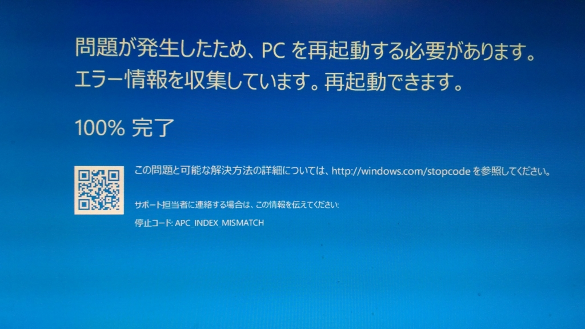
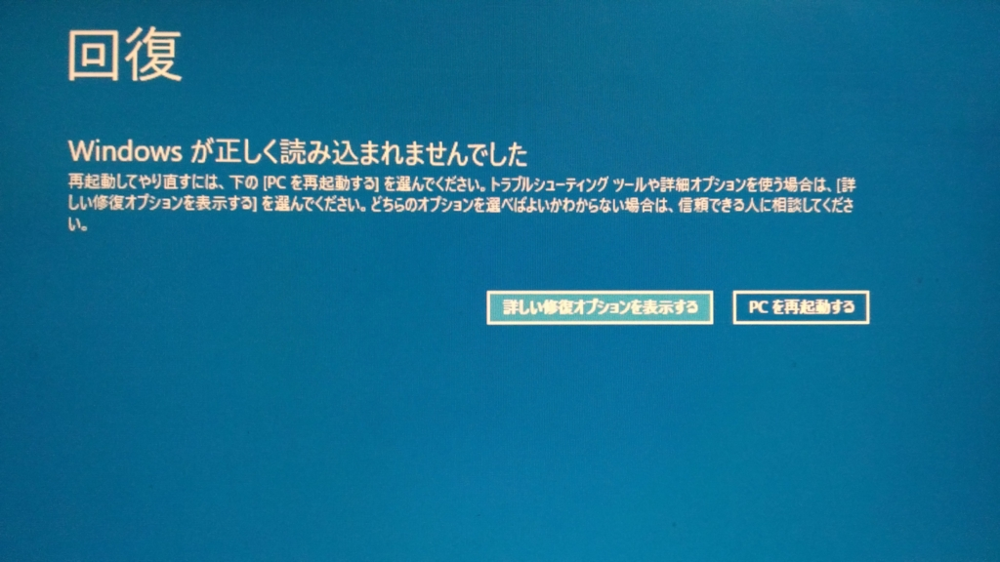
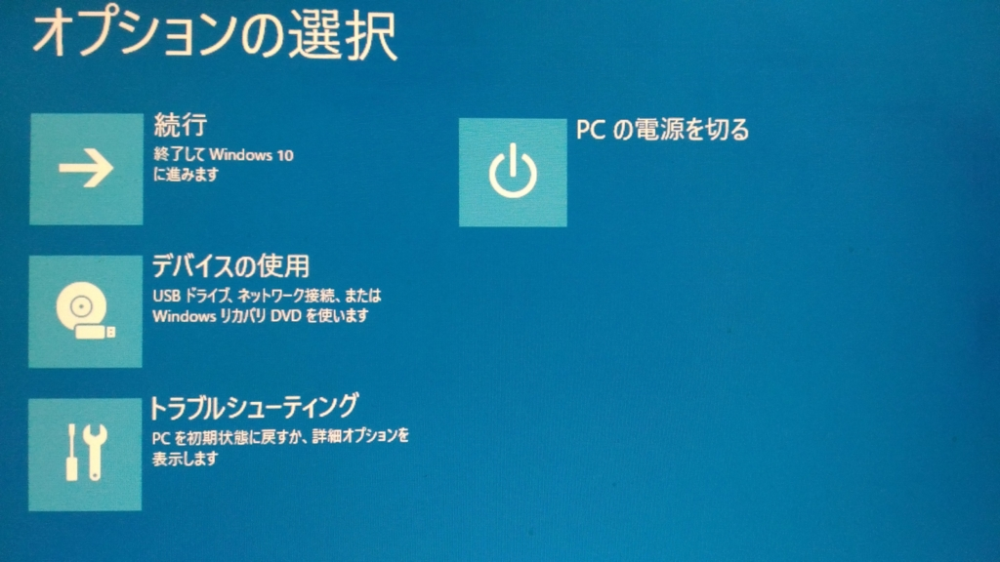
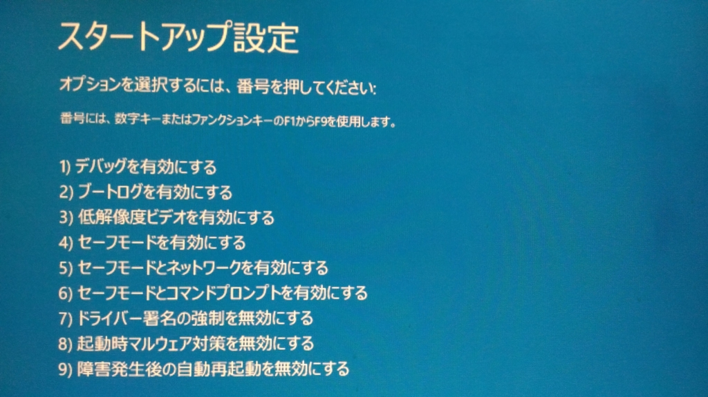
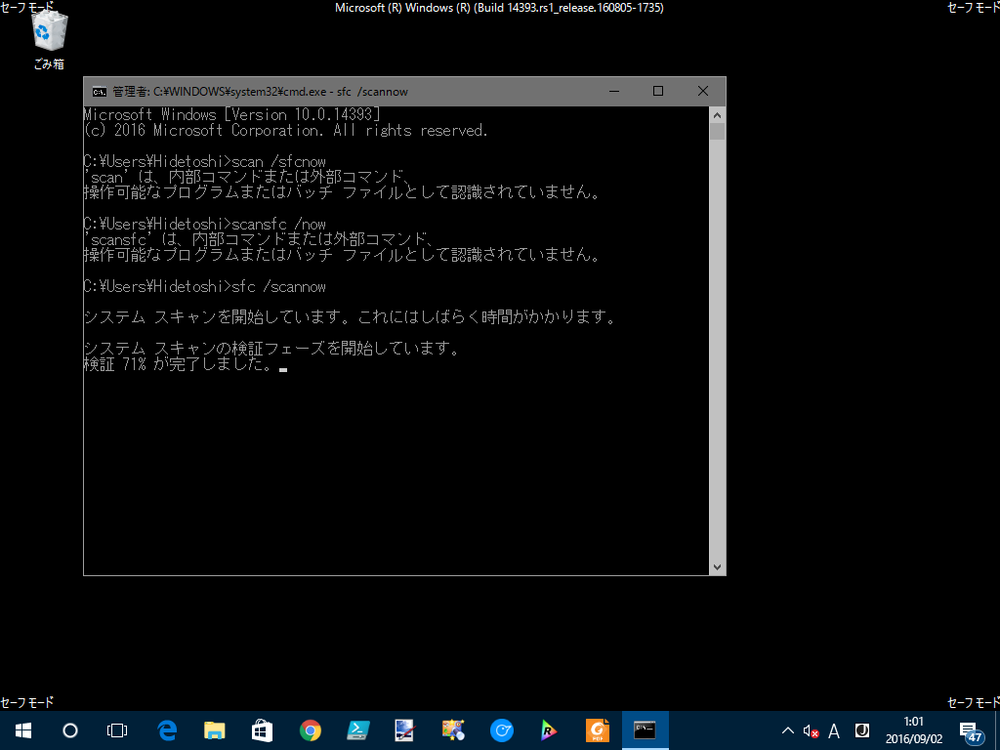
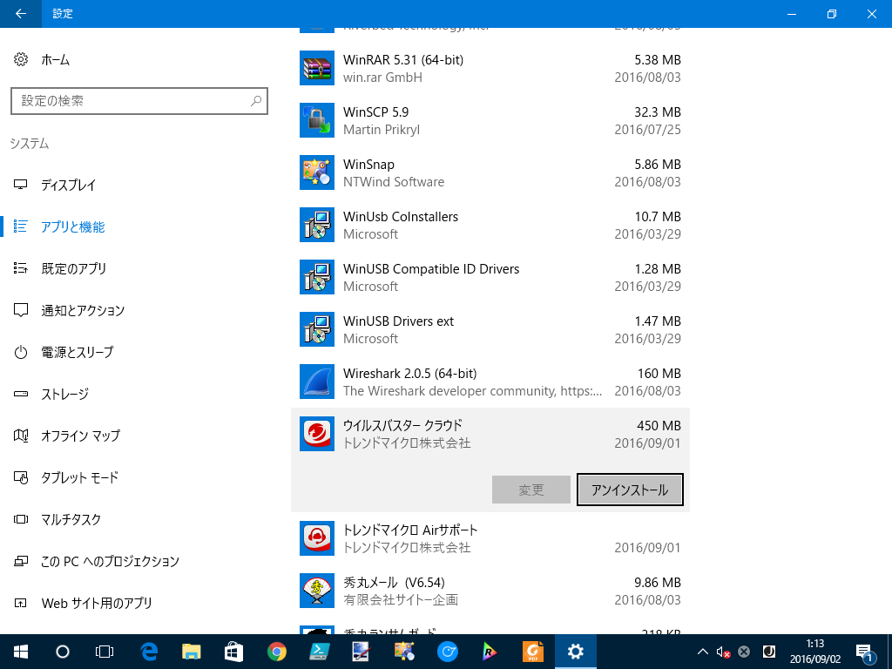
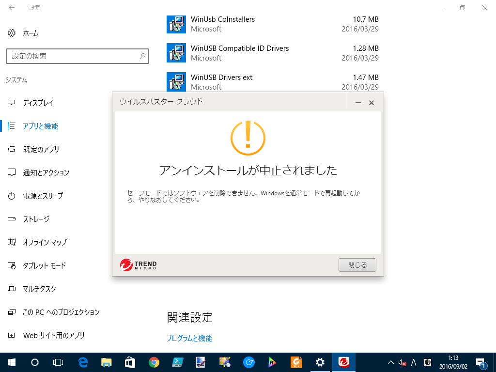

PC は基本つけっぱなしなのだけど、晩飯食ったあとにウトウトして目を覚ましたら、ブルースクリーンになって死んでた。俺の顔面もブルースクリーン。書きかけのコードが次元のはざまに旅立ったかもしれない。

とりあえず直さないと。

<h3>APC_INDEX_MISMATCH ってなんだ？</h3>

<blockquote cite="https://msdn.microsoft.com/en-us/library/windows/hardware/ff557419(v=vs.85).aspx">

The most common cause of this bug check is when a file system or driver has a mismatched sequence of calls to disable and re-enable APCs. The key data item is the Thread->CombinedApcDisable field. The CombinedApcDisable field consists of two separate 16-bit fields: SpecialApcDisable and KernelApcDisable. A negative value of either field indicates that a driver has disabled special or normal APCs (respectively) without re-enabling them. A positive value indicates that a driver has enabled special or normal APCs too many times.

<cite><a href="https://msdn.microsoft.com/en-us/library/windows/hardware/ff557419(v=vs.85).aspx">Bug Check 0x1: APC_INDEX_MISMATCH - Windows 10 hardware dev</a></cite>
</blockquote>

APC っていうのが非同期プロシージャ―呼び出し（<a href="https://msdn.microsoft.com/ja-jp/library/windows/desktop/ms681951(v=vs.85).aspx">Asynchronous Procedure Calls</a>）の略っぽいことはわかったが、だから何って感じだ。『Inside Windows』とかに書いてあるんだろうか。いい加減知識をアップデートしないと、最近は知らないことばっかりで困る（そういう系の本をマジメに読んだのは大学の頃が最後だよ）。

<h3>とりあえずセーフモードで起動する</h3>

電源をガチャガチャやると運よく回復メニューにたどり着けたので、まずはセーフモードで起動してみる。

［トラブル シューティング］－［詳細オプション］－［スタートアップ設定］と進み、Windows を再起動。

4 番を選択してセーフモードで起動する。

とりあえず、ログインできた。試しにここから単に再起動してみたが、やはり APC_INDEX_MISMATCH で起動できなくなる。どうやら何かごちゃごちゃしないと直らないっぽい。

<h3>SCAN /SFCNOW → ダメ</h3>

<b>SCAN /SFCNOW</b>（システムファイルのスキャン）という民間療法を試してみる。結論的には、なにも改善されなかった。

<h3>心当たりのあるプログラムをアンインストールする</h3>

<b>最近なにか変なアプリをインストールした</b>かなぁ、と記憶をたどると、あったあった。

<iframe src="//hatenablog-parts.com/embed?url=http%3A%2F%2Fforest.watch.impress.co.jp%2Fdocs%2Fnews%2F1017850.html" title="ランサムウェアからファイルを守る対策をさらに充実させた「ウイルスバスター クラウド」最新版" class="embed-card embed-webcard" scrolling="no" frameborder="0" style="display: block; width: 100%; height: 155px; max-width: 500px; margin: 10px 0px;"></iframe>

さっそくウイルスバスターさんには消えてもらうことにした。

こいつ一回死んでくればいいのにと思った。

けれどこの状態で再起動すると、なぜか正常に起動できた。原因はよくわからんが、ウイルス対策ソフトのアップデートと、Windows Update がコンボしてなんらかのヤバいなにかが起こったのかもしれん。

念のため、公式の削除ツールで完全に削除。

<ul>
<li><a href="https://esupport.trendmicro.com/support/vb/solution/ja-jp/1314086.aspx">&#x30A6;&#x30A4;&#x30EB;&#x30B9;&#x30D0;&#x30B9;&#x30BF;&#x30FC; &#x30AF;&#x30E9;&#x30A6;&#x30C9;&#x30A2;&#x30F3;&#x30A4;&#x30F3;&#x30B9;&#x30C8;&#x30FC;&#x30EB;&#x30C4;&#x30FC;&#x30EB; | &#x30B5;&#x30DD;&#x30FC;&#x30C8; Q&amp;A&#xFF1A;&#x30C8;&#x30EC;&#x30F3;&#x30C9;&#x30DE;&#x30A4;&#x30AF;&#x30ED;</a></li>
</ul>
あとは、<b>［システムの回復］</b>を使うという手もあるけど、環境がロールバックされるのが嫌なので今回は使わなかった。そういうのを気にしない人は、これを真っ先に試した方がいいかもしれない。

いい機会なので、大事なファイルはクラウド or サブ HDD に退避させて、Windows 10 を初期化。環境を再構築しておいた。Windows 10 にアップデートする前からほったらかしでカオスだったが、まっさらになって気持ちいい。

