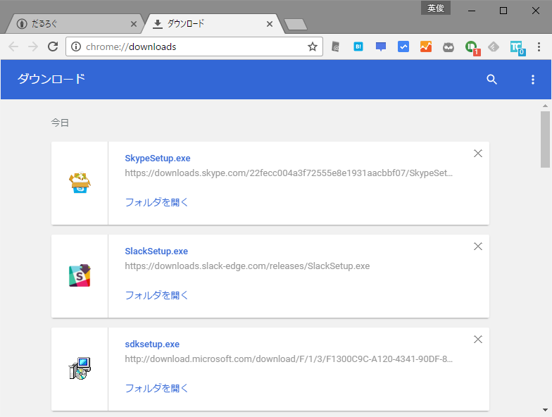

<iframe src="//hatenablog-parts.com/embed?url=http%3A%2F%2Fforest.watch.impress.co.jp%2Fdocs%2Fnews%2F1017725.html" title="マテリアルデザインをまとった「Google Chrome 53」が正式版に。Flashの排除強化も始まる" class="embed-card embed-webcard" scrolling="no" frameborder="0" style="display: block; width: 100%; height: 155px; max-width: 500px; margin: 10px 0px;"></iframe>

マテリアルデザインになったらしい。全体的に薄い感じになった。

<h3>タブと［Google Chrome の設定］ボタン</h3>

タブはカクカクに、［Google Chrome の設定］ボタンは 横線3本 → 縦点3個 になった。ウイルスバスターが拡張機能を仕込んだときボタンのアイコンが変わったから、アップデート通知なんかも以前よりわかりやすくなってるかもしれないな。

あと、拡張機能のインジケーターがやたらカラフルになったな？　こんなんだったっけ。

<h3>ページ内検索</h3>

前のデザインがあんまり思い出せないんだが、こっちも変わった。

<h3>ダウンロードシェルフ</h3>

こちらもフラットに。

ダウンロードページがマテリアルデザインなのは前からだっけ？（よく知らない

ブックマーク画面が相変わらず古臭いので、なんとかしてほしいな。

<h3>ユーザー関連</h3>

ユーザーのログイン画面が変わってた。

以前よりも親切な感じ（変わってるよね？　ここも）。

リンクをクリックすると同期の詳細設定画面に飛べる。

