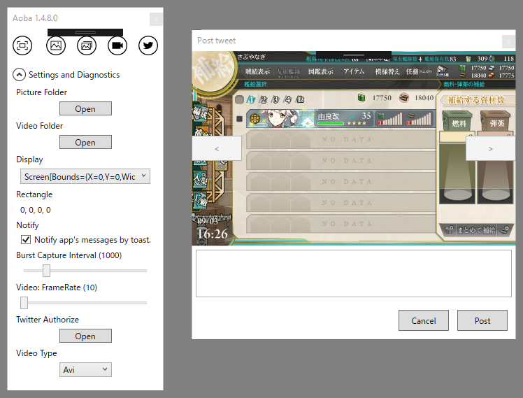

とりあえずほしい機能は全部付けたので、あとは自分で使いながら改良するだけかも。

<ul>
<li><a href="https://yanagi.blob.core.windows.net/aoba/setup.exe">&#x30C0;&#x30A6;&#x30F3;&#x30ED;&#x30FC;&#x30C9;</a></li>
</ul>
GitHub で ClickOnce するのは、思った以上に制約が多いのでやめて、代わりに Azure Blob Storage に置いてみたよ。初めて使ってみたけど、そんなに難しくなかった。お金はちょっとかかるっぽいけど、割と安いみたい。

GUI クライアントをいくつか比較してみたけど、<a href="http://www.cloudberrylab.com/free-microsoft-azure-explorer.aspx">CloudBerry Explorer</a> というのが一番使いやすかったかも。コマンドラインだったら AzCopy ってのもあるみたいで、自分みたいに ClickOnce のファイルを Azure Blob Storage に置くだけだったらそっちの方が楽かもしれない。

<h3>更新点</h3>

<ul>
<li>Twitter 投稿画面の改善</li>
<li>Gif キャプチャー機能</li>
<li>設定の保存</li>
<li>コードのリファクタリング</li>
</ul>
Twitter の投稿画面では、フリップビューのパチモノみたいなのをつけて（アニメーションないし、フリックではめくれない劣化版）、過去の写真も選択できるようにした。連写機能で撮った決定的瞬間をうｐしたいときとかに使えるかも。

作り方は簡単で、

<ul>
<li>スクショをリスト List&lt;string&gt; でもっておく</li>
<li>ViewModel で int SelectedIndex をもつ</li>
<li>Image に List[SelectedIndex] をバインド</li>
<li>ボタンに SelectedIndex を ++/-- するコマンドをバインドしていい感じに配置</li>
</ul>
するだけ。ユーザーコントロールにして、切り替えのアニメーションぐらい付けたいけど、自分の XAML 力でそこまでできるかどうかはわからない。

