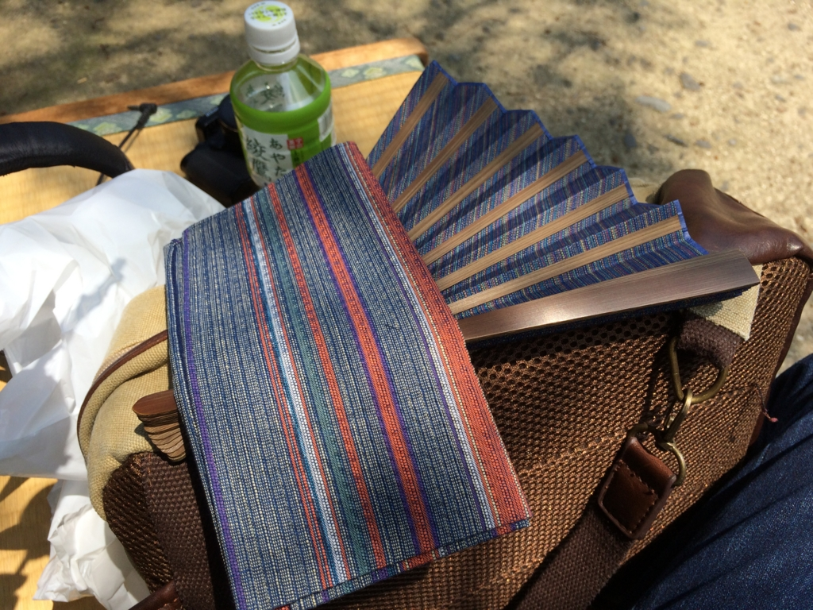
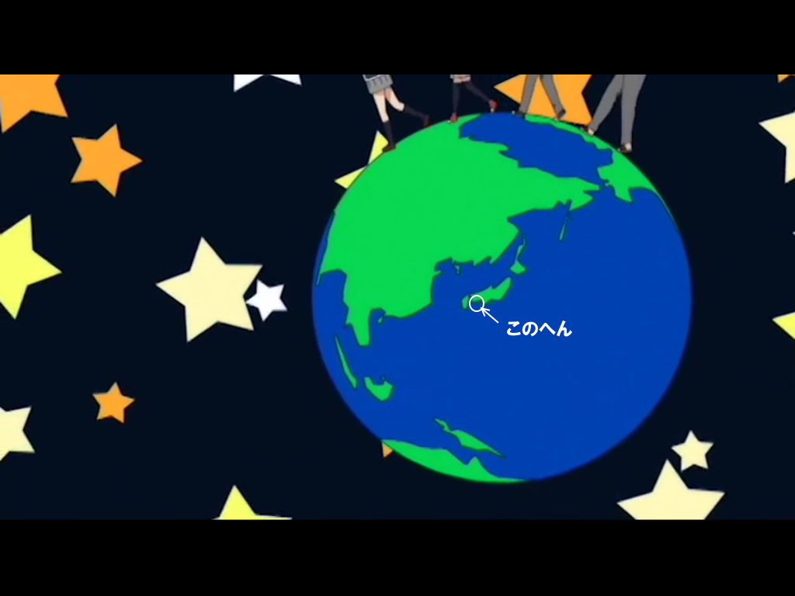
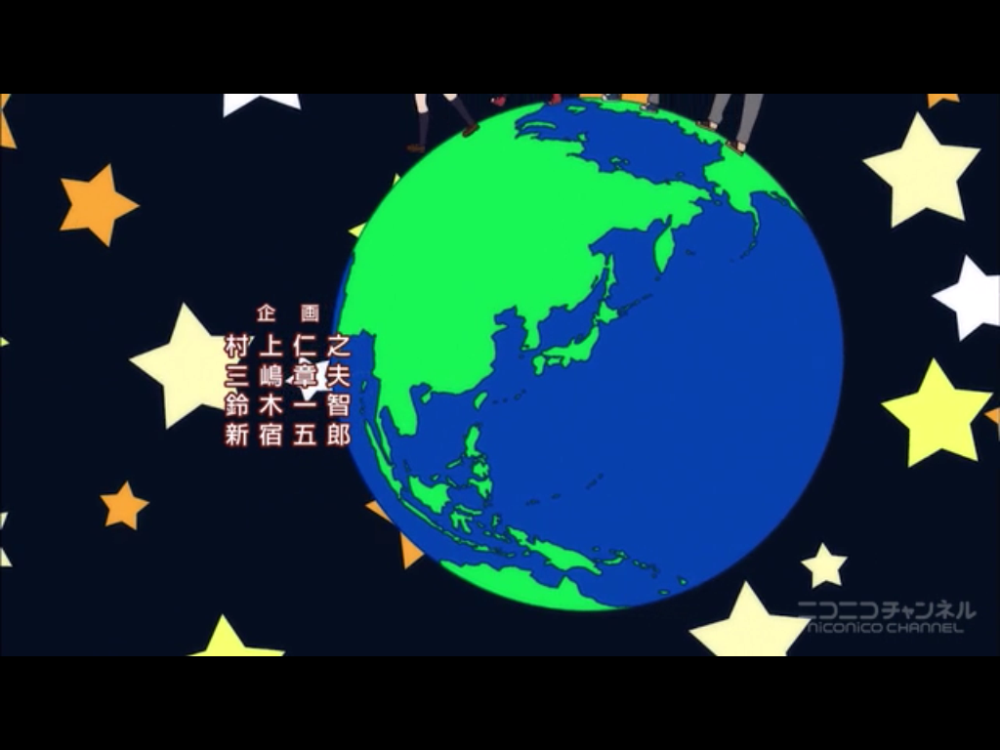

僕は昔から落とし物や忘れ物が多い。

たとえば、こんな話がある。

中学生か高校生のある日、僕は近鉄の田原本駅でお金を落とした。財布ごと落とすなんてことはしない（<a href="https://blog.daruyanagi.jp/entry/2013/03/26/085950">&#x3084;&#x3063;&#x305F;&#x3053;&#x3068;&#x306F;&#x3042;&#x308B;</a>）。歩きながら、ポケットから1枚ずつ、野口さんがダイブしていったのである。幸い、一緒にいた友人が僕のあとをつけ、ポッケからハラハラと舞い落ちる野口さんを一人ずつ拾い集めてくれていたため、事なきを得たが……自分でも思うけど、器用なモノの落とし方だと思う。

今でもたまに笑い話にされているが、僕はこの手の類の話には事欠かない。このお盆休みも、関西の旅行でさまざまなモノを落としたので、今回はその反省をしたい。

<h3>扇子</h3>

まずは、高松の栗林公園で衝動買いした扇子。お値段は確か5,000円ぐらいだったと思う。

<iframe src="https://hatenablog-parts.com/embed?url=https%3A%2F%2Fblog.daruyanagi.jp%2Fentry%2F2015%2F07%2F06%2F185809" title="高松：栗林公園で涙ながらに扇子を買う - だるろぐ" class="embed-card embed-blogcard" scrolling="no" frameborder="0" style="display: block; width: 100%; height: 190px; max-width: 500px; margin: 10px 0px;"></iframe>

使ってるうちに骨の一本が欠けてしまったのだが、ピシッと閉じられるので気に入っていたのだが、この旅行でとうとう紛失してしまった。心当たりはないので、もう戻ってこない。代わりのものがほしいのだが……いいものはないだろうか。

<h3>ヘッドフォン</h3>

<a href="http://www.amazon.co.jp/exec/obidos/ASIN/B01CG5DFIA/bestylesnet-22/">AUKEY bluetoothヘッドホン ワイヤレスヘッドセット 18時間連続再生 耳掛け式 iPhone 7,iPhone 7 Plus,6S, 6S Plus,Sony, Android スマートフォンなど対応 (ブラック) EP-B26</a>
<ul><li>出版社/メーカー: AUKEY（オーキー）</li><li>メディア: エレクトロニクス</li><li><a href="http://d.hatena.ne.jp/asin/B01CG5DFIA/bestylesnet-22" target="_blank">この商品を含むブログを見る</a></li></ul>

麦わら帽子をかぶるとヘッドフォンが使えないので、後ろ回り・耳かけ式のモノを最近購入して、お盆の旅行へ初めて投入した。Amazon によると「お客様は、2016/8/6にこの商品を注文しました。」との由。それをさっそく紛失したわけ。

気付いたのは 愛媛・東予港 → 大阪・南港 へのフェリーから降りて、ニュートラムで住之江公園の駅についたとき。引き返してもよかったのだが、面倒なのでそのままにし、あとで届けてもらうことにした。船内清掃しないと出てこないだろうし、すぐに戻っても無駄足になる可能性が高い（← 自分ほどの忘れ物マスターになると、紛失に気付いても妙に冷静になるんだよな）。

<ul>
<li><a href="http://www.orange-ferry.co.jp/contact/">http://www.orange-ferry.co.jp/contact/</a></li>
</ul>
関西から帰ってから問い合わせフォームで落とし物がなかったか確認してみると、折り返しメールで連絡がいただけた。あとはそのメールに書いてある電話番号番号に問い合わせ、着払い郵送の手続きをとって終わり。<b>梱包がとても丁寧</b>なので感激したので、来年は「<a href="http://www.orange-ferry.co.jp/contact/">&#x304A;&#x308C;&#x3093;&#x3058;&#x4F1A;</a>」 に入ろうかと思う。

ちなみに、この子の着け心地はなかなか良好。耳かけ式の宿命として、長時間の利用で耳が痛くなるは仕方ないが、それも以前に利用した同タイプに比べてだいぶ抑えられていると思う。Bluetooth 接続だが、バッテリーのもちも良好で、操作性も悪くはない。

<h3>Windows 10 搭載スマートフォン「NuAns NEO」</h3>

<a href="http://www.amazon.co.jp/exec/obidos/ASIN/B018LQA0HM/bestylesnet-22/">NuAns NEO TWOTONE CORE(ネオ ツートーン コア)本体セット スムースブラック(Windows 10 Mobile/Continuum for Phone)</a>
<ul><li>出版社/メーカー: NuAns</li><li>発売日: 2016/01/31</li><li>メディア: エレクトロニクス</li><li><a href="http://d.hatena.ne.jp/asin/B018LQA0HM/bestylesnet-22" target="_blank">この商品を含むブログ (3件) を見る</a></li></ul>

これは近鉄特急においてきた。座席のポケットに入れてたんだが、もって降りるのを忘れたのだな。名張駅で降りた直後に気づいたが、改札を出たあとで、特急はすでに名古屋へ旅立って行ったあとだった。

まぁ、こいつはサブ機なのでたいした実害はないのだが、<b>PiTaPa カードを筐体に内蔵させていた</b>のがだいぶヤバい。不正利用されたら、わいのクレカから諭吉がダダ漏れだ。

近鉄で忘れ物をした場合は、まず旅客案内テレフォンセンターへ連絡する。上本町あたりの大きめの駅で相談してもよい（すでに経験済み）。

<blockquote cite="http://www.kintetsu.jp/cs/otoiawase.html">

お忘れ物のお問い合わせ

旅客案内テレフォンセンター 
大 　阪 06-6771-3105 
名古屋 052-561-1604 
8:00～21:00（年中無休)

※ 旅客案内テレフォンセンターの営業時間外は、お近くの駅におたずねください｡  
※ 近鉄線と相互直通運転を行っている路線では、直通運転先で拾得されることもありますので、こちらの鉄道会社・交通局へもご確認ください。

<cite><a href="http://www.kintetsu.jp/cs/otoiawase.html">&#x8FD1;&#x757F;&#x65E5;&#x672C;&#x9244;&#x9053;&#xFF5C;&#x304A;&#x554F;&#x3044;&#x5408;&#x308F;&#x305B;</a></cite>
</blockquote>

その日に連絡したところ届いてないとのことだったが、旅行から帰って再度連絡すると見つかったとの報告。うちの NuAns NEO は、どうやら特急の終点・名古屋駅まで列車旅行を満喫していたらしい。そこで助けられて預かりとなっているとのことなので、名古屋駅の電話番号を教えてもらって直接電話をかけ、平身低頭で着払いによる郵送をお願いした。翌日ぐらいには届いて、本当に助かる。

近鉄(/・ω・)/ﾊﾞﾝｻﾞｲ

<h3>そのほか</h3>

もしかしたらそのほかにもいろいろ忘れてるかもだけど、思い出さないということはたいして必要のないものなので、問題はなかろうと思う。

<h3>答え合わせ</h3>

冒頭の画像はアニメ『この美術部には問題がある』のオープニングより。何か日本の大事なパーツを忘れているのだが、おわかりだろうか。

2話か3話では、ちゃんと修正されている（というか、より詳細に書き直されている）。

