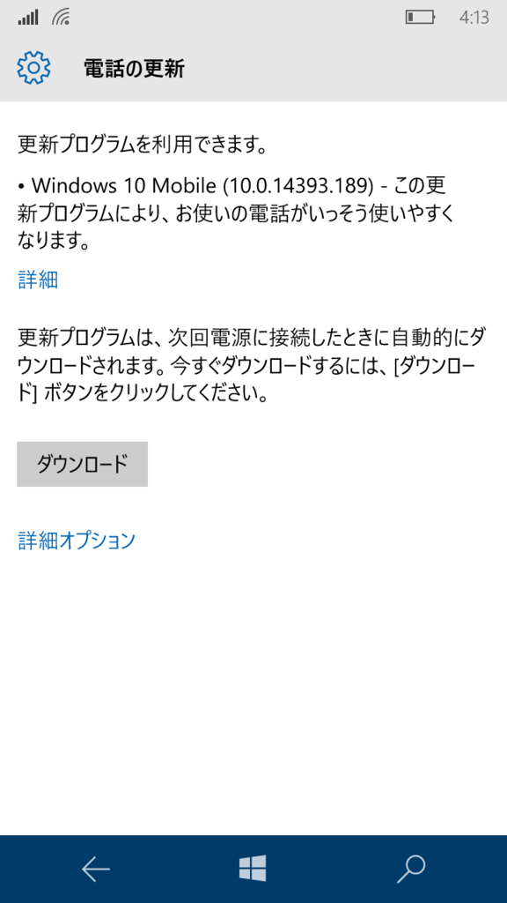
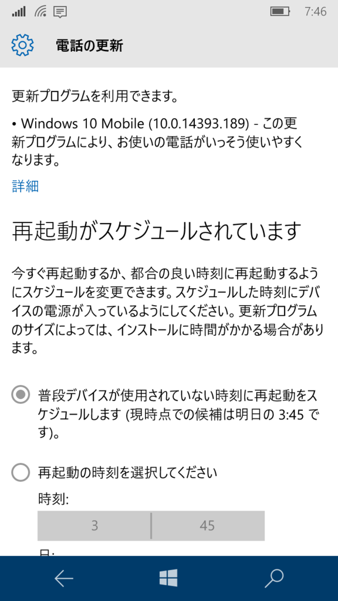
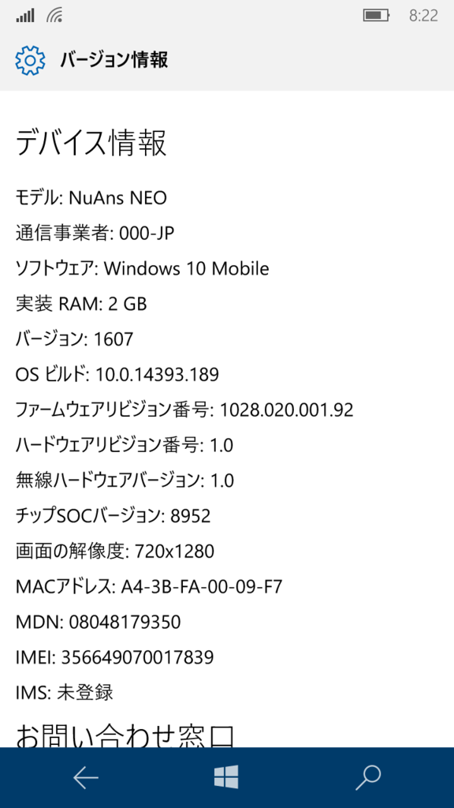
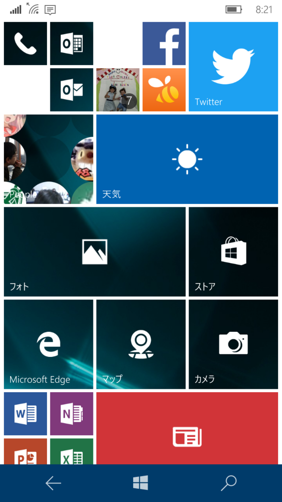

 

今作ってる UWP アプリのターゲットを間違って Anniversary Update にしちゃった（だって新しい方がいいじゃん）ので、非 Anniversary Update な NuAns NEO で実機デバッグできなくて困ってた。助かる―

 

なんかアプリがいくつか消えて、スタート画面が歯抜けになってるっぽいけど、なにがなくなったんだっけ（ピン留めが外れただけかな？）。とりあえず アクション センター の使い勝手がちょっとよくなってうれしい。

