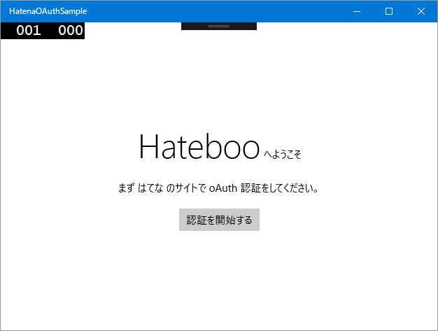
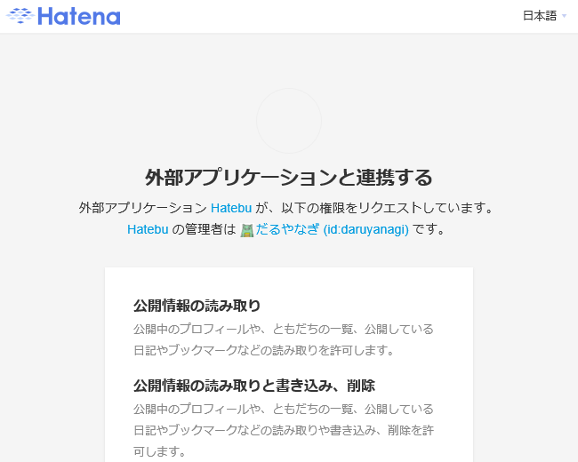
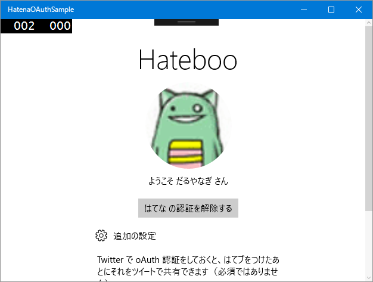

プログラミングの秋……なのかな？　最近、またプログラミングをちょろちょろとやっています。今回は、UWP。一つ新しいのができたのでストアに提出して、今はむかし作りかけて放置中のはてブをつけるアプリを完成させようと四苦八苦してる途中。

実はこのアプリ、ほぼ完成していて、Windows 10 Mobile ではてブみたりはてブつけるのに使っているのだけど、セットアップに AtomPub の APIキー を使うタイプなんだよね。自分で使う分にはこれでもいいんだけど、ちょっとダサいので oAuth でやりたかった。

<h3>AsyncOAuth を導入する</h3>

さて、oAuth はトークンのやり取りとかハッシュとかヘッダーの生成とか、いろいろややこしい処理がある。自分でも組んでみたけど、どこかちょっと間違ってるみたいで、なかなか認証が通らない。というわけで、ライブラリさまのお力を借りた。

いろいろ探してみたんだけど、AsyncOAuth が一番気に入ったかも。

<ul>
<li><a href="http://neue.cc/2013/02/27_398.html">neue cc - AsyncOAuth - C#&#x7528;&#x306E;&#x5168;&#x30D7;&#x30E9;&#x30C3;&#x30C8;&#x30D5;&#x30A9;&#x30FC;&#x30E0;&#x5BFE;&#x5FDC;&#x306E;&#x975E;&#x540C;&#x671F;OAuth&#x30E9;&#x30A4;&#x30D6;&#x30E9;&#x30EA;</a></li>
</ul>
UWP プロジェクトに NuGet でインストールできなかったんだけど、手動で加えたら問題なく動いた。もうメンテナンスされていないのかもしれないけど、せっかくいいものなので UWP でもサクッと使えるようにしてほしいな（賛同してくれるヒトは、みんなで のいえっち にサイレントプレッシャーをかけよう！）。

<iframe src="//hatenablog-parts.com/embed?url=https%3A%2F%2Fgithub.com%2Fneuecc%2FAsyncOAuth%2Fissues%2F23" title="Cannot add nuget to UWP project · Issue #23 · neuecc/AsyncOAuth" class="embed-card embed-webcard" scrolling="no" frameborder="0" style="display: block; width: 100%; height: 155px; max-width: 500px; margin: 10px 0px;"></iframe>

AsyncOAuth にはコンソールアプリだけど はてな 認証のサンプルもついてる。これを UWP 向けにチョロチョロと改造すればおっけ。

<pre class="code lang-cs" data-lang="cs" data-unlink>var authorizer = new OAuthAuthorizer(ConsumerKey, ConsumerSecret);
var callbackUri = &quot;http://localhost/&quot;;

var requestTokenResponse = await authorizer.GetRequestToken(
&quot;https://www.hatena.com/oauth/initiate&quot;,
new[]
{
new KeyValuePair&lt;string, string&gt;(
&quot;oauth_callback&quot;,
callbackUri
)
},
new FormUrlEncodedContent(new[] {
new KeyValuePair&lt;string, string&gt;(
&quot;scope&quot;,
&quot;read_public,write_public,read_private,write_private&quot;
)
}));

var requestToken = requestTokenResponse.Token;

var authorizeUrl = authorizer.BuildAuthorizeUrl(
&quot;https://www.hatena.ne.jp/touch/oauth/authorize&quot;,
requestToken);
</pre>
たとえば、リクエストトークンをとるまでのところはこんな感じ。めんどくさいところは全部やってくれるので楽ちんだー。

callbackUri を“oob”にしたら PIN を使った認証になる。WebAuthenticationBroker.GetCurrentApplicationCallbackUri() で取得した URL は はてな では使えないみたいなので、今回は“<a href="http://localhost/">http://localhost/</a>”をセットしておく（これはあとで認証するときに必要になる）。

<h3>WebAuthenticationBroker を使って認証する</h3>

次は Web へアクセスして認証。UWP には WebAuthenticationBroker っていうダイアログを出す仕組み（それだけじゃないけど）が用意されているので、それを使うといい感じ。

<pre class="code lang-cs" data-lang="cs" data-unlink>// さっき取得したリクエストトークンを使って認証 URI を取得
var authorizeUrl = authorizer.BuildAuthorizeUrl(
&quot;https://www.hatena.ne.jp/touch/oauth/authorize&quot;,
requestToken);

// ダイアログを開いて結果を取得
var webAuthenticationResult = await WebAuthenticationBroker
.AuthenticateAsync(
WebAuthenticationOptions.None,
new Uri(authorizeUrl), new Uri(callbackUri)
);

// 結果をみていろいろ分岐処理
switch (webAuthenticationResult.ResponseStatus)
{
case WebAuthenticationStatus.Success:
try
{
// http://localhost?...=...&amp;...=... っていうのが
// 返るのでテキトーに千切って verifier だけ取得
var verifier = webAuthenticationResult.ResponseData
.Split('?').Last()
.Split('&amp;').Last()
.Split('=').Last();
// リクエストトークンと verifier で
// アクセストークンをゲット
// これでいろいろし放題だ！
var accessTokenTokenResponse = await authorizer
.GetAccessToken(
&quot;https://www.hatena.com/oauth/token&quot;,
requestToken, verifier);

AccessToken = accessTokenTokenResponse.Token;

result = true;
}
catch (Exception exception)
{
// エラー処理するんやで
}
break;

case WebAuthenticationStatus.ErrorHttp:
case WebAuthenticationStatus.UserCancel:
default:
break;
}
</pre>

<h3>ユーザー情報を取得</h3>

あとは OAuthUtility.CreateOAuthClient() でクライアントを取得してごにょごにょするだけ。このクライアントは AsyncOAuth が HttpClient にフィルター（？）をかましているだけなので、HttpClient みたいに GetAsync() とかできる。

<pre class="code lang-cs" data-lang="cs" data-unlink>var client = OAuthUtility.CreateOAuthClient(
ConsumerKey, ConsumerSecret, AccessToken
);

var json = await client.GetStringAsync(
&quot;http://n.hatena.com/applications/my.json&quot;
);
</pre>
これでディスプレイネームやプロフィールイメージなんかが取得できるので、テキトーにバインディングしてあげればおっけ。楽ちんでいいわー。

