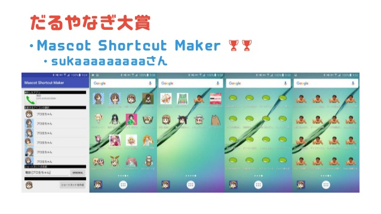
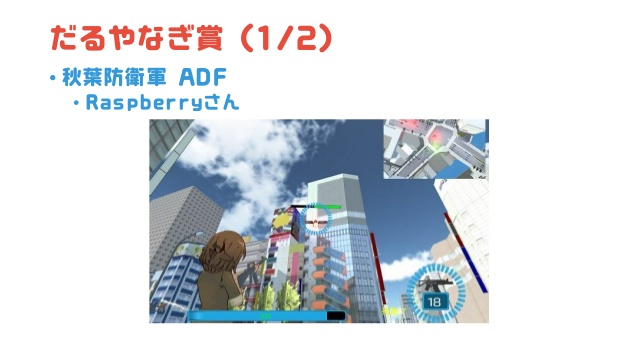
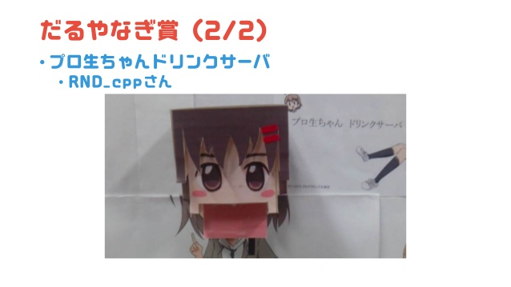

「マスコットアプリ文化祭」が帰ってきた！

<iframe src="//hatenablog-parts.com/embed?url=https%3A%2F%2Fmascot-apps-contest.azurewebsites.net%2FPosts%2F168" title="マスコットアプリ文化祭2016、開催予告！" class="embed-card embed-webcard" scrolling="no" frameborder="0" style="display: block; width: 100%; height: 155px; max-width: 500px; margin: 10px 0px;"></iframe><cite class="hatena-citation"><a href="https://mascot-apps-contest.azurewebsites.net/Posts/168">mascot-apps-contest.azurewebsites.net</a></cite>

「マスコットアプリ文化祭」というのは、巷にあふれるいろんなキャラクターを題材にしたアプリケーションのコンテストです。実はアプリケーション以外の作品も応募可能なんですけどね！　かくいう私“だるやなぎ”もキャラクターといえばキャラクターなので使っていただいていいですし、地味に“だるやなぎ大賞”“だるやなぎ賞”を協賛させていただいています。

で、思い出したんですけど、2015年の「マスコットアプリ文化祭」の“だるやなぎ大賞”“だるやなぎ賞”の寸評をブログで書くという約束をしていたのをちゃっかり忘れていたので、この機会にちょちょいと紹介したいと思います。

<h3>だるやなぎ大賞</h3>

“だるやなぎ大賞”は、「Mascot Shortcut Maker」です。

<iframe src="//hatenablog-parts.com/embed?url=https%3A%2F%2Fmascot-apps-contest.azurewebsites.net%2FWorks%2F141" title="Mascot Shortcut Maker" class="embed-card embed-webcard" scrolling="no" frameborder="0" style="display: block; width: 100%; height: 155px; max-width: 500px; margin: 10px 0px;"></iframe><cite class="hatena-citation"><a href="https://mascot-apps-contest.azurewebsites.net/Works/141">mascot-apps-contest.azurewebsites.net</a></cite> 

<blockquote>

アプリのショートカットをマスコットキャラのアイコンで作成します。 
プリセットされたマスコットのアイコンから選択できます。 
<b>全部ずんだもちとかだるやなぎにするとかっこいいです。</b>

</blockquote>

大事なことなのでもう一度言いましょう。<i>だるやなぎにするとかっこいいです。</i>この紹介文だけで“だるやなぎ大賞”をあげようと決意しました。

このアプリを使っていて思い出したのですが、僕が高校の頃入り浸っていた“パリ研（パソコン研究会のソがリになってる）”のパソコンでは、ごみ箱のアイコンが“木”のアイコンになっていました。どこかのだれかが、やなぎの木をゴミ箱にしたんですな。ほんと許されざるやつですね。でも、<i>アプリのアイコンが気に入らないなー、だるやなぎにできたらいいのになー</i>って思う人は案外多いんじゃないかと思います。本ソフトを使えば、そういう野望を簡単に実現できるというわけですな。たいしたことはないといえばないんだけど、こういうのがないと世の中面白くないよねー。

<h4>だるやなぎ賞</h4>

だるやなぎ賞は2作品。

1作品目は、「秋葉防衛軍 ADF」です。

<iframe src="//hatenablog-parts.com/embed?url=https%3A%2F%2Fmascot-apps-contest.azurewebsites.net%2FWorks%2F137" title="秋葉防衛軍 ADF" class="embed-card embed-webcard" scrolling="no" frameborder="0" style="display: block; width: 100%; height: 155px; max-width: 500px; margin: 10px 0px;"></iframe><cite class="hatena-citation"><a href="https://mascot-apps-contest.azurewebsites.net/Works/137">mascot-apps-contest.azurewebsites.net</a></cite>

アキバは大事だもんね、守らないとね！

マウスとキーボードでライフルやサブマシンガン（だったような気がする）で敵を撃つ感じのよくある感じではあるんですが、こういうのは割と好きだったり。見知った街が舞台（超リアルかっていうとそうでもないんだが、見覚えがある感じなんだよなー！）だと、楽しさも倍増って感じです。次回作への期待も込めて、“だるやなぎ賞”をお送りします！　あっ、要らないとか言わないで！！

もう1作品は、「プロ生ちゃんドリンクサーバ」です。

<iframe src="//hatenablog-parts.com/embed?url=https%3A%2F%2Fmascot-apps-contest.azurewebsites.net%2FWorks%2F135" title="プロ生ちゃんドリンクサーバ" class="embed-card embed-webcard" scrolling="no" frameborder="0" style="display: block; width: 100%; height: 155px; max-width: 500px; margin: 10px 0px;"></iframe><cite class="hatena-citation"><a href="https://mascot-apps-contest.azurewebsites.net/Works/135">mascot-apps-contest.azurewebsites.net</a></cite> 

<blockquote>

プロ生ちゃんドリンクサーバは 同一のLAN内からブラウザでアクセスすることで飲み物を注文することができる自作ドリンクサーバです。

ペットボトルの蓋を交換するだけで飲み物の交換をおこなったり， 飲み物の変更などが容易にでき，また複数の飲み物を混ぜた注文ができます。

注文した飲み物はプロ生ちゃんの口から"だばぁ"します

</blockquote>

単純に<b>頭おかしいなぁ</b>と思いました（褒

<iframe width="560" height="315" src="https://www.youtube.com/embed/qFzuEY38zhY" frameborder="0" allowfullscreen></iframe>

こういう発想ができる大人になりたかったですね。無駄に電子パーツがごてごてしててそこはかとなくカッコいいところや（文系人間なんで、こういうのにしびれる！　あこがれるぅ！）、アゴが外れてる感があるのも、だばーって感じでいいです。

でも、愛媛県民的にはポンジュースを出してほしかったところなので、大賞ではなく賞にしときます。今年はおしっこな！（←ぉぃこら

<h3>追伸</h3>

ことしは俺も参戦するぞー！！

