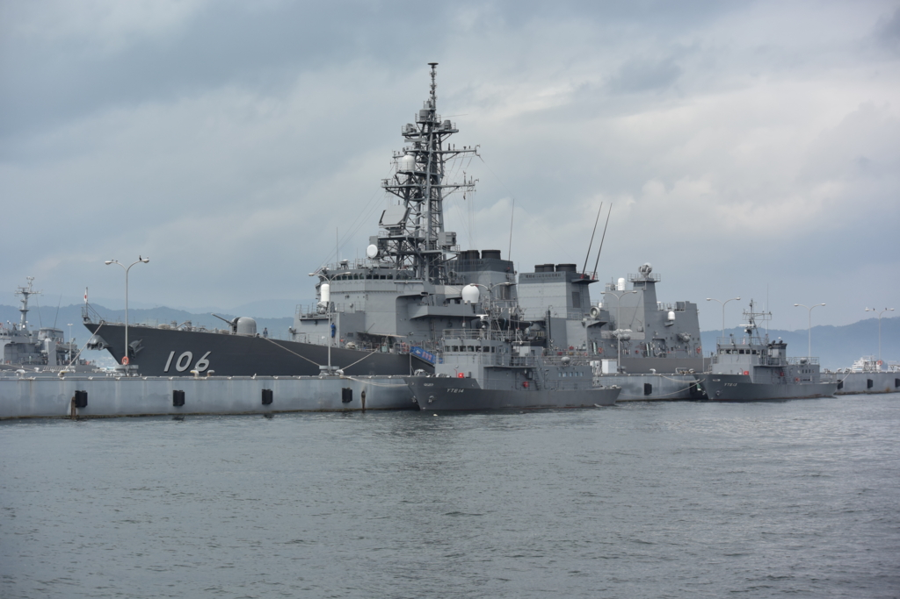

1年ぶりに呉に行ってきました。

今度親父が海外に仕事に行くんだけど、狂犬病だとか腸チフスだとか、そういうもろもろの予防接種をうけなければいけないらしい。しかも、その一部は大阪や広島といった大都会でしかやっていないっぽい（岡山でやっていないのは解せないことだ）。ならば、どうせなので、ついでに呉の観光を勧めたというわけ。毎月『丸』とか読んでたりするし、こういうのは好きだろう。たまには親孝行もしてやろうと、今回は案内役に徹することにした。

自分は二回目だし、今回はハズレを引かないことを重視して（親父の接待みたいなもんやしな）、前回と同じところを回った。

<iframe src="https://hatenablog-parts.com/embed?url=https%3A%2F%2Fblog.daruyanagi.jp%2Fentry%2F2015%2F08%2F21%2F042801" title="呉に行ってきたった：1日目 - だるろぐ" class="embed-card embed-blogcard" scrolling="no" frameborder="0" style="display: block; width: 100%; height: 190px; max-width: 500px; margin: 10px 0px;"></iframe>

<iframe src="https://hatenablog-parts.com/embed?url=https%3A%2F%2Fblog.daruyanagi.jp%2Fentry%2F2015%2F08%2F31%2F190752" title="呉に行ってきたった：2日目 呉艦船めぐり - だるろぐ" class="embed-card embed-blogcard" scrolling="no" frameborder="0" style="display: block; width: 100%; height: 190px; max-width: 500px; margin: 10px 0px;"></iframe>

<iframe src="https://hatenablog-parts.com/embed?url=https%3A%2F%2Fblog.daruyanagi.jp%2Fentry%2F2015%2F09%2F13%2F181514" title="呉に行ってきたった：2日目 てつのくじら館 - だるろぐ" class="embed-card embed-blogcard" scrolling="no" frameborder="0" style="display: block; width: 100%; height: 190px; max-width: 500px; margin: 10px 0px;"></iframe>

なので、とくに新しい発見というのはないのだけど、それでもいくつか新しい体験ができた。

<h3>メロンパンのメロンパンを食ったった！</h3>

前回食べ逃したメロンパンのメロンパンをゲット。（有）メロンパンっていう会社が売っている、メロンパン。前より早めに店にいってみたのだけど、それが功を奏したみたいで無事に食べることができました。

朝ごはんをしっかり食べた直後だったのでかなりベビーだったけど、確かにおいしいかも。カスタードっぽい餡がいいな。もともとメロンパンはこの形が本当で、いつしか今の形のものに駆逐されてしまったのだそうな。

当時をしのぶ商品として「神戸発祥　元祖メロンパン」というのが売っているので、あとで食べてみたのだけど、メロンパンのメロンパンの方がダイブ美味しい。まぁ、コンビニで売ってるのと比べるのはちょっとフェアじゃないかもしれないが。

<h3>大和ミュージアム企画展「呉の人びとと戦艦大和の記憶」</h3>

 

<blockquote cite="http://yamato-museum.com/info/%E5%91%89%E3%81%AE%E4%BA%BA%E3%81%B3%E3%81%A8%E3%81%A8%E6%88%A6%E8%89%A6%E5%A4%A7%E5%92%8C%E3%81%AE%E8%A8%98%E6%86%B6/">

　本企画展では日本海軍が撮影した艦艇や工廠の写真（福井静夫艦艇写真コレクション）、呉のまちの写真館で撮影された写真などを展示します。写真資料を中心に、明治・大正・昭和の海軍工廠内の様子、呉のまちの変化を紹介します。

<cite><a href="http://yamato-museum.com/info/%E5%91%89%E3%81%AE%E4%BA%BA%E3%81%B3%E3%81%A8%E3%81%A8%E6%88%A6%E8%89%A6%E5%A4%A7%E5%92%8C%E3%81%AE%E8%A8%98%E6%86%B6/">&raquo; &#x7B2C;24&#x56DE;&#x4F01;&#x753B;&#x5C55;&#x300C;&#x5449;&#x306E;&#x4EBA;&#x3073;&#x3068;&#x3068;&#x6226;&#x8266;&#x5927;&#x548C;&#x306E;&#x8A18;&#x61B6;&#x300D;</a></cite>
</blockquote>

むかしはこんな感じで写真撮ってたんだなーって感じ。西南戦争の頃の写真なんかもあって（名前忘れたけど、なんか最初期の写真家が撮ったらしい。当時は撮影に時間がかかったので、焼け跡の写真ばかりだったけど生々しい）、写真機・撮影技法の歴史としても興味深い内容だった。

割と面白かったのでパンフレットがほしかったのだけど、売ってないみたいで残念。

あとは、2回目だったので前回見逃したあたりをメモがてら写真にバシバシ撮った。

大和に零式観測機？がいたんだけど、これ、前もいたっけ……？

かわいかった(n*´ω`*n)

<h3>潜水艦の操縦したった</h3>

てつのくじら館は前回よりも人が少なかったので、ゆっくりと回ることができた。潜望鏡も2、3回のぞいたし。あと、操縦室に座ることもできた。当たり前だけど潜水艦って外が見えるわけでもなけりゃ、周囲を写すディスプレイもないわけで。操縦系統は飛行機っぽい感じをうけたけど、そこは全然違っていて難しそうやな。

<h3>さみだれカレー</h3>

ほんとはてつのくじら館であきしおカレーを食べるつもりだったけど、無慈悲な売り切れ。

しょうがないので、大和ミュージアムの隣にあるレストランでさみだれカレーをたべた。さすがに艦内ではナンではないんだよな？　お味は……フツーにおいしかったデス。

ちなみに、ホンモノの護衛艦「さみだれ」も観てきました。観る前に散々くぎを刺したんだけど、親父がウンチク垂れてめんどくさかった。詳しい人が近くにいるかもしれんのに、滔々と自分の知識を開陳してくださるのには閉口する。でも、楽しんでくれたみたいでよかった。

次はバイクで江田島とか走りたいかな～。

