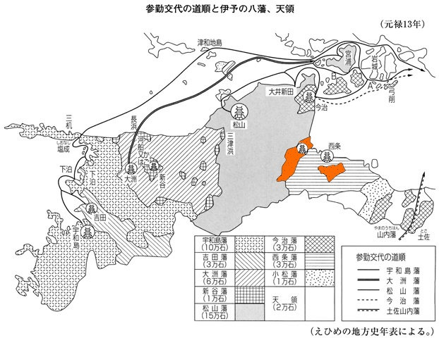
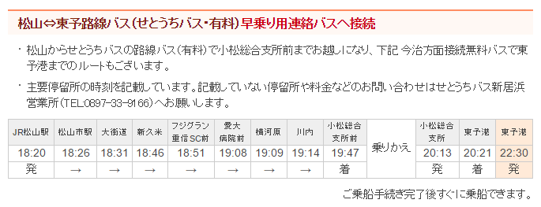

読書の秋だけど、あんまり固い本を読む気になれない今日この頃。最近は新書っぽいものを読み散らかしている。

<a href="http://www.amazon.co.jp/exec/obidos/ASIN/4087201007/bestylesnet-22/">伊予小松藩会所日記 (集英社新書)</a>
<ul><li>作者: 北村六合光,増川宏一</li><li>出版社/メーカー: 集英社</li><li>発売日: 2001/07/17</li><li>メディア: 新書</li><li> クリック: 2回</li><li><a href="http://d.hatena.ne.jp/asin/4087201007/bestylesnet-22" target="_blank">この商品を含むブログ (3件) を見る</a></li></ul>

愛媛には<b>「伊予八藩」</b>といわれるように、江戸時代には8つの藩が存在した（幕府の直轄地である天領も多かった）。なので、割と地域<s>同士が仲悪い</s>ごとに特色があるっぽい……ということに興味を抱いて、Wikipedia でいろいろ読んでいたのだけど（最近の寄付のお願いは近年まれにみるしつこさだな！）、その過程で小松藩の存在を知った。

（<a href="http://www.i-manabi.jp/system/regionals/regionals/ecode:3/40/view/11590">&#x30C7;&#x30FC;&#x30BF;&#x30D9;&#x30FC;&#x30B9;&#x300E;&#x3048;&#x3072;&#x3081;&#x306E;&#x8A18;&#x61B6;&#x300F;&#xFF5C;&#x751F;&#x6DAF;&#x5B66;&#x7FD2;&#x60C5;&#x5831;&#x63D0;&#x4F9B;&#x30B7;&#x30B9;&#x30C6;&#x30E0;</a>）

オレンジ色で塗ったところが小松藩。陣屋（政庁）があるのが周布郡（の一部）で現在の西条市小松町、飛び地になってるのが新居郡（の一部）。「小松」ってどこかで聞いた地名だけど……

松山 → 東予港の連絡バス（早乗り）で乗り換えるところやな。前にちょっと調べたときに目にしたわ。

<iframe src="https://hatenablog-parts.com/embed?url=https%3A%2F%2Fblog.daruyanagi.jp%2Fentry%2F2016%2F08%2F23%2F060000" title="オレンジフェリーで松山～東予港 → 大阪・南港 - だるろぐ" class="embed-card embed-blogcard" scrolling="no" frameborder="0" style="display: block; width: 100%; height: 190px; max-width: 500px; margin: 10px 0px;"></iframe>

30分も待たされるなら、ちょっと周りを散歩できるかも。今度はそっち使ってみるか。

ちょっと話はそれちゃったけど、この小松藩が毎日マメに付けていた日記が<b>『伊予小松藩会所日記』</b>ってわけやな。

<b>伊予小松藩</b>は小田原攻めで戦死した豊臣秀吉の武将・一柳直末の弟、<b>一柳直盛</b>を始祖とする藩。ちなみに一柳氏はもともと美濃・土岐氏の家臣だったけれど、その前は伊予の河野氏（河野通直）から分かれたのだという（ウソっぽいけど）。入封に際してそう称したのか、そう名乗っていた縁で伊予を与えられたのか、自分は知らない。

さて、父祖の故地で6万8000石余（播磨にもまたがっていた）を得た直盛はウキウキで領国へ下るが、残念ながらその途中、大阪で病で亡くなる。その後、遺領は分割相続され、<b>西条藩</b>（3万石）・<b>伊予川之江藩</b>（2万3000石余、のちに播磨の小野に本拠を移すが（播磨小野藩）、世襲を末期養子で凌いだ時に伊予領は召し上げられる。6年で消滅したので伊予八藩には数えない）、<b>伊予小松藩</b>（1万石）などが生まれた。しかし、隣にあった本家の西条藩はのちに改易され、御三家紀州藩の支藩に。頼みの本家は改易、隣は譜代の松山藩・西条藩という状況で、小松藩はただひたすら家の維持に腐心することになる。

そんなわけで、この藩にはとくに事件らしい事件があるわけでなく（あったらその時点で改易されてる）、日記も個別の記事はたいして面白くない。殿様が何した、どこの誰が生まれた、今年は不作でヤバい、どこのだれそれがお金を返せと言ってきたので追い返した、だれとだれがケンカした、どこぞのだれが駆け落ち（欠落）した……そんな話ばっかり。でも、現代の目から見てみると、なかなかテキストとして残ることのない“江戸時代の日常”が生き生きと描かれていて、全体としてとても興味深いモノになっている。まぁ、そういうネタを拾ってくれてるってのもあるんだろうけど。

それにしても、一万石の小藩は割とみじめだな。江戸屋敷を維持して、参勤交代をやらなくちゃいけないので、慢性的な財政難に苦しんでる。それでも大きな一揆などに遭うこともなく、周りの藩が飢饉で餓死者を出す中で小松藩だけは一人も餓死者を出すことがなかったっていうのは偉いものだと思う。“錬金術”（笑）で状況を一発逆転を図ろうとするのも、見ていてハラハラする。この辺りは『超高速！参勤交代』の経済バージョンみたいな話に仕立て上げられそうだな。オチが難しいけれど。

気が向いたら他の藩についても、独断と偏見で今度まとめようかなと思う。

