
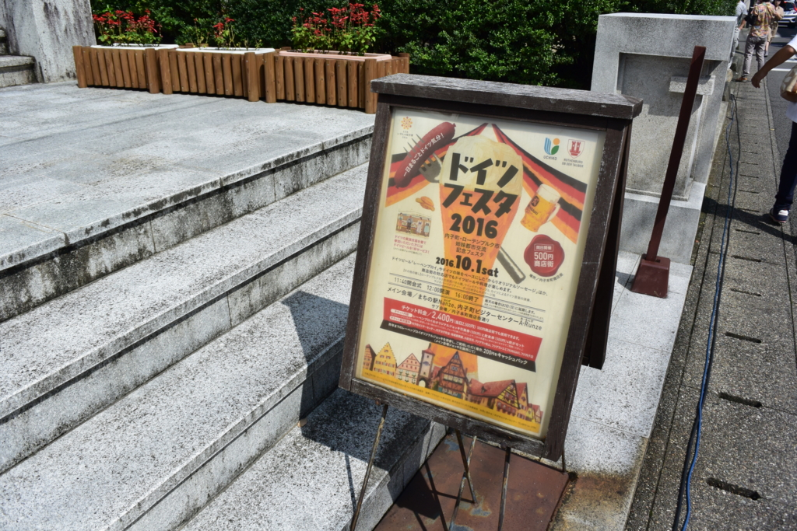

週末は @nakaji 先生と愛媛県内子町まで行ってきました。ドイツのビールを飲みまくるのだ！

<iframe src="//hatenablog-parts.com/embed?url=http%3A%2F%2Fuchiko-dfesta.com%2F" title="ドイツフェスタ2016 公式サイト 愛媛県内子町" class="embed-card embed-webcard" scrolling="no" frameborder="0" style="display: block; width: 100%; height: 155px; max-width: 500px; margin: 10px 0px;"></iframe><cite class="hatena-citation"><a href="http://uchiko-dfesta.com/">uchiko-dfesta.com</a></cite>

天気予報は雨か曇りって感じだったんだけど、さすがの晴れ男、雨を免れるどころか、真夏並みのカンカン照りになりやがりました。おかげでビールがうまくなるってもんよ！

<h3>内子駅</h3>

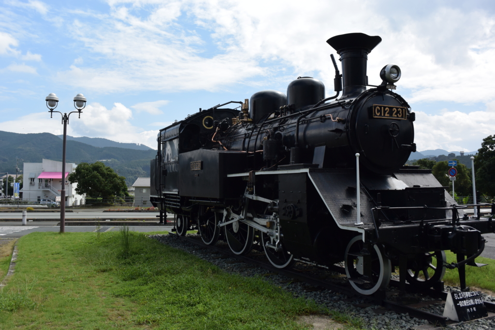

松山駅から一両編成のワンマン<s>電車</s>汽車に乗ること1時間弱で内子駅に到着。おカネがある人は特急「宇和海」にのると30分ぐらいで行ける。駅の前は機関車以外ほとんどなにもない感じ。古い駅は街を避けて建設されたからね、多少はね？

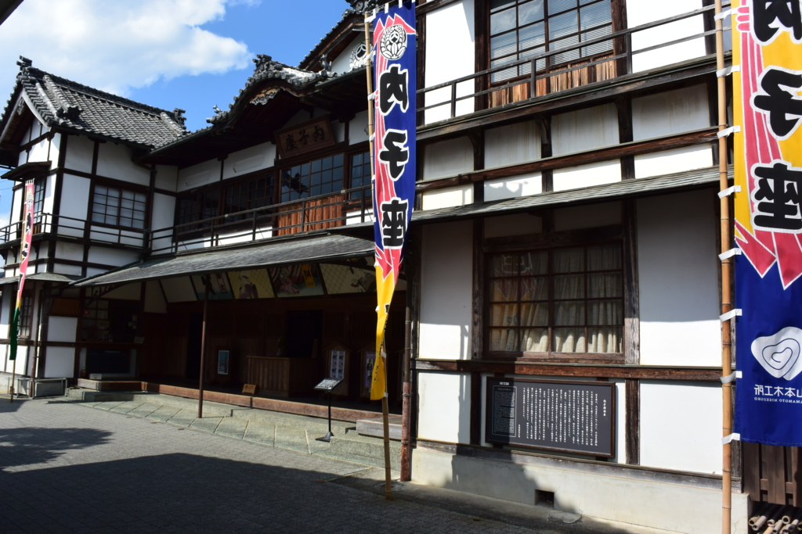 

<h3>内子駅</h3>

市街地までは徒歩10分ぐらいかな。途中に創建100周年を迎えたという「内子座」があります。

<ul>
<li><a href="https://www.town.uchiko.ehime.jp/site/uchikoza/">&#x5185;&#x5B50;&#x5EA7; - &#x5185;&#x5B50;&#x753A;&#x30DB;&#x30FC;&#x30E0;&#x30DA;&#x30FC;&#x30B8;</a></li>
</ul>
今度なにか見に行きたいな。狂言とかはさっぱりなので、落語あたりで。

<h3>ドイツフェスタ</h3>

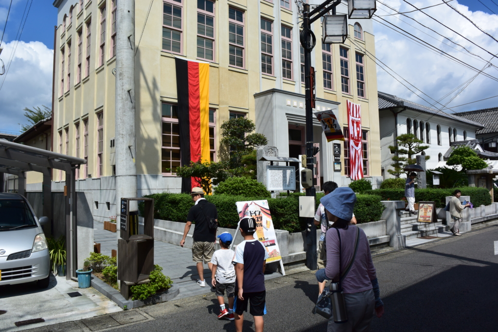

やっとこさ会場に到着。

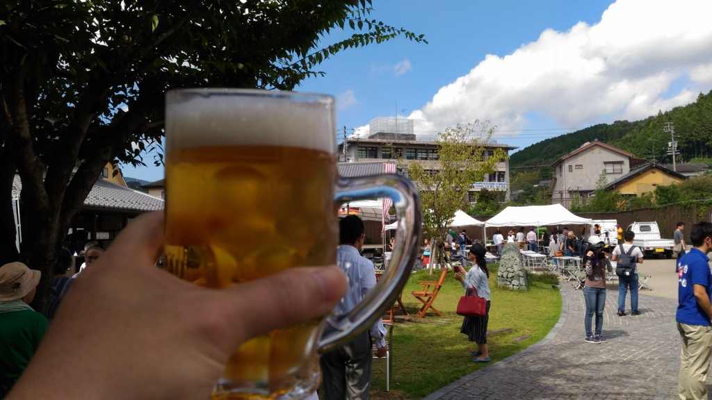

東京でやってるやつに比べればさすがにこじんまりとしていますが、雰囲気はある。偉い人がスピーチするのをしり目に、さっそく始めさせていただきました。

よくわかんないんですが、内子町はドイツのローデンブルク市と姉妹提携をしているのだそうな。あとア○ヒビールの偉い人の何人かが実は内子町出身だったりと、妙なビールつながりのある町なんだなぁ。まぁ、どうせどれも昼から大っぴらに飲むための口実ですがね！

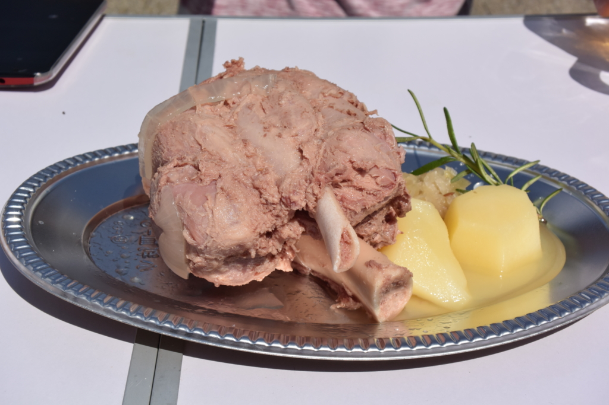

料理はドイツっぽくウィンナーみたいなのとか。個人的にはこのチキンがおいしかったです。やわらかくて、なんか香草の香りがする？　チケット（500円）を2枚出しただけあった。

結局、5枚つづりのチケットを2枚使い果たしたばかりか、1枚足りなくて買い足しました(＾ω＾)

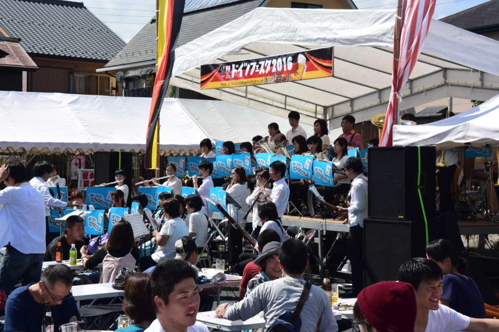

あと、地元の高校生かな？　炎天下で素敵な演奏で、楽しかったデス。なんかすんげーながい笛とか吹いてた。

<h3>内子の街並み</h3>

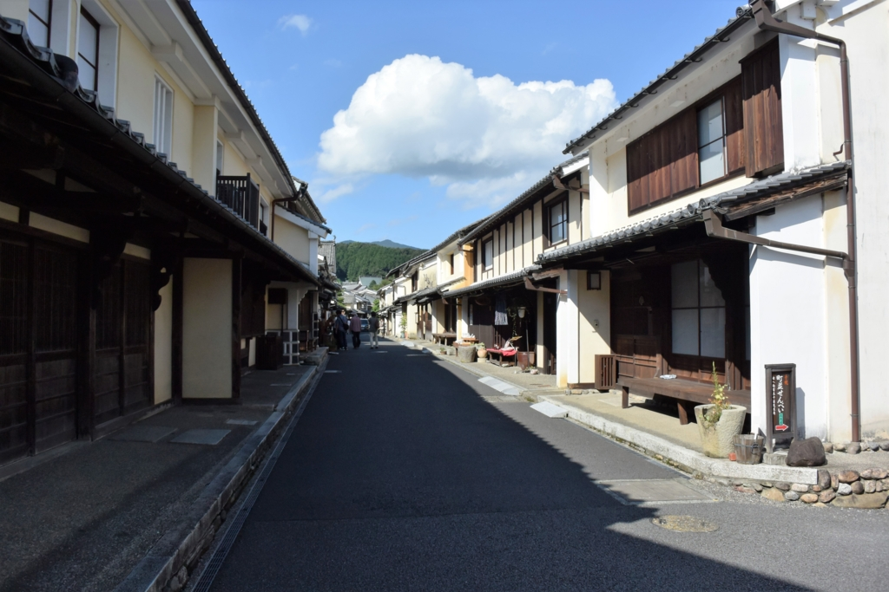

ビールを楽しんだ後は、内子出身の @nakaji 先生の案内で街を散歩しました。内子の町はかつて<b>和ろうそく</b>でガッポガッポ儲けた街なんだそうで、その当時の立派な街並みがそのまま残っているんですな。

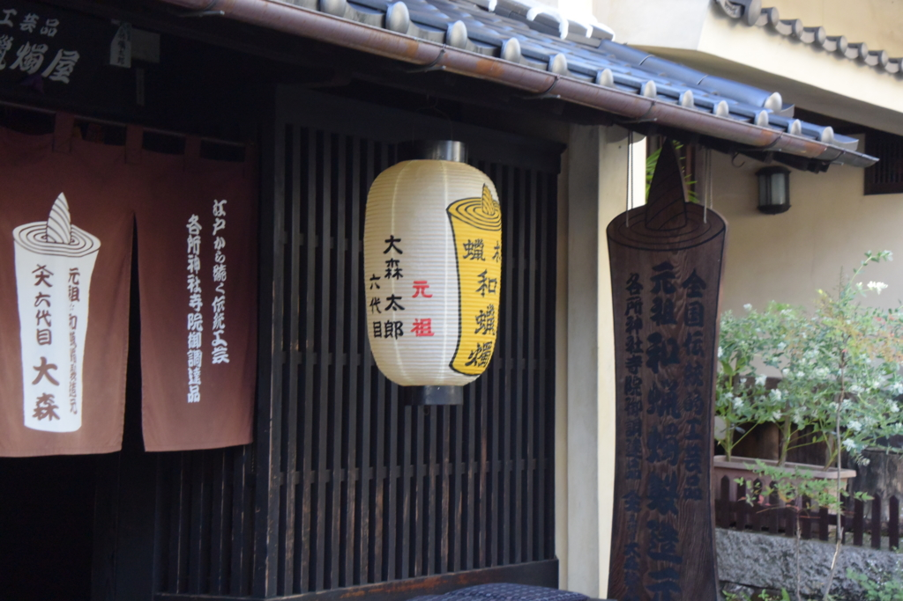

今では1軒しか残ってませんが、その伝統をついでいらっしゃいます。

まぁ、近所のおばさん曰く「あんな店、昔はなかった」のだそうですけどｗ　せっかくお土産買ったのになんか台無しｗｗｗ　でも、大事なのは看板ではなく、気持ちですからね。続けていこう、守っていこうという気持ちがよいわけだし、和ろうそくの町なのに一軒もないのもアレだしな。いいんですよ。

あとは最近テレビで話題になっているホテルの話とか。テレビで見ると反対一色って感じだけど、現実には（安く）泊まるところが少なくて客を逃がしていたり、そもそも郊外の方が景観無視の建物がすでに建っていたりっていう話もあるんだな。街にとって何がいいか、決めたキマリが公平に運用されているか、そういうのも考えるといろいろ難しくて、ニュースの5分紹介ではなかなかわかんないなっていうのが今回の反省でもある（まぁ、おばちゃんの意見が偏ってるのかもしれんし）。

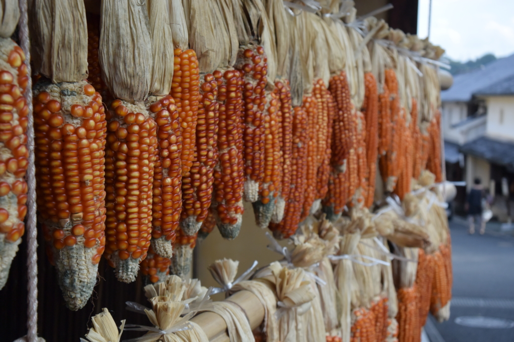

あとは和ろうそくの資料館や、かつての豪商の家なんかにも入ってみたり。いまでいうたら石油王みたいな位置付けやったんやろうか。わしも totoBIG があたったらこういう暮らしがしたいなーって感じでした。今回はいろいろ長くなっちゃったので、内子は機会を作って再訪して、またブログで紹介したいかな。

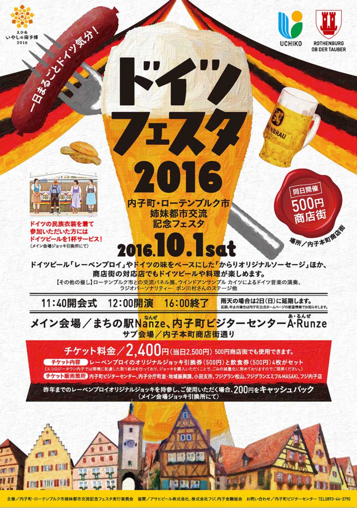

