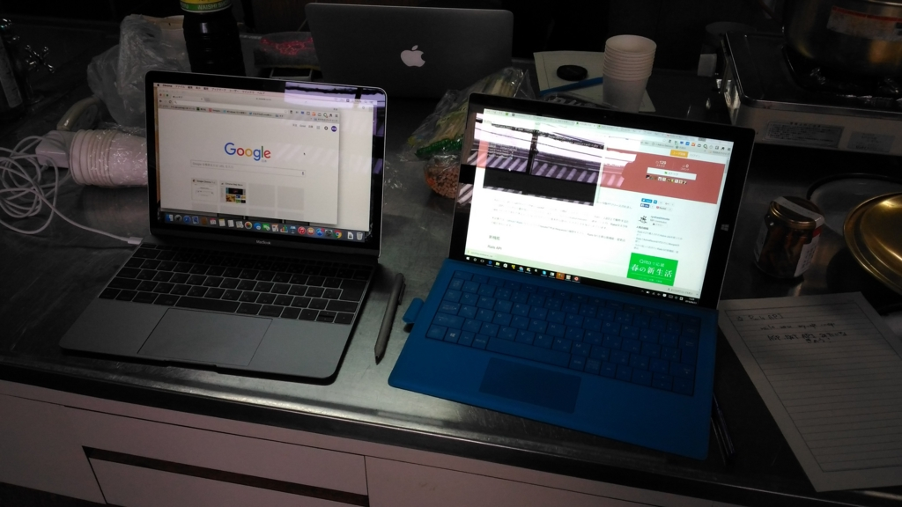

Macbook（macOS）だと三本（指の）スワイプで Mission Control 呼んだりデスクトップ切り替えたりできるじゃないですか。Surface でも Task View が呼べるよね。そういうのを Bootcamp で Windows 10 をいれた Macbook でもやりたいんだけど（Surface で慣れちゃったし！）、Apple のタッチパッドのドライバーはウンコで、三本スワイプをサポートしていない。

そんなわけで Trackpad++ というのを試してみたんだけど……

<iframe src="//hatenablog-parts.com/embed?url=http%3A%2F%2Ftrackpad.powerplan7.com%2F" title="Trackpad++ Driver: alternate Windows driver with multi-touch gesture support for Macbook trackpads in Boot Camp environment. Now with Force Touch trackpads support." class="embed-card embed-webcard" scrolling="no" frameborder="0" style="display: block; width: 100%; height: 155px; max-width: 500px; margin: 10px 0px;"></iframe><cite class="hatena-citation"><a href="http://trackpad.powerplan7.com/">trackpad.powerplan7.com</a></cite>

こいつ、要らん変なアプリ入れなきゃいけないし（バッテリーセーバーらしいが）、Windows 10 がテストモード（署名なしドライバーを入れるためのモード）になるし、かなりイマイチ。おカネ払ってもいいから、署名付きのドライバーほしいなぁ。

仕方ないので、次善の策として Autohotkey を試してみた。

<iframe src="//hatenablog-parts.com/embed?url=http%3A%2F%2Fahkscript.org%2F" title="AutoHotkey" class="embed-card embed-webcard" scrolling="no" frameborder="0" style="display: block; width: 100%; height: 155px; max-width: 500px; margin: 10px 0px;"></iframe><cite class="hatena-citation"><a href="http://ahkscript.org/">ahkscript.org</a></cite>

［Fn］＋［→］キーとか［Fn］＋［←］キーで仮想デスクトップを切り替えられれば、まぁ、三本スワイプと大して変わらない使い勝手にはなるかもしれない。ほとんど隣同士だし。

というわけで、キーコードを調べてみたんだけど

<ul>
<li>［Fn］＋［←］キー：［Home］キー</li>
<li>［Fn］＋［→］キー：［End］キー</li>
</ul>
なんだな。他のも調べてみると、

<ul>
<li>［Fn］＋［↑］キー：［PageUp］キー</li>
<li>［Fn］＋［↓］キー：［PageDown］キー</li>
<li>［Fn］＋［Enter］キー：［Insert］キー</li>
</ul>
みたいな感じらしい。デスクトップならともかく、ラップトップでは［Home］だの［End］だのはあまり使わないので（コンビネーションしてまで使うキーではないよね）、こいつらにショートカットを割り当てることにした。

<pre class="code" data-lang="" data-unlink>End::Send, #^{Right}    &#39;右のデスクトップに移動
Home::Send, #^{Left}    &#39;左のデスクトップに移動

PgUp::Send, #{Tab}    &#39;Task View
PgDn::Send, #{Tab}    &#39;Task View

$RWin::Send, {AppsKey}    &#39;右［Win］キーはアプリキーに

Ins::Send, {PrintScreen}    &#39;［Fn］＋［Enter］でキャプチャー</pre>
Autohotkey スクリプトって初めて書いたけど、まぁまぁ、慣れれば簡単やね。デスクトップでも試してみたけど、［Home］［End］で仮想デスクトップの移動ができて面白かった（デスクトップが一つしかない場合は何も起こらない）。

もし使いたい人がいれば、コンパイルしたのを置いておくのでどうぞご自由に（無断で改変するかもだけど）。

<ul>
<li><a href="https://dl.dropboxusercontent.com/u/129878/TaskView.exe">https://dl.dropboxusercontent.com/u/129878/TaskView.exe</a></li>
</ul>