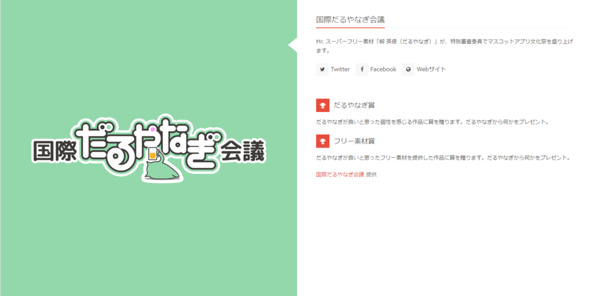

今年の<a href="https://mascot-apps-contest.azurewebsites.net/">&#x30DE;&#x30B9;&#x30B3;&#x30C3;&#x30C8;&#x30A2;&#x30D7;&#x30EA;&#x6587;&#x5316;&#x796D;</a>開催にあわせ、UWP版「プロ生ちゃん時報」アプリを開発しました。Windows 10 と Windows 10 Mobile で利用できます。

<iframe src="//hatenablog-parts.com/embed?url=https%3A%2F%2Fwww.microsoft.com%2Fja-jp%2Fstore%2Fp%2F%25E3%2583%2597%25E3%2583%25AD%25E7%2594%259F%25E3%2581%25A1%25E3%2582%2583%25E3%2582%2593%25E6%2599%2582%25E5%25A0%25B1%2F9nblggh52rdj" title="プロ生ちゃん時報 – Microsoft ストアの Windows アプリ" class="embed-card embed-webcard" scrolling="no" frameborder="0" style="display: block; width: 100%; height: 155px; max-width: 500px; margin: 10px 0px;"></iframe><cite class="hatena-citation"><a href="https://www.microsoft.com/ja-jp/store/p/%E3%83%97%E3%83%AD%E7%94%9F%E3%81%A1%E3%82%83%E3%82%93%E6%99%82%E5%A0%B1/9nblggh52rdj">www.microsoft.com</a></cite>

正時になるとプロ生ちゃんが声をかけてくれるだけのアプリですが、Mac 版（<a href="https://itunes.apple.com/jp/app/keisignal/id1144071713?mt=12&ign-mpt=uo%3D4">KeiSignal &#x3092; Mac App Store &#x3067;</a>）を見かけたので作ってみたかったんだ！　アクティブタイムの設定が行えるので、夜は黙っててほしいといった要望にもお応えできます。トーストによる通知も可能。今気づいたけど、トーストのセリフも声にあわせればよかったな。まぁ、追々アップデートします。

ちなみに、うちはテストのためすべての環境にこのアプリを入れているので、正時になるとにぎやかでいいです。

なお、アプリケーションのアイコンには去年の作品を流用させてもらいました。

<iframe src="//hatenablog-parts.com/embed?url=https%3A%2F%2Fmascot-apps-contest.azurewebsites.net%2FWorks%2F165" title="単色SDプロ生ちゃん" class="embed-card embed-webcard" scrolling="no" frameborder="0" style="display: block; width: 100%; height: 155px; max-width: 500px; margin: 10px 0px;"></iframe><cite class="hatena-citation"><a href="https://mascot-apps-contest.azurewebsites.net/Works/165">mascot-apps-contest.azurewebsites.net</a></cite>

お礼申し上げまする。

あと、このアプリを作ったときのことは11月に開催予定（のはず）のプロ生熊本でお話しできるかと。

<iframe src="//hatenablog-parts.com/embed?url=http%3A%2F%2Fpronama.azurewebsites.net%2F2016%2F03%2F16%2Fpronama-2016%2F" title="2016年 プロ生勉強会 予定" class="embed-card embed-webcard" scrolling="no" frameborder="0" style="display: block; width: 100%; height: 155px; max-width: 500px; margin: 10px 0px;"></iframe><cite class="hatena-citation"><a href="http://pronama.azurewebsites.net/2016/03/16/pronama-2016/">pronama.azurewebsites.net</a></cite>

まだ更新されてないみたいだけど、チェックしておいてください。

<h3>だるやなぎ賞のお知らせ</h3>

あと、今年もマスコットアプリ文化祭に協賛させていただきます。僕の琴線に触れたアプリには“だるやなぎ賞”が贈られるほか、秀逸なフリー素材には“フリー素材賞”を設定しました。去年のサイン手形よりは豪華な賞品を考えているので、みんな狙ってくれ！（お尻フリフリ

<iframe src="//hatenablog-parts.com/embed?url=https%3A%2F%2Fmascot-apps-contest.azurewebsites.net%2F2016%2FAwards" title="キャラクター &amp; 賞" class="embed-card embed-webcard" scrolling="no" frameborder="0" style="display: block; width: 100%; height: 155px; max-width: 500px; margin: 10px 0px;"></iframe><cite class="hatena-citation"><a href="https://mascot-apps-contest.azurewebsites.net/2016/Awards">mascot-apps-contest.azurewebsites.net</a></cite>

