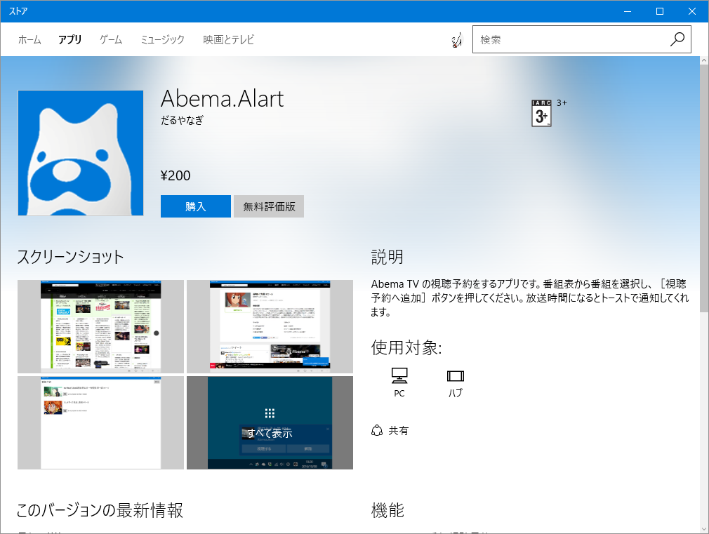
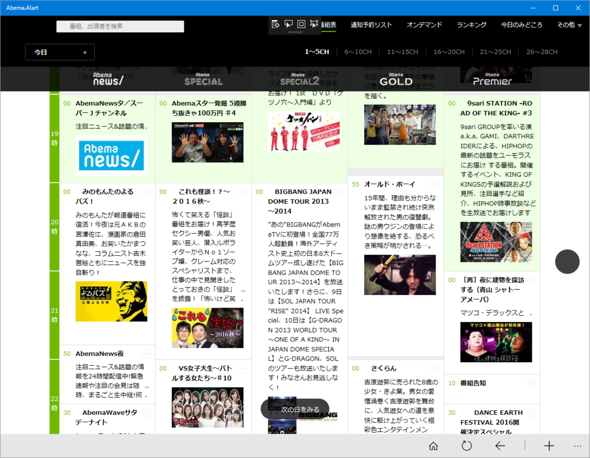
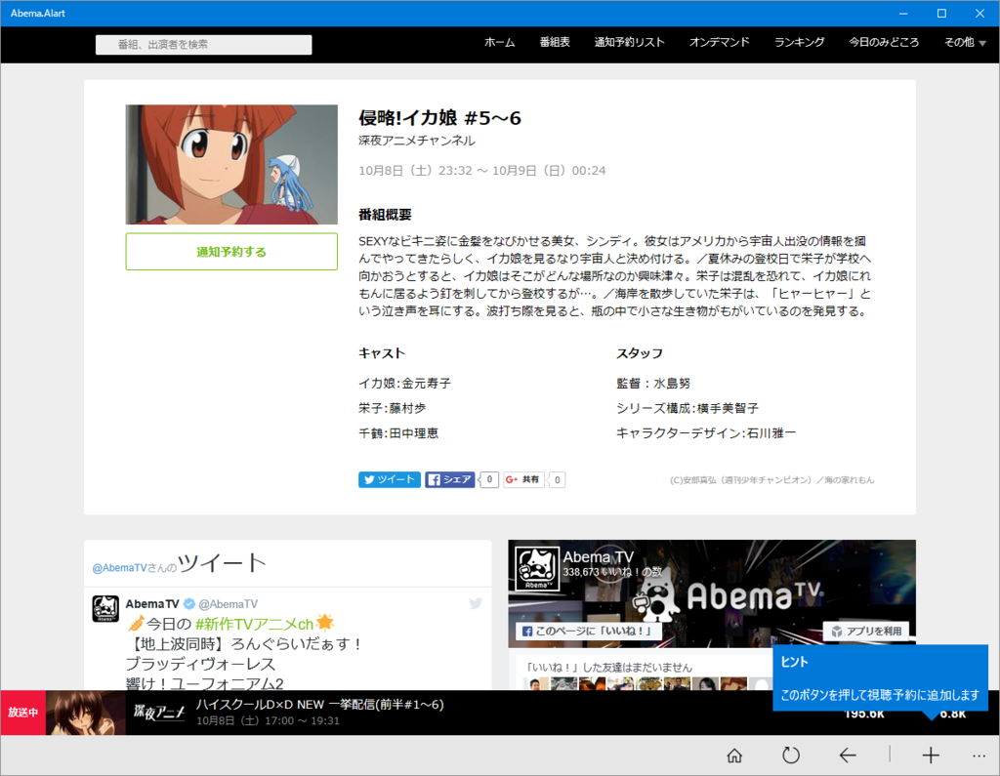
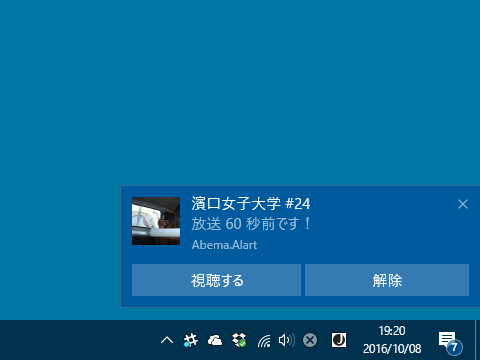
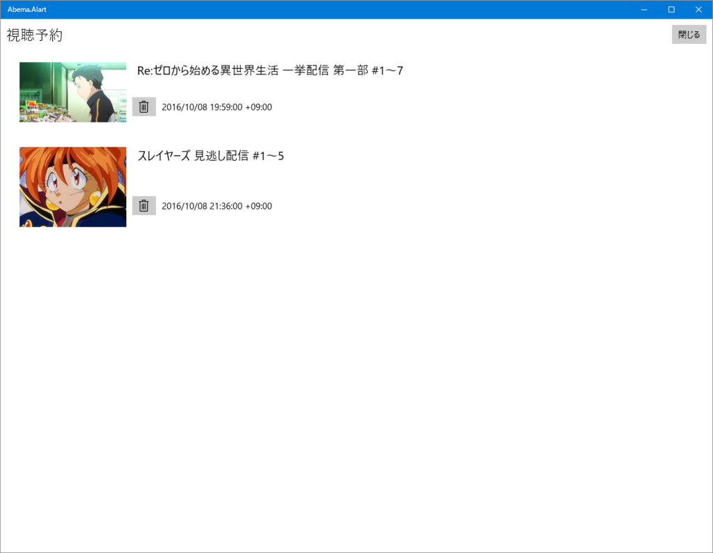

200円って書いてあるけど、「無料評価版」を使えばずっとタダです。

<iframe src="//hatenablog-parts.com/embed?url=https%3A%2F%2Fwww.microsoft.com%2Fja-jp%2Fstore%2Fp%2Fabemaalart%2F9nblggh42jk1" title="Abema.Alart – Microsoft ストアの Windows アプリ" class="embed-card embed-webcard" scrolling="no" frameborder="0" style="display: block; width: 100%; height: 155px; max-width: 500px; margin: 10px 0px;"></iframe><cite class="hatena-citation"><a href="https://www.microsoft.com/ja-jp/store/p/abemaalart/9nblggh42jk1">www.microsoft.com</a></cite>

最近“だるろぐ”の収益が落ちてきているので、ビール代をカンパしてください。

<h3>「Abema.Alart」の使い方</h3>

起動するとこういう画面が出るので、好みの番組を選択して――

番組の詳細画面で［視聴予約する］ボタンをクリック（初回利用時にバルーンで教えてくれます）。ダイアログで「登録しました」って出れば成功（過去の番組であれば失敗するはずです。重複登録のチェックを忘れていたので、次のバージョンにはつける予定）。

時間になると、トーストで通知してくれます。［視聴する］ボタンを押すと既定のブラウザーで番組を閲覧できます。

視聴予約の取り消しにも対応しています。

でも、週末高松・神戸に遊びにっている間、船の中でいいアイデアが浮かびましたので、また改訂版を出すつもり。次回はもう少しエレガントになっていると思います。

<h3>失敗したこと</h3>

単語の綴り間違ってた。

