
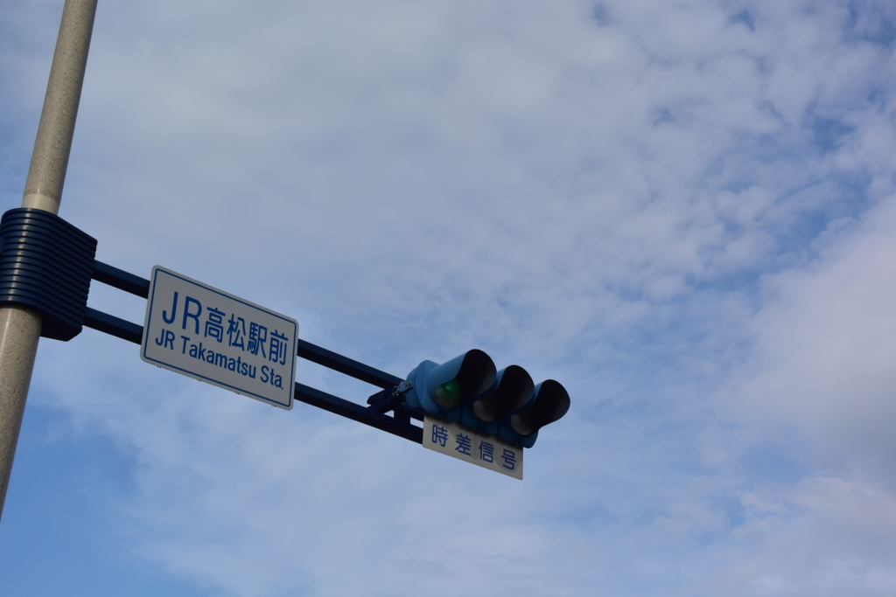

先々週末は、ブラリと神戸へ。フツーに電車に乗って行くのは面白くないので、うどん県（香川県じゃなくて。ジャンボフェリーのホームページにそう書いてあるんだから仕方ない）→ 神戸のフェリーを使おうかなと思ったのですが、都合のいい便がないので高松で一泊することにしました。ついでなので、独りで高松の街をブラブラすることに。

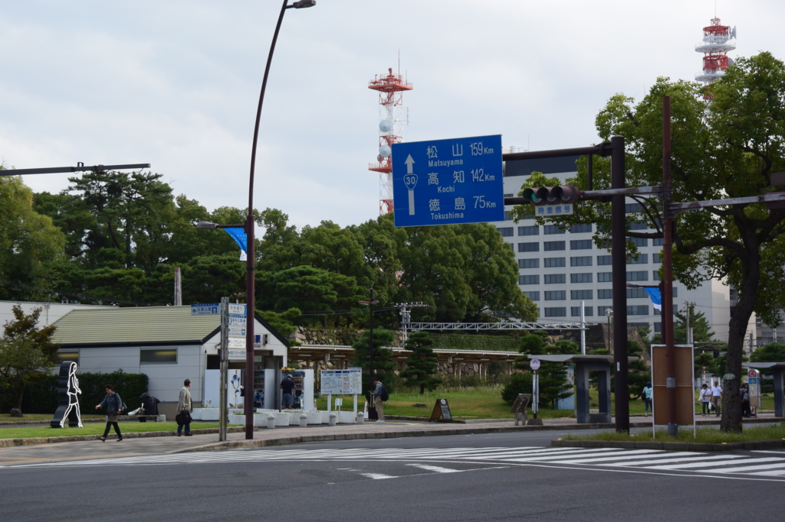

ちなみに、高松は

<ul>
<li>松山から約160km</li>
<li>高知から約140km</li>
<li>徳島から75km（松山との距離は200kmぐらい）</li>
</ul>
なのだとか。まだこっちの地理的な距離感覚がつかめないでいるのですが、高松＝徳島はわりかし近いのに、ほかの2県は割と離れてるんだなーなどといまさら思ったり。

<h3>玉藻公園</h3>

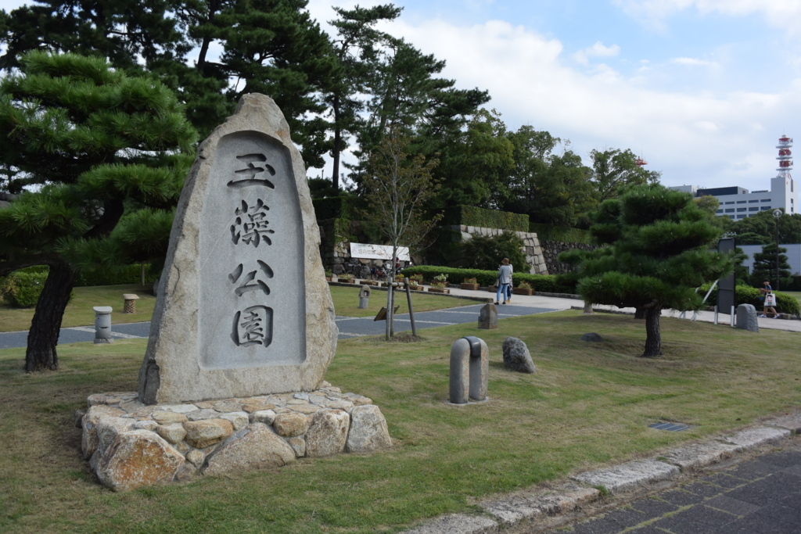

JR 高松駅（すげぇぜ？　<b>四国なのに自動改札機がある！！</b>）から歩いて10分足らずのところに“<b>玉藻公園</b>”という公園があります。昔はここに<b>高松城</b>があったのだとか。万葉歌人・柿本人麻呂が讃岐国の枕詞に「玉藻よし」と詠んだことに因み、このあたりは“玉藻の浦”と呼ばれていたそうで、高松城の異名も“<b>玉藻城</b>”というらしい。――で、玉藻って一体なんやろな。なんか北海道のお土産に売ってるやつとは違うんだろうけど……。

ちなみにすぐ隣に見えるのは、ことでん（高松琴平電気鉄道）の高松築港駅ですね。JR 高松駅と高松築港駅、連絡していればいいのにと思うのですが、地元の人もそう思っていたようで、かつてはそういう計画もあったそうな。

<h3>高松城の由来</h3>

高松城は天正15年（1587）豊臣秀吉から<s>うどん県</s>讃岐一国を与えられた<b>生駒親正</b>によって、翌16年（1588）に築城が開始されました（玉藻公園にあった説明より）。縄張りは藤堂高虎、黒田孝高（如水）、細川忠興など諸説があります。個人的には藤堂高虎が好きそうな縄張りだなーって思いますケド。

生駒親正は割りとマイナーなヒトかなと思いますが、一応秀吉の三中老の一人（残りは中村一氏、堀尾吉晴）。信長の美濃攻めから織豊に使えた古参です。コツコツ昇進して近畿に近い讃岐を与えられた点、三好・十河の影響を断つためにいろいろ画策してたっぽい点（十河存保の嫡男千松丸を預かって養育してたけど若死。毒殺説もある）、関ヶ原でどっちつかずの態度を取りつつも家を保った点（自分は西軍につくも、息子は東軍に参加して功績を上げる）など、ハデさには欠けるもののなかなか保身に巧みだったようなイメージがあります。

この生駒氏は4代54年続きましたが、4代高俊が美少女大好きなダメ人間で、家中は分裂（生駒騒動）。代わりに水戸藩初代藩主・徳川頼房の子の<b>松平頼重</b>（水戸黄門のお兄さん）が12万石で入封し、小倉城を模した層5階の天守を築くなど、城を大改築したんだそうな。飲料水確保の水道なんかも作ってて、頼重さんは割りと名君な感じ。さすが黄門さまのお兄ちゃんだよ。

ちなみにこの家は幕末まで続き、水戸宗家を継いだり、最後の将軍・慶喜を輩出したりしています。

<h3>石的なもの</h3>

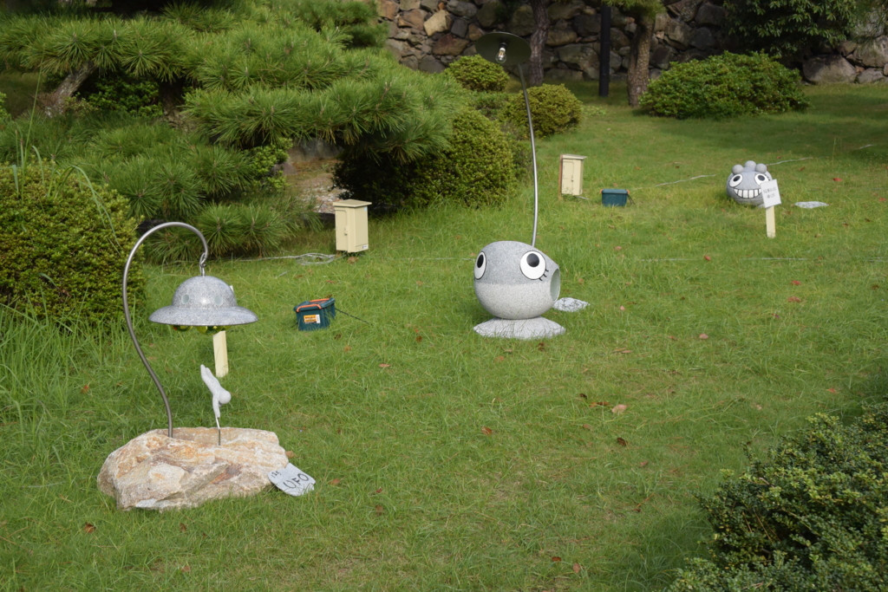

玉藻公園（有料）にはいると、なんか謎の石細工が置いてありました。

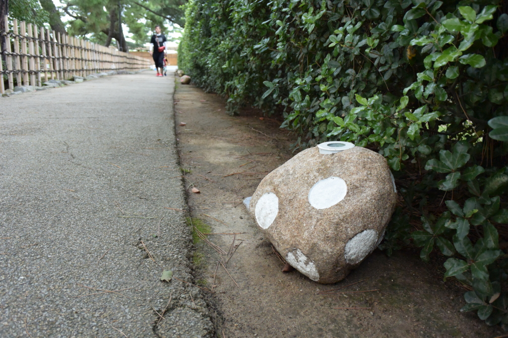

あちこちにちょこちょこ置いてあったのですが、なにかのイベントでもあったのかな？

前回、屋島にきたときも思ったのですが、この地方は石材屋さんを目にすることが多いし、石細工が盛んなのかな。石切り場とかもたまに見るし、石が豊富な地方なのかもしれませんね（そういうのに疎くて……よく知らなかったり）。

<h3>蛸橋</h3>

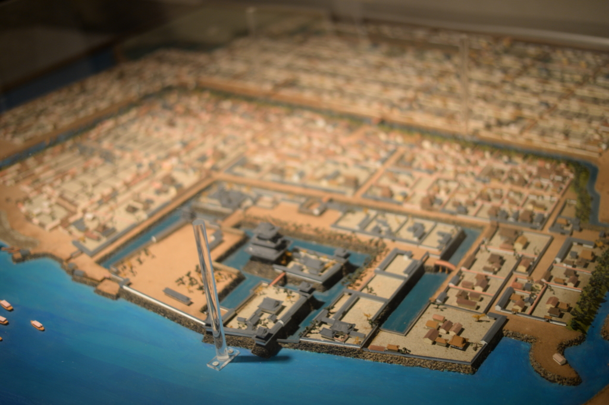

高松城は海に面した海城。かつては3重の堀に囲まれていたようですが、現在残るのは本丸と二の丸を囲む一番内側の堀だけです。

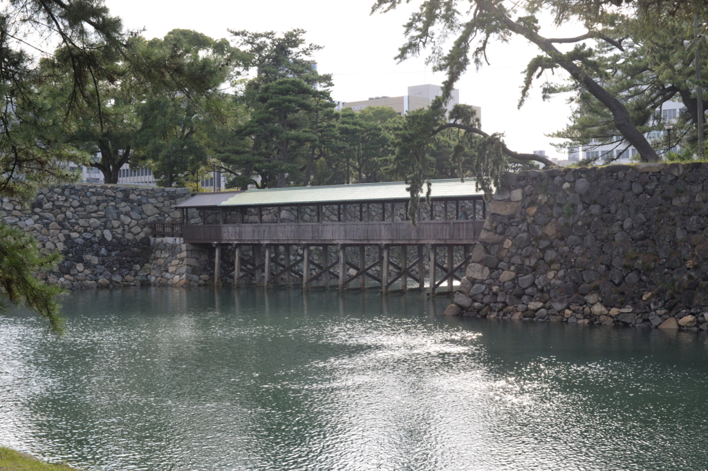

本丸と二の丸を繋ぐのは、一本の橋だけ。二の丸まで踏み込まれたら、この橋を落として城を枕に討ち死に必至や……。

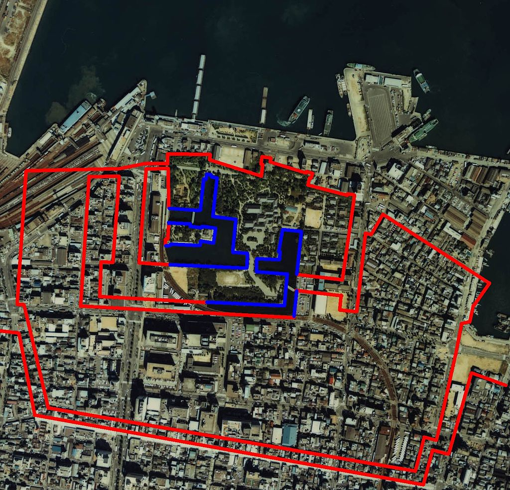

そもそも、この城の構造自体はわりかしシンプル（と素人的には見える）。防御のことはもちろん考えているんだろうけれど、どっちかっていうと政治・経済の中心地に建てましたって感じがしますね。堀に海水が引き込んであるのは高虎好みな気がするのですが、構造に工夫が少ないところはちょっと高虎らしくない気もするので、やっぱり縄張りは別の人かもしれない。

<h3>本丸</h3>

さて、この橋を渡ると天守閣の建つ本丸へ――といいたいところなんですが、それは明治の中頃に老朽化の為取り壊してしまったのだそう。

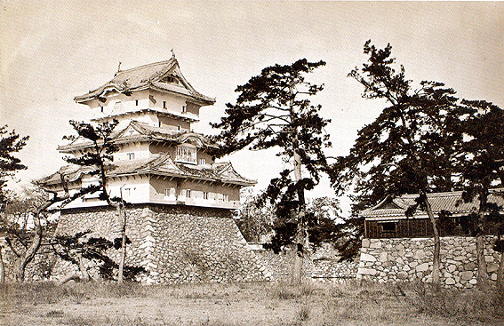

今は天守台が残るのみです。

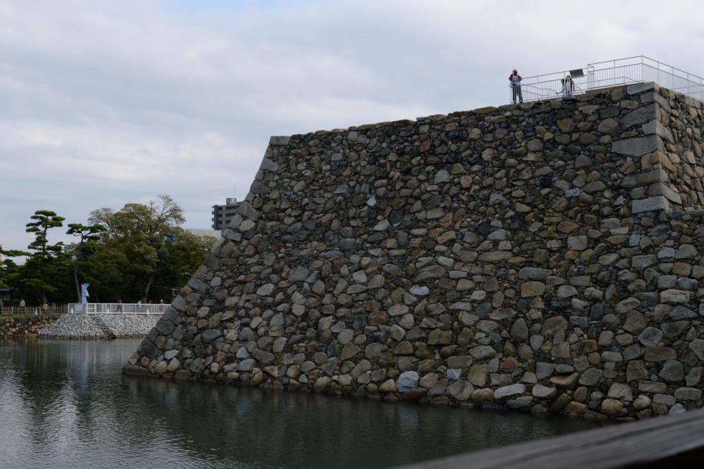

最近はこの天守台をめぐる舟（和船「玉藻丸」）に乗ることができるみたいで、のんびり水上散歩を楽しんでいる人たちがいました。

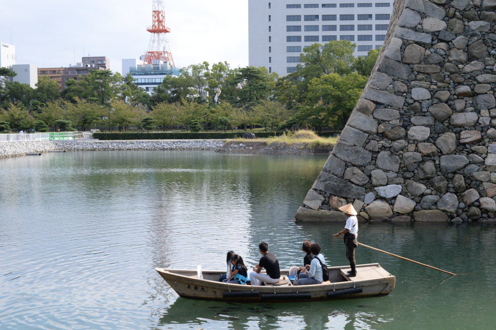

僕も乗りたかったのですが、残念ながらその日の便は終わってしまっていて乗れませんでした／(^o^)＼

<h3>海への玄関</h3>

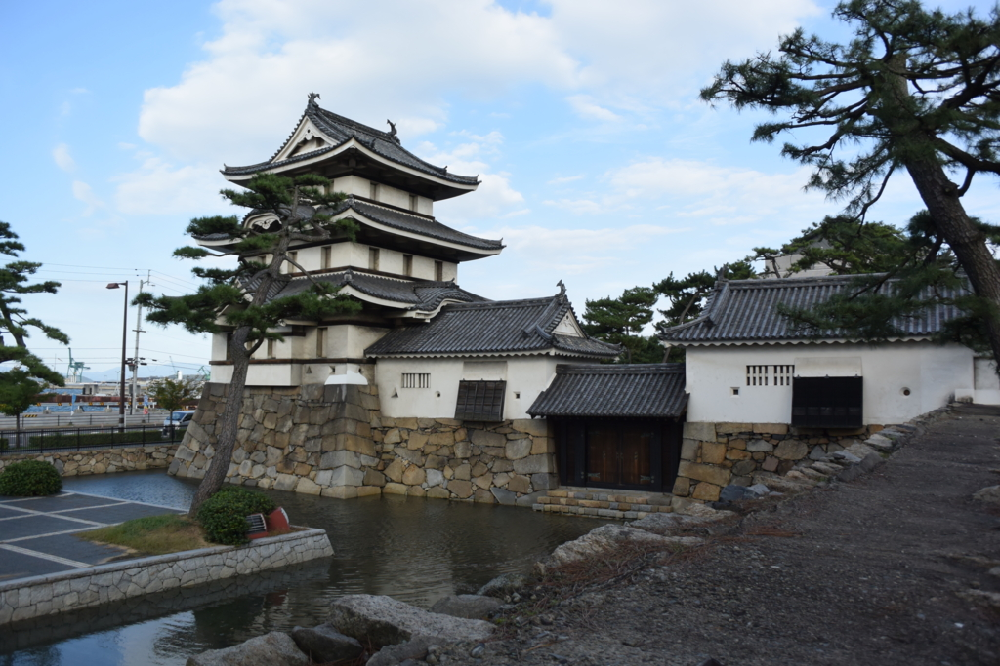

天守閣のない高松城ですが、一番の見所といえば北の丸の月見櫓・水手御門でしょうか。ぶっちゃけこれ単体でも宇和島城の天守閣とタメが晴れそうな立派さだなー。

水手御門は海城の正門。城主はこの門から小舟に乗り、沖に止まった大船に向かったのだそうです。城主の船が着くのを見るから「着き見」≒「月見」櫓。海に出る月をみても風流でしょうね。

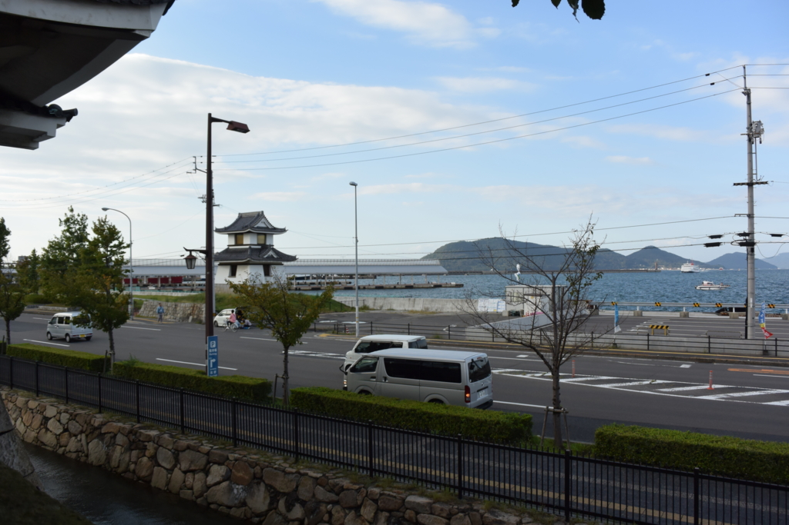

今でも塀から頭を出せば、フェリーの入ってくる高松港が望めるのだぜ！

そのほかにも旧松平家高松別邸・披雲閣などが見どころのようです。なんかいい感じのところでしたよー。

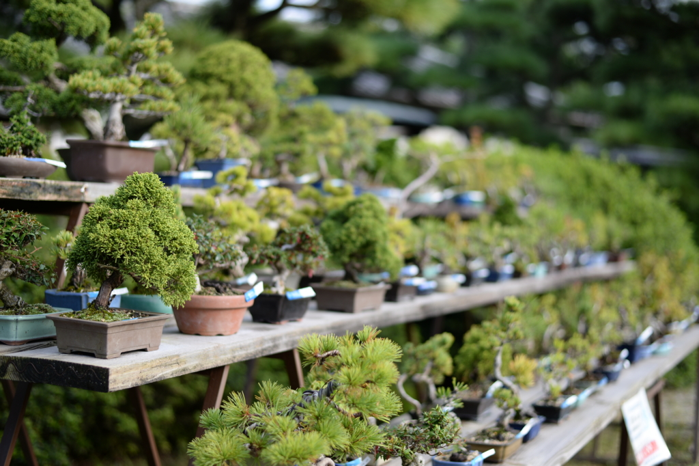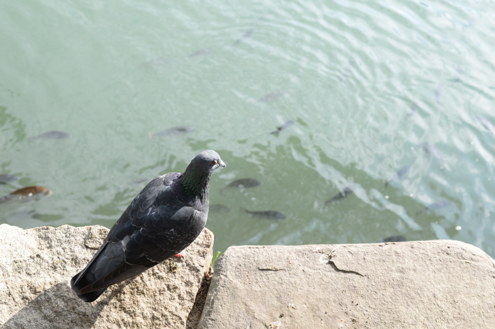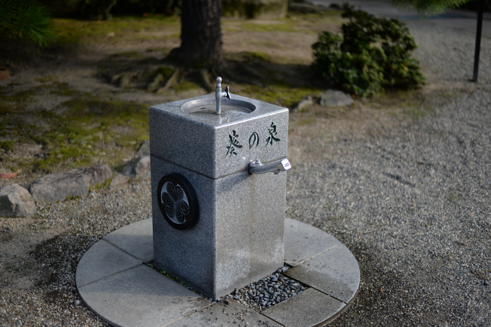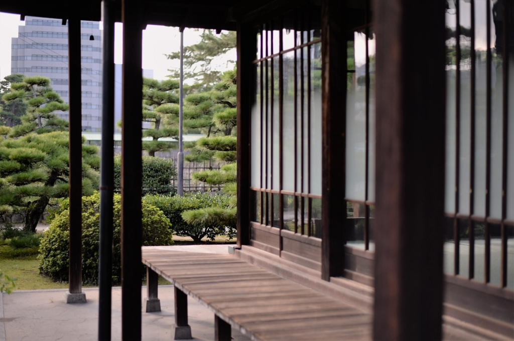

松山城と比べるとこじんまりしていますが、標高差がない分、気軽に寄れる感じ。いろいろイベントもやっているみたいで、身近な雰囲気がありました。潮の香りのするしろってなんかいいですよねー。管理大変そうだけど！

