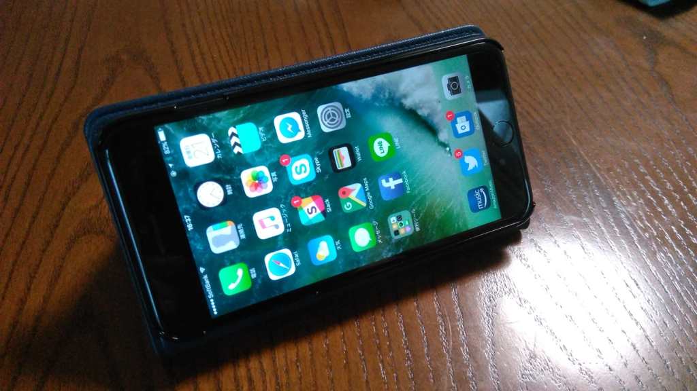
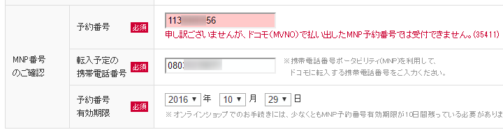

このまえ Zenfone Max を買ったばかりなので必要ではないのだけど、Apple Pay とか SUICA とかに興味が湧いたので購入。でも、買ったあとに気付いたんだけど、愛媛ではあんまり SUICA 意味なかった。東京へ行ったときに活躍してもらおうと思う。

<h3>IIJ → メジャーキャリアへの MNP が面倒くさかった</h3>

なぜか事務で色々詰まって、時間がかかってしまった。時系列で並べると――

<ul>
<li>09月09日：iPhone 7 の予約開始</li>
<li>09月09日：IIJ で MNP 転出手続き（←！）</li>
<li>09月10日：MNP 予約番号が発行される（9月24日まで）</li>
<li>09月11日：ソフトバンクで予約してみる</li>
<li>09月14日：<b>IIJ から MNP 転出完了の誤報</b>（←！）</li>
<li>09月16日：iPhone 7 の発売開始</li>
<li>09月21日：ソフトバンクからお届けまで時間がかかるとメールで連絡</li>
<li>09月24日：ソフトバンクから入荷の連絡（期限は9月27日まで）。IIJ で MNP 転出手続き（2回め）（←！）</li>
<li>09月26日：MNP 予約番号が発行される。ソフトバンクで本申し込み開始するも<b>身分証明書の再提出を何度も求められるエラー</b></li>
<li>09月27日：ソフトバンクに電話で確認。なんか MNP の事務手続きのミス（これは僕のミスかも）で、もう一度最初からやり直せと言われてやる気喪失。</li>
<li>10月04日：ドコモでもう一度予約</li>
<li>10月14日：ドコモから入荷の予約。IIJ で MNP 転出手続き（3回め）。念のためソフトバンクでもう一度予約（2回め）（←！）</li>
<li>10月15日：MNP 予約番号が発行される。<b>ドコモでの手続き失敗。</b>ソフトバンクから入荷の連絡するが<b>手続き失敗</b>（←！）</li>
<li>10月20日：エディオンへでかけて iPhone 7 Plus を買う</li>
</ul>
よく読まないと意味分かんないと思うし、よく読んでも意味分かんないと思うので、これからやる人がきをつけたほうがいいのかなと思うことだけ挙げると――

<h4>MNP 転出手続きは、入荷案内がきてからでよい</h4>

IIJ では MNP 予約番号の発行に最大4日かかる（実際は1日ぐらいで出る）。それを見越して入荷案内がくるまえに転出手続きを始めてみたが、これが失敗。 

オンラインで端末を買う場合は、MNP 予約番号の有効期限が10日程度残っている必要があるので、先走って予約番号を取得してしまうと、<b>入荷案内がきた時点で有効期限が足りなくなる</b>ことがある。

ソフトバンクでは入荷案内から本申し込み完了までに数日間の猶予しか設けられていないので「MNP 予約番号の発行に最大4日かかる」という注意書きが気になってしまうけれど、入荷案内のあとに MNP 転出手続きをした方が間違いが少ないと思った。

<h4>MNP 予約番号を発行したあと、何もしなければ契約は継続</h4>

<blockquote class="twitter-tweet" data-lang="ja">
本日、MNP予約番号発行中のお客様において、実際にはMNP転出をしていないにも関わらず、MNP転出完了のお知らせメールが発行されデータ通信ができない障害が発生しておりました。お客様にご迷惑をおかけしましたことを深くお詫びいたします。<a href="https://t.co/gdec7Wq1r2">https://t.co/gdec7Wq1r2</a>
&mdash; IIJmio (@iijmio) <a href="https://twitter.com/iijmio/status/776224441059553280">2016年9月15日</a></blockquote>

IIJ のミスで予約番号を発行したあとすぐに転出完了のメールがきたのだが、予約番号を使って転出処理を行わなければ契約は継続。よくわかってなかったのでちょっと焦った。まだ何もやってないのに追い出されたのかと思ったぜ……。

<h4>IIJ → ドコモ の転出はできるはずだけどできないかも</h4>

できるという話だけど、できなかった。今回はどのキャリアでもよかったので（ただし au は除く）、ドコモはすぐに諦めてソフトバンクで処理を進めた。こっちでも事務のミスでダメだったのは秘密☆（ゝω・）vｷｬﾋﾟ

<h4>MNP 転出のフォームは正確に書く</h4>

ミスすると受理されなかったり、最悪の場合、予約からやり直しになる。

ミスしてもそれがわかりにくいのもちょっと困るな。ソフトバンクの場合、1回目のミスは MNP 周りの情報の入力ミスなのに、返ってくるメールが「本人確認書類再提出のお願い」だったので、バカ正直に何回も免許証の写真をアップロードしてしまった。電話で話をしてようやく免許証の写真がおかしかったわけではないことが判明。無事、予約からのやり直しになった／(^o^)＼

ちなみに2回めの失敗は、住所を書いたときにマンション名の中黒（・）を忘れただけなのだけど（たぶん）、それだけでも電話問い合わせが必要になったりする。そして、電話はつながらない／(^o^)＼

<h3>結論</h3>

書類手続きが苦手な人は、<b>SIM フリー版を購入する or 店で手続きしたほうが早い。</b>さすがにここまで端末価格が高く、割引が効くとなるとなかなか SIM フリーでは買いづらいけど、一時的な出費さえ問題なければ SIM フリー版を買ったほうがいいと思った。今度はそうするつもり。

<h4>エディオンで iPhone 7 Plus を買う</h4>

そんなこんな、いろいろあって、今回は結局近くのエディオンで買うことにした。暇を見つけてバイクを駆り（久しぶりに GB250 だしたよ。近場だと気軽便利だな、やっぱり）、在庫の有無を聞いてみると、<b>ソフトバンクの iPhone 7 Plus（128GB）のジェットブラック</b>だけが1台残ってるとのことだったので、その場で購入した。ジェットブラックには興味がなかったのだけど、それしかないというのだからしょうがない。どうせケースかぶせるのに光沢もクソもないが、逆に言えばジェットブラックで困ることもない。

手続きは楽ちんだったのだけど、少し難儀したのが<b>追加サービスのお断り</b>。これが面倒でオンライン購入にこだわっていたのだけど、案の定めんどくさかった。「翌月に解約すればいいですから」といろいろ変なサービスを付けてくるが、これはガンとして断らなければならない。エラいヒトがでてきても、ガンとして断る。不退転の決意を示す。先方はだいぶ困っていたけれど（たぶん「<b>鬱陶しい関西弁のおっさんだな</b>」と思っていたはずｗ）、<i>「じゃぁ、データプランはギガモンスターの 20GB にします（どうせ通信量足りないし」</i>と提案してからはすんなり手続きが進んだ。追加サービスの押し売りするだけじゃなくて、こっちのニーズも汲んでくれれば気持ちよく取引できるのにね。

あと、受け付けのお姉ちゃんが最後、引き渡しの前に俺の iPhone をコソコソ触るのには難儀した。なんかソフトバンクのショッピングアプリを勝手にインストールして ID を設定していたみたいだけど（「ぜひよければこれで買い物をしてください」と案内された）、これは家に帰って速攻端末を初期化して消した。「MMS の設定をします」「連絡帳の移行はいかがですか」という提案も全部拒否、拒否、拒否。勝手にいじくり回すなクソがとおもったけど、なんか10,000ポイント付きの会員カードくれたから許した。しっかし、そこまで無理してポイントくれなくてもいいんだけどなぁ……なんかいろいろ本末転倒だなって感じた。個人的にはポイントが多いことより、こっちの都合を聞いてくれて、さっさと手続きしてくれた方が嬉しい。

えらく手間取ったけど、Apple Pay の開始前に手に入れられてよかった。iD だったら愛媛でも使えると思うのでちょっと楽しみ。

