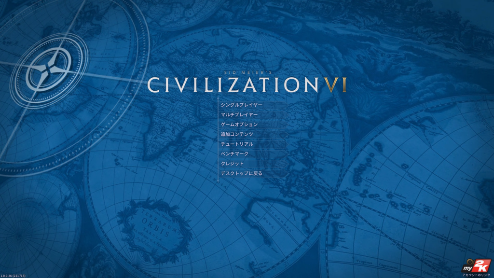
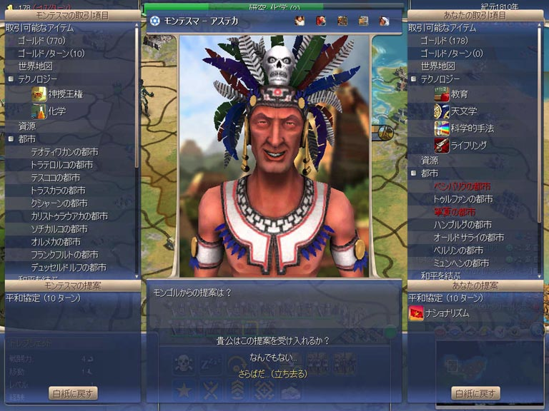
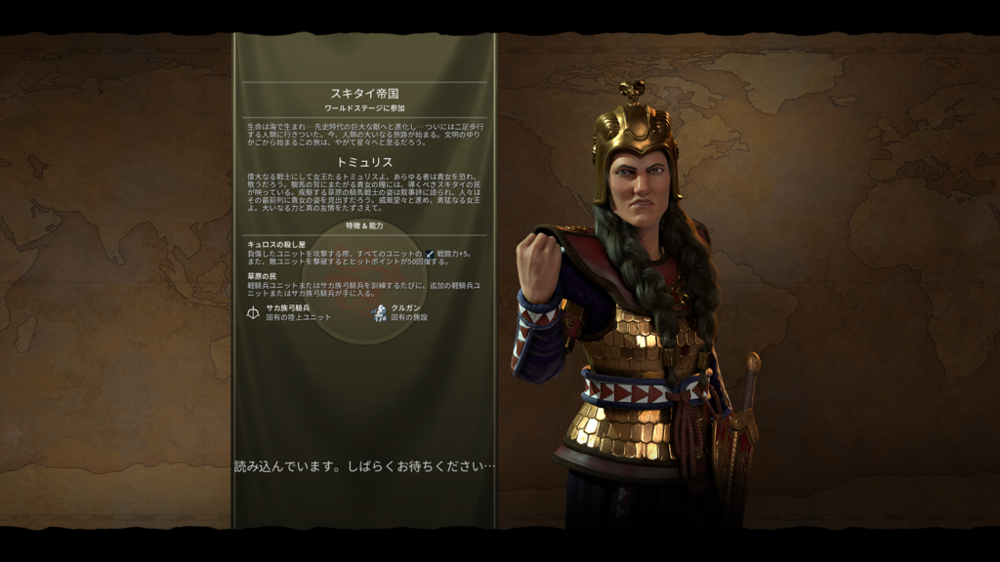
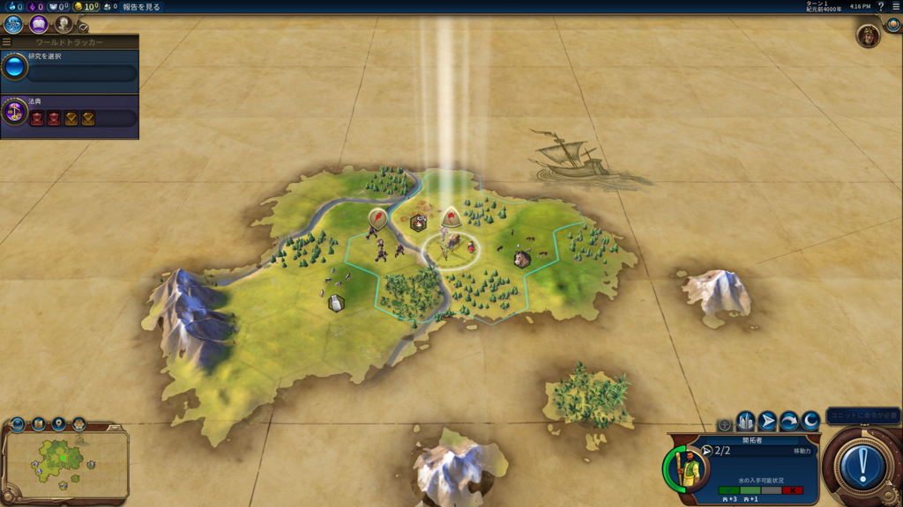
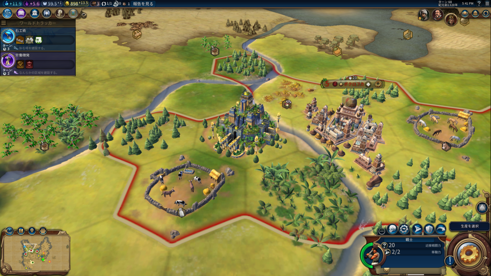
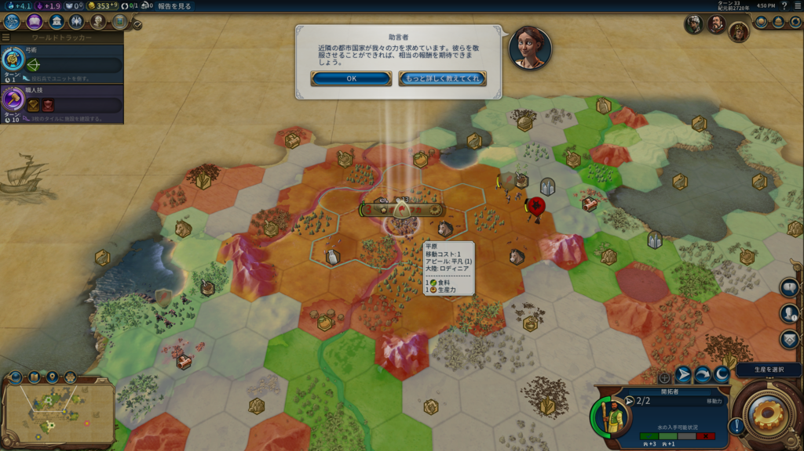

<b>お前は仕事を放置しているのだぞ（-10）</b>

<a href="http://www.amazon.co.jp/exec/obidos/ASIN/B01FQFL2K0/bestylesnet-22/">シドマイヤーズ シヴィライゼーション VI : デジタルデラックス [日本語:吹替え版] [オンラインコード]</a>
<ul><li>出版社/メーカー: 2K Games</li><li>発売日: 2016/10/21</li><li>メディア: Software Download</li><li><a href="http://d.hatena.ne.jp/asin/B01FQFL2K0/bestylesnet-22" target="_blank">この商品を含むブログを見る</a></li></ul>

パッケージ版を購入したので発売日当日にプレイというわけには行かなかったのですが、今日のお昼、無事届いたので、それからはずっと Civilization 6 をプレイして過ごしました。

<blockquote class="twitter-tweet" data-lang="ja">
Civ 6 が到着したら起こして頂戴（すやぁ
&mdash; だるやなぎ に天使が舞い降りた！ (@daruyanagi) <a href="https://twitter.com/daruyanagi/status/789572652776120320?ref_src=twsrc%5Etfw">2016年10月21日</a></blockquote>

<blockquote class="twitter-tweet" data-lang="ja">
寝てる間に Civ 6 がきて、そしてそのまま帰っていったらしい！！
&mdash; だるやなぎ に天使が舞い降りた！ (@daruyanagi) <a href="https://twitter.com/daruyanagi/status/789633502903832577?ref_src=twsrc%5Etfw">2016年10月22日</a></blockquote>

うたた寝している間にクロネコヤマトがきたらしく、一度受け取りを逃してしまったのは秘密。あと、パッケージを買ったら技術ツリーのポスターぐらいくれるんじゃないかと期待していたんですが、ディスクと紙っぺら2枚だけでした。普通にダウンロード版を買ったほうがいいと思います。

初回生産限定盤なら、みんな大好き「モンテスマ」が90日早く楽しめるぞ！　余と貴公でそれぞれ5万人ずつの奴隷を生け贄とし、この出会いを祝おうではないか。「<b>こんにちは、死ね！</b>」

<h3>スキタイ帝国の女王・トミュリスからスタート</h3>

前提知識はまったくないので（ゲームサイトをチェックするほどマメな男ではないのでな！）、初期設定でゲームを始めると <b>トリュミス</b> が選択された。聞き覚えのある名前だけど何をしたヒトかわかんないのでぐぐってみると、思い出したキュロス2世を倒したスキタイの女王か。

キュロス2世はハルパゴスを使ってメディアを倒し、ペルシアを建国した大王やな。イラク建国の父、というか大ペルシア帝国の創設者。中国で言えば始皇帝みたいなヒトやろうか。

<iframe src="https://hatenablog-parts.com/embed?url=https%3A%2F%2Fblog.daruyanagi.jp%2Fentry%2F2014%2F07%2F05%2F030732" title="今日の名言：「ば～～～っかじゃねえの！？」 - だるろぐ" class="embed-card embed-blogcard" scrolling="no" frameborder="0" style="display: block; width: 100%; height: 190px; max-width: 500px; margin: 10px 0px;"></iframe>

僕は Civilization を 2 あたりからやってるけど、一番好きなのは 4 やな。どことは言えないのだが 5 はちょっと苦手なんだけど、6 は割とすんなり入れた。

おっと、忘れてた。知らない人のために Civilization というゲームを簡単に説明すると、<b>文明を育てるゲーム</b>だ。敵を叩き潰してもよし、外交で屈服させるもよし、文化的に支配下においても勝利。ライバルに先んじて宇宙に進出し、アルファ・ケンタウリへの入植を果たすのもあり。とりあえず紀元年4000年から僕達がまだ見ぬ未来まで、文明をいい感じに育てればいい。筆記や青銅器なんかの技術を開発したり、未知の世界を探検したり、世界の七不思議を建設して他の文明を驚かせたり、槍兵・弓兵から最後は航空母艦・核ミサイルまで建造できるのも面白いんだぜ。

適当に首都を建設してスタート。今作のちょっとお面白いところは、

<ul>
<li>特定の条件を満たすと研究がブーストされる</li>
<li>政体を選択して、アジェンダカードをセットすることで文明の成長方針を決定
<ul>
<li>政体によってセットできるアジェンダの数やタイプに限りがあるみたい</li>
<li>アジェンダによって色んな要素がブーストされる。こまめに見直せば思い通りに文明を強化できそう</li>
</ul></li>
</ul>
かな？　<b>労働者を3回働かせると死んじゃう</b>ところとかは最初「アレ？」と思ったけど、まぁ、バランスはいいかもしれない。ホワイト企業なのかブラック企業なのか、よくわからんところあるな。

ちなみに死んじゃうのがもったいなくて労働者をケチってたら、土地の改良が研究のブースト条件になってたりしてあばばばってなった。バランス大事。

とりあえず世界遺産「<b>空中庭園</b>」をつくってみたやで。古代都市バビロンにほんまにあったらしいという世界の七不思議の一つやな。本作では都市タイルの外に遺産が建築されるんだな。そのほかにも「区域」という概念があって、都市郊外に軍事・研究・宗教・商業のための専門エリアを設けることができる。ここらへんはあまりまだよくわかっていないのだけど、「小屋を立てまくればいい」みたいな単純な都市改良ではダメそう。外交周りも前作より面白いかなって思った。

あと、日本語版は声優さんの吹き替えになってるんだぜ！　自分はあんまり声優さんの名前を知らんのだけど、<b>アドバイザーの女の人の声がやたら耳に心地よかった</b>。これは買いですゾ！（ぉ

