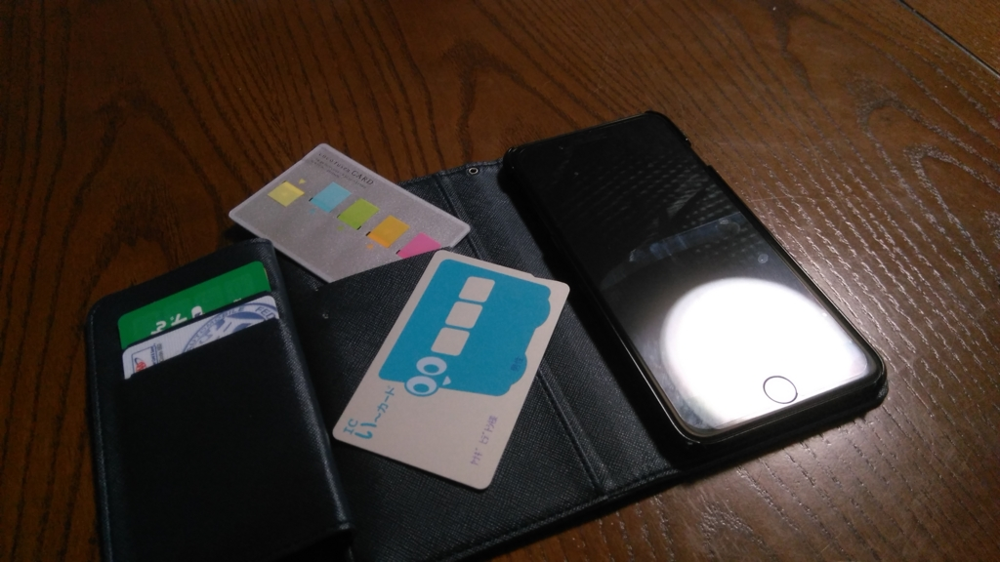
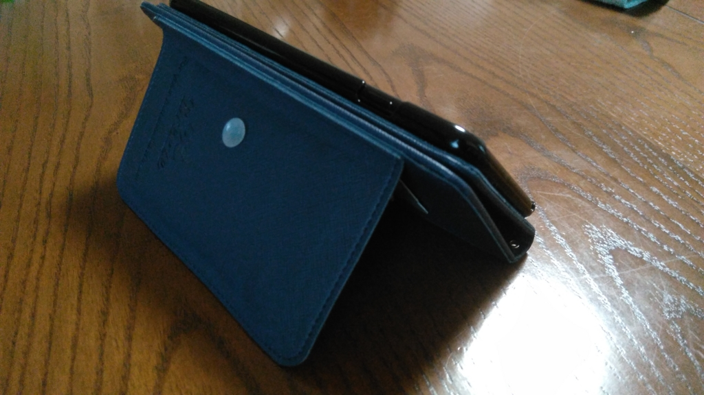

「<a href="https://blog.daruyanagi.jp/entry/2016/10/21/181102">&#x306D;&#x3093;&#x304C;&#x3093;&#x306E; iPhone 7 Plus &#x3092;&#x3066;&#x306B;&#x3044;&#x308C;&#x305F;&#x305E;&#xFF01; - &#x3060;&#x308B;&#x308D;&#x3050;</a>」の続き。iPhone を手に入れる前に Amazon からケースが届いたのは秘密だ！

<a href="http://www.amazon.co.jp/exec/obidos/ASIN/B01LMUYSKE/bestylesnet-22/">[Breeze]iPhone7 Plus ケース apple iPhone7 Plus カバー アイフォン7 プラス ケース iPhone7 Plus 手帳型ケース iphone 7 Plus スマホケース iphone 7 Plus 手帳型カバー SIMフリー スマホケース 液晶保護フィルム付/全機種対応★NAVY</a>
<ul><li>出版社/メーカー: SmartTengoku</li><li>メディア: エレクトロニクス</li><li><a href="http://d.hatena.ne.jp/asin/B01LMUYSKE/bestylesnet-22" target="_blank">この商品を含むブログを見る</a></li></ul>

今回買ったのはコレ。お値段は2,220円。

東京にいたころはメタルバンパー信者だったけど（薄さは正義！）、愛媛では四六時中触るわけでもないので手帳型が好み。端末も大型化してきたしね。そのほかにも合わせて、細かい要求仕様をザッと挙げると――

<ul>
<li><b>手帳型</b></li>
<li>いよてつカードを入れたいから<b>カードを入れるところ</b>はほしい</li>
<li><b>マグネットボタンで止めるタイプはなるべく避けたい</b>。磁気カードを壊す</li>
<li><b>背中にアップルロゴのための穴が空いてあるやつは生理的嫌悪を覚える</b>のでナシ</li>
<li>折りたたみで自立できるタイプもあんまり好きじゃない（背中の折れ線がイヤ</li>
</ul>
みたいな感じ。条件が多すぎて、豊富な在庫を誇る Amazon ですらほぼ一択になってしまった。隅のダサいロゴが少し可愛らしくもあるので、本当は女性向けなのかもな。

こいつが少し変わっているのが、<b>小型の吸盤でフタを閉じておける</b>こと。ボタンは圧力が一点に集中してスクリーンを割る恐れがあるし、マグネットは磁気カードをダメにするおそれがあるので、吸盤というのは工夫したな。吸着力はそれほどないので、カッチリとフタが閉まらないとイヤなヒトには向かないかもしれないけれど。自分はフタがペラペラあいていても気にしないので、むしろ何もなくていいぐらい。使ってて気に入らなければ取っ払ってしまおうかと思っている。

あと、<b>カードホルダーの部分は折りたたみ</b>になっており、ポケットが4つもある。若干分厚くなるのがデメリットだが、スクリーンにカードの跡がつかないみたいなメリットがある。これも気に入らなければ切り取ってしまおうと思っているけど、今のところ便利なので残している。むかしロフトで買った名刺カードサイズの付箋紙を挿してみたけど、いい感じ。

カードホルダー部分をうまく使えば、動画鑑賞用に立てることもできないことはない。ケースの背面を折りたたんで自立するタイプと比べると安定性は劣るけど、ぶっちゃけそんなに使う機能でもないしね。コレで十分だと思う。

