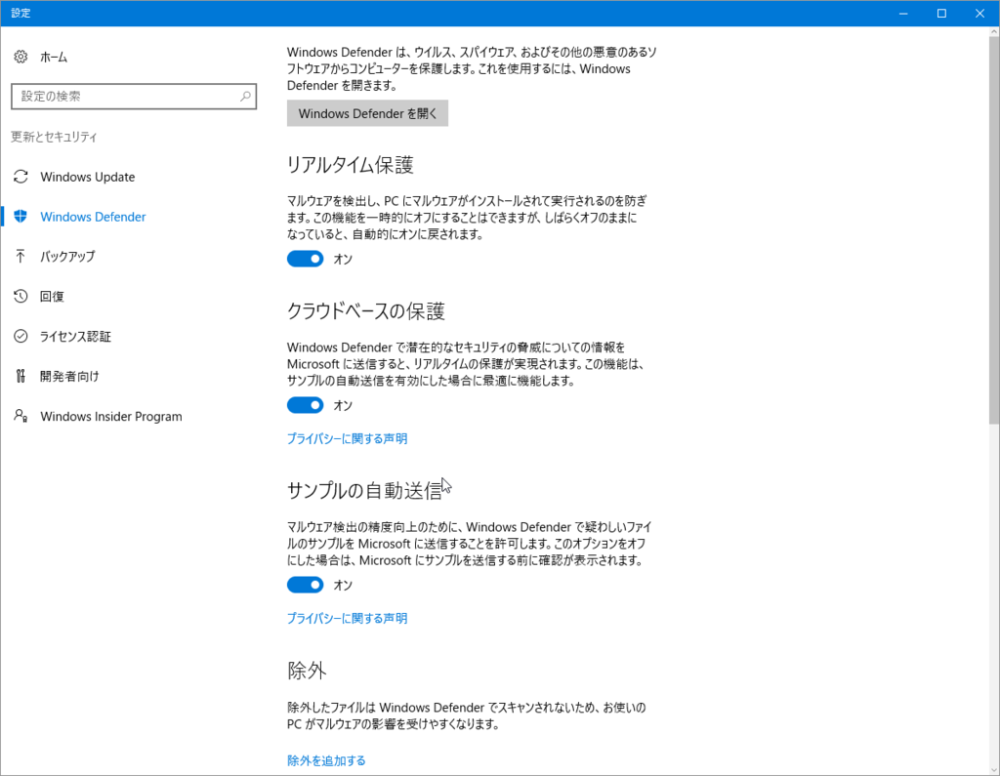
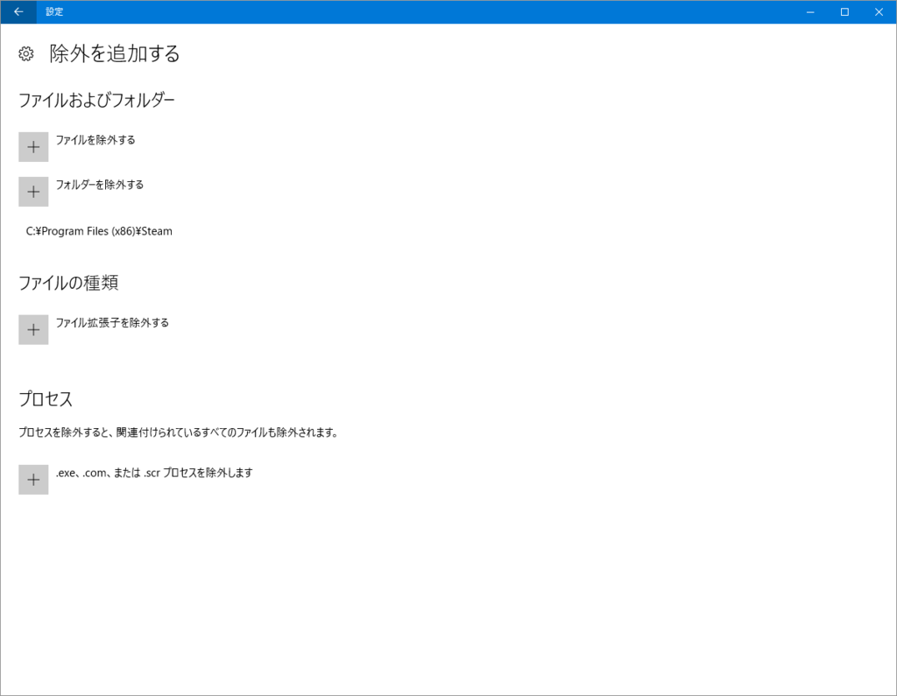

昨日から急に Civilization 6 のロードが遅くなった。とくに新規ゲーム画面で読み込みが終わらず、ゲームが開始されないのは痛い。

調べてみると、<b>Antimalware Service Executable</b> が CPU を食っていたので、たぶん Windows Defender が悪さをしているのだと思う。

「設定」アプリを開いて［更新とセキュリティ］－［Windows Defender］－［除外を追加する］画面を開き、Steam のアプリフォルダー（<b>C:\Program Files(x86)\Steam</b>）を丸ごと除外指定したら、正常にゲームがロードできるようになった。あんまりお勧めできない方法かもしれないけど、急場しのぎとして。

