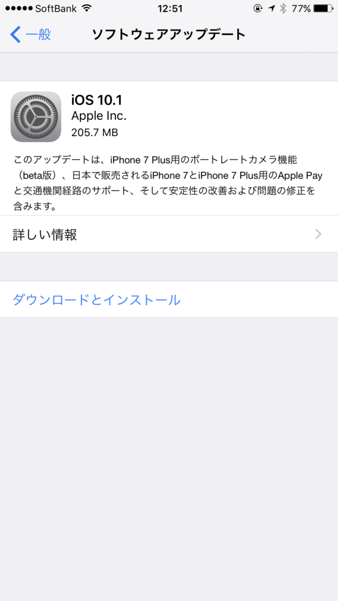

Apple Pay が使えるようになったので、手持ちのカードを登録してみた。

<h3>まずは OS のアップデート</h3>

 

とりあえず iOS を 10.1 へアップデート。これで「Wallet」アプリにカードを登録できるようになるらしい

<h3>カードの登録</h3>

現在の手持ちのカードは以下の通り。

<ul>
<li>ANA ワイドゴールドカード（VISA、三井住友カード。Apple ID の決済に利用）</li>
<li>Amazon MasterCardクラシック（Master、三井住友カード）</li>
<li>SUICA（記名式、東京にいるときに定期券として使っていた）</li>
</ul>
 

Apple ID の決済用として登録していた ANA カードは、セキュリティコード＋（SMS などを利用した）認証コードを入れるだけで登録できた。

 

新規登録となる Amazon のカードは、写真を撮ってカード番号を読み取るタイプだった。これも楽ちん。オンラインショッピングで毎回カード番号を入れてるのがアホクサくなる簡単さだな！

ちなみに、この2つのカードは 三井住友カード が発行しているので、コンビニなどで <b>iD として利用できる</b>。でも、クレジットカードとして使えるのは MasterCard の Amazon カードの方だけっぽい。Apple Pay を利用した Suica チャージができるのは Amazon のカードの方だけだった（オートチャージサービスへの登録は可能みたいだけど）。マイルを貯めるために ANA ワイドゴールドカードをメインにしつつも、それが使えないときは Amazon カードを使うことになると思う。

ついでなので 5000円もらえるキャンペーンにもちゃんとエントリー。

<iframe src="//hatenablog-parts.com/embed?url=https%3A%2F%2Fwww.smbc-card.com%2Fmem%2Fcardinfo%2Fcardinfo7020932.jsp" title="先着5万名 Apple Payの「iD」でのご利用を5,000円まで負担！｜クレジットカードの三井住友VISAカード" class="embed-card embed-webcard" scrolling="no" frameborder="0" style="display: block; width: 100%; height: 155px; max-width: 500px; margin: 10px 0px;"></iframe><cite class="hatena-citation"><a href="https://www.smbc-card.com/mem/cardinfo/cardinfo7020932.jsp">www.smbc-card.com</a></cite>

早い者勝ちっぽいので、乞食したい人は今すぐ Go だ。

あと、Amazon Mastercard の還元率もなぜか上がってた（クラシックは 2％。ゴールドは 2.5％）。Apple Pay がらみなのかどうかは知らないけど、お得になるのはうれしいな。

<iframe src="//hatenablog-parts.com/embed?url=https%3A%2F%2Fwww.amazon.co.jp%2Fgp%2Fbrowse.html%2Fref%3Dpe_09%2Fref%3Djp_cbcc_pb_trm%3Fie%3DUTF8%26node%3D4715302051%26plattr%3DJPCBCCPBTRM" title="Amazon.co.jp: Amazon Mastercardがさらにおトクに: ファイナンス" class="embed-card embed-webcard" scrolling="no" frameborder="0" style="display: block; width: 100%; height: 155px; max-width: 500px; margin: 10px 0px;"></iframe><cite class="hatena-citation"><a href="https://www.amazon.co.jp/gp/browse.html/ref=pe_09/ref=jp_cbcc_pb_trm?ie=UTF8&node=4715302051&plattr=JPCBCCPBTRM">www.amazon.co.jp</a></cite>

 

一方 SUICA の登録は、モバイル SUICA がダウンしていたらしく、なかなかうまくいかなかった。<b>JR 東日本の「Suica」アプリ</b>を使ってカードを新規に登録すればよさそうだったけど、カードが増えても仕方ないと思い、夜まで待って登録。登録したカードはデータが iPhone に移行されるらしいので、捨ててしまってもよい。かなり長い間使ったけど、これでおわかれだなー。おおきにおおきに。

「Suica」アプリをいじくってたらいつの間にか 1000円 チャージされてたんだけど、この辺りは使いながら追々マスターしていこうと思う。まずは近所のローソンで iPhone のかざし方の修行をしてくる( ｰ`дｰ´)ｷﾘｯ

