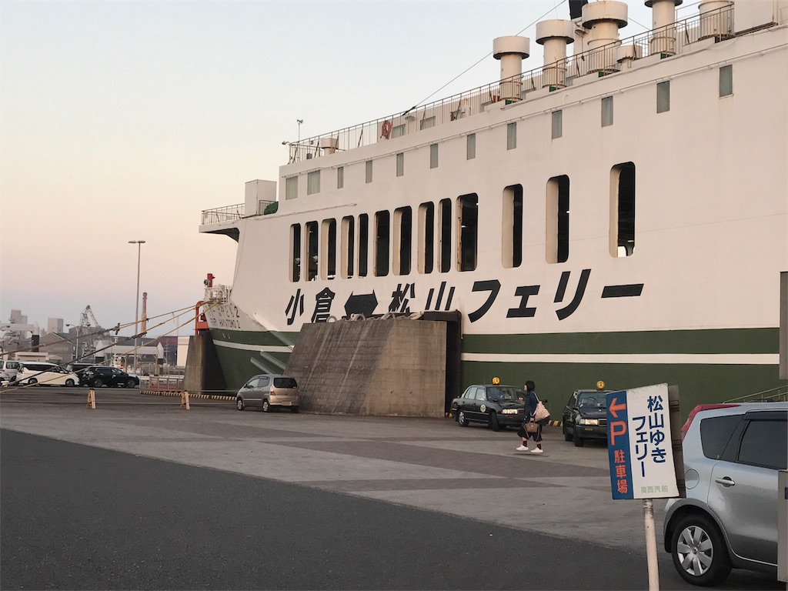
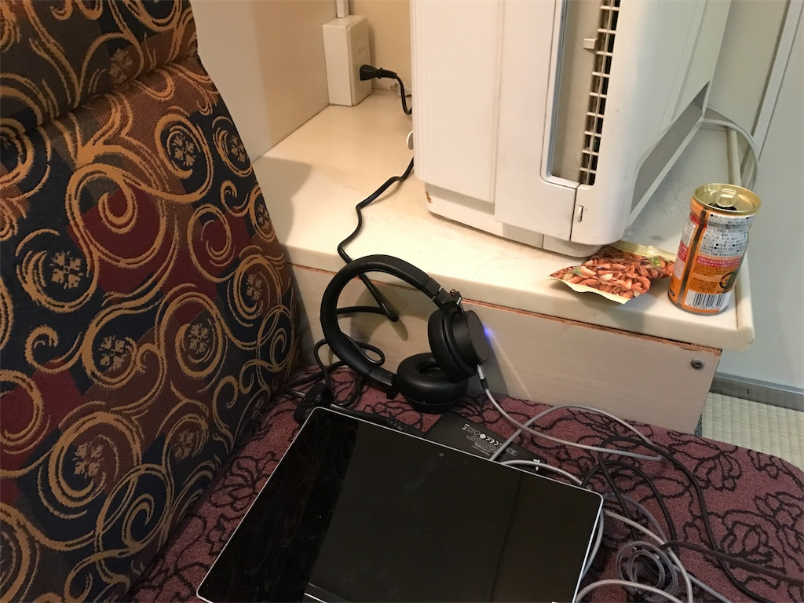
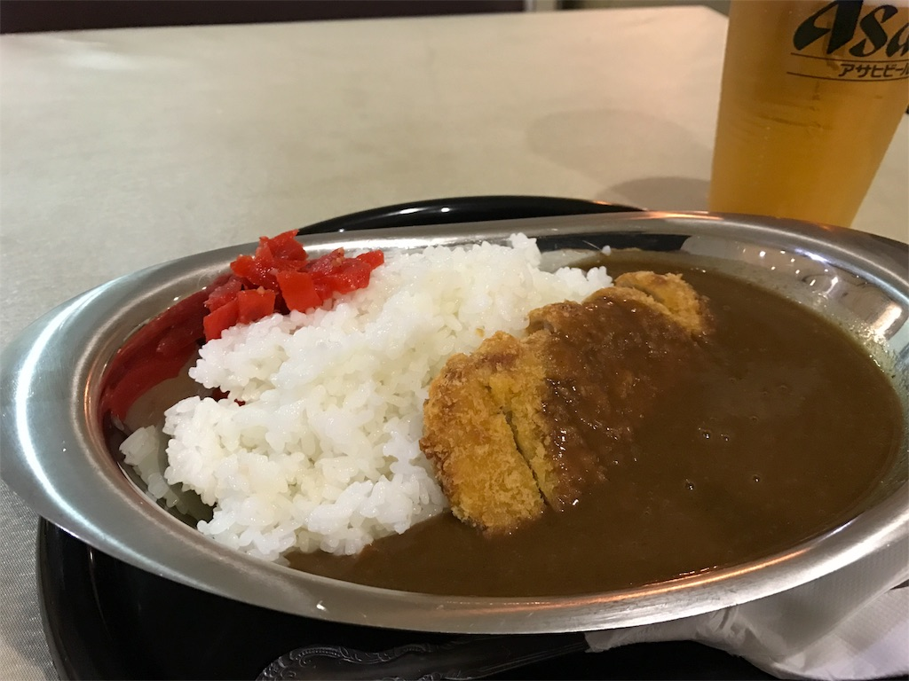

プロ生勉強会・熊本へ参加するために、四国を出国。当初はバイクで

 

行き: 松山 → （フェリー） → 別府（宿泊）→ 阿蘇 → 熊本

帰り: 熊本 → 小倉 →（フェリー）→ 松山

 

というルートで行くつもりだったが、またバイクのバッテリーが上がっちゃった（マジで新しいの買わないと……）ので、急遽往復とも小倉フェリー＋新幹線に切り替えた。電話でフェリーのバイク乗船をキャンセル＋往復割引の手続きをしたが、とても丁寧に対応してもらえた。

 

さて。

 

松山 ⇄ 小倉のフェリーは2度目だけど、松山 → 小倉 へ行くのは初めて。今回は「はやとも（早鞆）」という船だった。前回の教訓を踏まえモバイルバッテリーを携帯していったので、iPhone のバッテリーに困ることはない。

 

（一応朝の船内休憩時に広間で電源補給）

 

松山 ⇄ 小倉 のフェリーは 東予 ⇄ 南港 のフェリーに比べてひとまわり小さい。当然食堂もショボいのだが、客同士が自然と席を譲り合う雰囲気は嫌いじゃない。おばちゃんやおっちゃんの伊予弁が飛び交うのもまたいいものだ。

 

 

ご飯はまた じゃこカツカレー にした。じゃこカツはトンカツよりも軽く、胃に優しい気がする。それでいてそれなりのボリュームはあるので、自分のような食い意地の張ったおっさんには適している。

 

それでも2杯目のビールを頼む頃にはカレーも尽きてしまう。そこでおつまみに唐揚げを追加したが、生憎の品切れ。それではとポテトも頼むが、それもない。では何があるのかというと、冷えたイカフライが一パックあるのみだという。仕方がないのでそれを頼むと、厨房のおっちゃんがオツマミの菓子を一袋おまけしてくれた。

 

ヌクモリティ。
