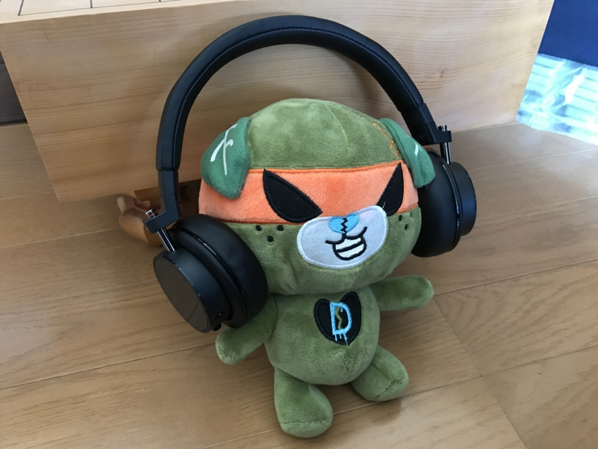
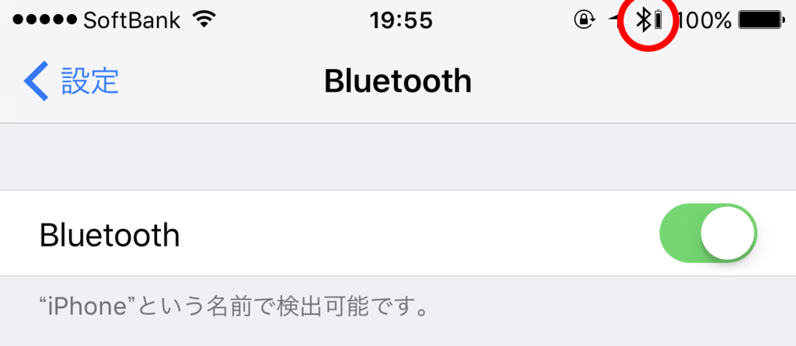

iPhone 7 Plus にはヘッドフォン端子がないので、Bluetooth なヘッドフォンを買った。いろいろ考えたのだけど、見た目で ONKYO H500BT をチョイス。

<a href="http://www.amazon.co.jp/exec/obidos/ASIN/B019IRV13A/bestylesnet-22/">ONKYO ワイヤレスヘッドホン 密閉型/Bluetooth・NFC対応/ハイレゾ音源対応/リモコン・マイク付 ブラック H500BTB</a>
<ul><li>出版社/メーカー: オンキヨー</li><li>発売日: 2015/12/17</li><li>メディア: エレクトロニクス</li><li><a href="http://d.hatena.ne.jp/asin/B019IRV13A/bestylesnet-22" target="_blank">この商品を含むブログを見る</a></li></ul>

<h3>接続</h3>

iPhone 7 Plus に接続する分にはまったく問題がなかった。ちゃんとバッテリーの残量がみられるのもいいね！

<a href="http://www.amazon.co.jp/exec/obidos/ASIN/B01CG5DFIA/bestylesnet-22/">Aukey bluetooth ヘッドセット ワイヤレスイヤホン 耳掛け式 iPhone 6S, 6S Plus,sony, Android スマートフォンなど対応 (ブラック) EP-B26</a>
<ul><li>出版社/メーカー: AUKEY（オーキー）</li><li>メディア: エレクトロニクス</li><li><a href="http://d.hatena.ne.jp/asin/B01CG5DFIA/bestylesnet-22" target="_blank">この商品を含むブログを見る</a></li></ul>

手持ちの Aukey EP-B26 でもこのバッテリーインジケーターはでるのだけど、なかにはでない機種もあるみたい。ちょっと不安だったので Amazon で「バッテリーの残量はみられますか？」と聞いたのだけど（最近はコミュニティベースの質疑応答機能があるんだね）、

<blockquote>

私は iPhone をもっていないのですが、ダメだと思います。

</blockquote>

っていう謎な返事をもらった。Yahoo! 知恵袋とかにもたまにいるけど、知りもしないのにわざわざ答えを書き込むやつ、脳味噌腐ってんのかな？　思考回路が謎だ。

さて、ついでなので Windows でも使いたいなって思ったんだけど、そっちはダメだった。音がブチブチ切れて使い物にならない。あちこちガチャガチャいじったら一瞬うまくいったので、もしかすると設定次第でなんとかなるのかもしれないけれど、面倒くさいので iPhone 専用で使うことにする。

<h3>音質</h3>

正直、参考価格 37,584 円（実売は 26,340 円でした）の価値は感じなかった。ケーブル接続ならばハイレゾでも聞けるらしいが、あいにくハイレゾには興味なかった……そっちで使うならいいのかもしれない。今度なにか買ってみようかな？

<h3>スタイル</h3>

ヘッドフォンがカッコいいからといって、つけたヒトもカッコよくなるかって言うと、そういうことはない。単体だとコンパクト＆シンプルでかっこいいけれど、自分は頭がデカイので着けると浮いた感じになるな～。あと、締め付けももう少しキツいほうがいいかも。くしゃみしたらヘッドフォンが飛んでいった。ここらへんは好みにもよるんだろうけどね。

でも、タッチ操作で音量を変えたり曲を送ったりできるのは楽しい(*´ω｀*)

最初は操作を覚えるのが面倒かなって思ったのだけど、直感的ですぐに慣れた。ボタンを連打しなくても、指をスイーッと動かすだけで音量を変えられる。とはいえ、これに何万も出す価値があるかって言うと、それはヒトによるかなって感じ。

<h3>総評</h3>

むかし3万円ぐらいで買ったノイズキャンセリング付きの ONKYO ヘッドフォンが気に入っていたので、スタイリングの良さもあって買ってみたけど、ポテンシャルを引き出せていないかな。宝の持ち腐れかもしれぬ。まぁ、気に入ってないわけじゃないので、これからも末永く付き合っていきたいと思います(｀･ω･´)ゞ

