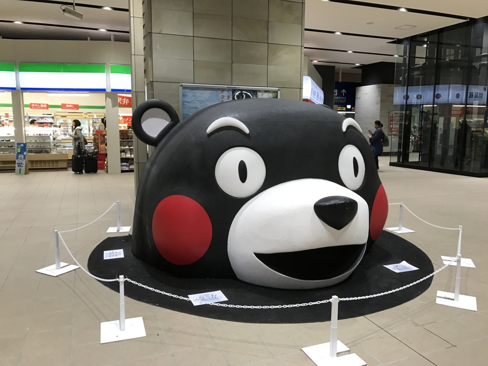
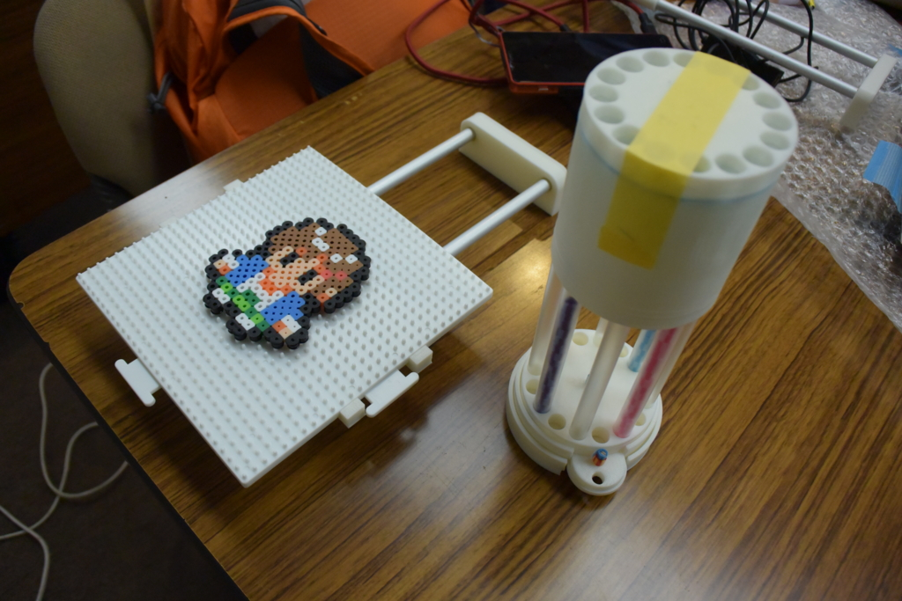
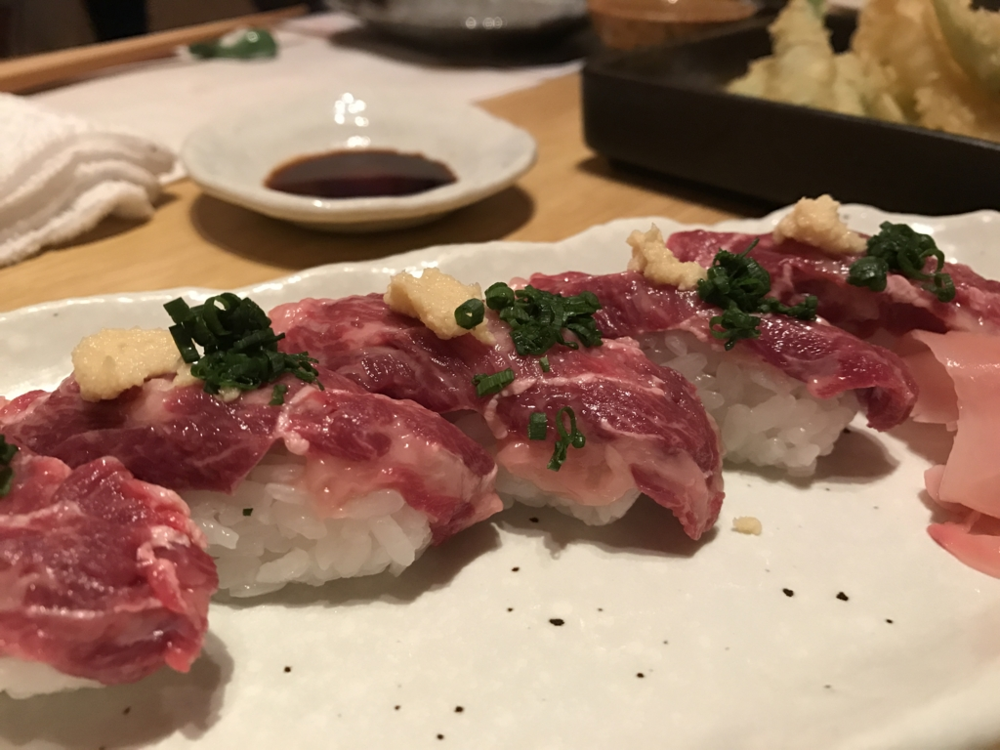
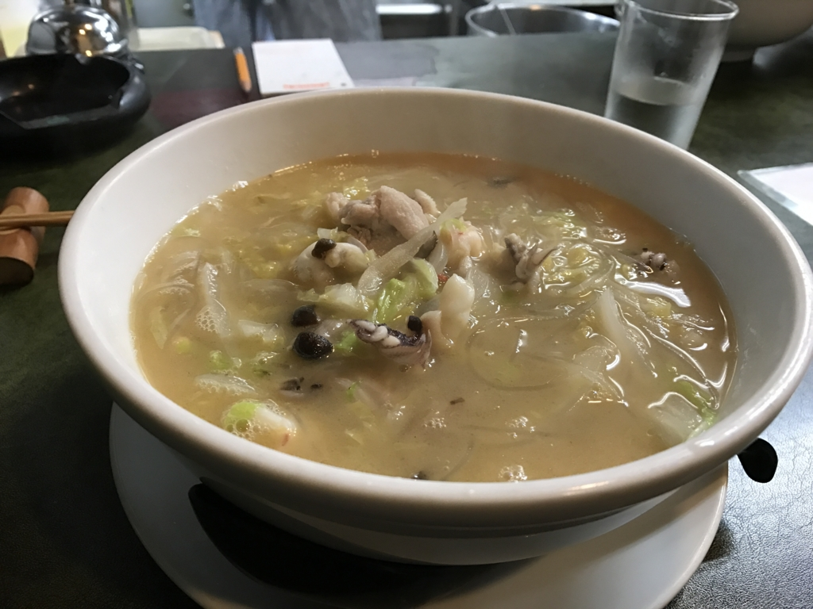

プログラミング生放送勉強会 第44回@熊本 #マスコットアプリ文化祭 に参加してきました！　熊本は生まれて初めてかも？

<iframe src="https://hatenablog-parts.com/embed?url=https%3A%2F%2Fatnd.org%2Fevents%2F82199" title="プログラミング生放送勉強会 第44回@熊本 #マスコットアプリ文化祭 : ATND" class="embed-card embed-webcard" scrolling="no" frameborder="0" style="display: block; width: 100%; height: 155px; max-width: 500px; margin: 10px 0px;"></iframe><cite class="hatena-citation"><a href="https://atnd.org/events/82199">atnd.org</a></cite>

当初はバイクで行くつもりだったんですけど、結局フェリー＋新幹線でいきました。

<iframe src="https://hatenablog-parts.com/embed?url=https%3A%2F%2Fblog.daruyanagi.jp%2Fentry%2F2016%2F11%2F05%2F073702" title="松山 から 小倉へ - だるろぐ" class="embed-card embed-blogcard" scrolling="no" frameborder="0" style="display: block; width: 100%; height: 190px; max-width: 500px; margin: 10px 0px;"></iframe><cite class="hatena-citation"><a href="https://blog.daruyanagi.jp/entry/2016/11/05/073702">blog.daruyanagi.jp</a></cite>

今度はぜひバイクで行きたいですねぇ。

<h3>セッション</h3>

参加者はそれほど多くはなかったけれど、登録者全員出席かな？　これは結構すごいかも。松山は人数増えてきたけど、その分無断欠席も増えましたからねー。懇親会でお話しした感じでは、高専のヒトが多かったのかな？　熊本にも高専あるんだね。次回はぜひ中心になって頑張ってほしいと思います！（別にプロ生じゃなくてもいいんでｗ

<h4>「すぱこーに学ぶアプリ開発の第一歩 〜考えるな、調べろ〜」 by You&I さん (@youandi)</h4>

プロ生ちゃんのWebコミック「すぱこー」から開発のヒントを得てみよう、みたいな感じだったと思います。

<iframe src="https://hatenablog-parts.com/embed?url=http%3A%2F%2Fpronama.azurewebsites.net%2Fweb-comic%2F" title="Web コミック「すぱこー」" class="embed-card embed-webcard" scrolling="no" frameborder="0" style="display: block; width: 100%; height: 155px; max-width: 500px; margin: 10px 0px;"></iframe><cite class="hatena-citation"><a href="http://pronama.azurewebsites.net/web-comic/">pronama.azurewebsites.net</a></cite>

ちなみに僕はフィネスちゃんがいいと思います！

<h4>「アイロンビーズプロッター作ろうとしてみた with プロ生ちゃん」by きりん さん (@kirin_nico)</h4>

アイロンビーズプロッターっていうものそれ自体をあまり知らなかったのだけど、なんか小さなパイプを組み合わせるアートらしい。これをロボットで作ろうぜっていう話。

最近は 3D プリンターなんかも普及してきて（＋それをターゲットに、使いやすい・無償で使えるモデリングツールもでてきた）、こういうのを作るハードルは低くなっているのかな。まぁ、それでもマイコンとか電子工作とか機械の設計とか、そういうのがトータルにできないと個人では難しそう。

<blockquote class="twitter-tweet" data-lang="ja">
スライドテーブルできた <a href="https://t.co/Mj9xhYZOEI">pic.twitter.com/Mj9xhYZOEI</a>
&mdash; きりん (@kirin_nico) <a href="https://twitter.com/kirin_nico/status/796385841501216768?ref_src=twsrc%5Etfw">2016年11月9日</a></blockquote>

ちなみに先日、いろいろ稼働するようになったらしい。完成が楽しみ。できたら、本人を脅しあげて だるやなぎ のアイロンビーズを作ってもらおうと思っています。

<h4>「『診る』人が見たアプリの通信と脆弱性の考え方」 by greenz さん (@greenz_greenz)</h4>

プロキシ型のパケットキャプチャー（なのかな？）を使ってソシャゲの通信の中身を見てみる、みたいな感じ。

自分は「Fiddler」しか知らなかったのですが（一応、本も持ってる！）、それ以外にもいろいろあるんだなーというのが一つの収穫（派閥抗争もあるらしい。こわいじぇ）。自分はわりと「艦これ」なんかの通信をたまにのぞいているのですが（別に悪いことをするつもりはなくて、興味本位）、デスクトップからだと割と簡単。モバイルは面倒くさそうかなって思ってたけど、今回のを見てまぁ、できそうかなーっていう感想をもちました。

あとは、アーキテクチャーによってはアイテムを無限増殖できたり、個人情報を抜いたりできる穴ができるので気をつけないとねー、みたいなお話だったと思います。実践的だったので、興味をもった人も多かったのではないかなー。

<h4>「マスコットアプリ（キャラアプリ）開発 with Xamarin」 by jz5 （プロ生代表）</h4>

マスコットアプリ（キャラアプリ）を作るきっかけとなるようなマスコットアプリの話題と、Xamarin でスマホアプリ開発の話。あと、だるやなぎ を使った「Text to だるやなぎ」とか。

だるやなぎ の乱用に警鐘を鳴らしたい。

<h3>ライトニングトーク</h3>

かっぱてっく（@9appat3ch）さんと僕とで。かっぱてっく氏はめっちゃテンション高くて、おっちゃん、そのあとを務めるのが割と大変だった／(^o^)＼

ちなみに僕は「マスコットアプリ文化祭」にちなんで、プロ生ちゃん時報アプリを作ったときのお話をしました。

<iframe src="https://onedrive.live.com/embed?cid=8D890D7855B010BC&resid=8D890D7855B010BC%21604318&authkey=AN7hJzsClPyXmJc&em=2" width="402" height="327" frameborder="0" scrolling="no"></iframe>

シンプルで何でもないアプリなんですが、新しいプラットフォームで・ちゃんとひとつのものを完成させるといろんな学びがあるし、耳学問だけじゃなくてチャレンジしてみるのが大事かなって思います。あと、こんな LT でもいいんだよって示すことで、次回からもっと積極的に発表してもらえると嬉しいですね（震え声）。カッコいい・スゴい発表はやっぱり注目されるけど、みんながみんな最初からそういうのができるわけじゃないのでね！

<h3>懇親会</h3>

不案内な土地でいきなり世話することになって、いろいろどんくさいことになりましたけど（部屋が狭い！）、それなりに楽しめたんじゃないかなーと思います。

3次会までいって、馬肉・からし蓮根・太平燕（タイピーエン、春雨のラーメンみたいな感じ）と、土地の名物も制覇。控えめに言って熊本はいいところだったので、また行きたいです。

