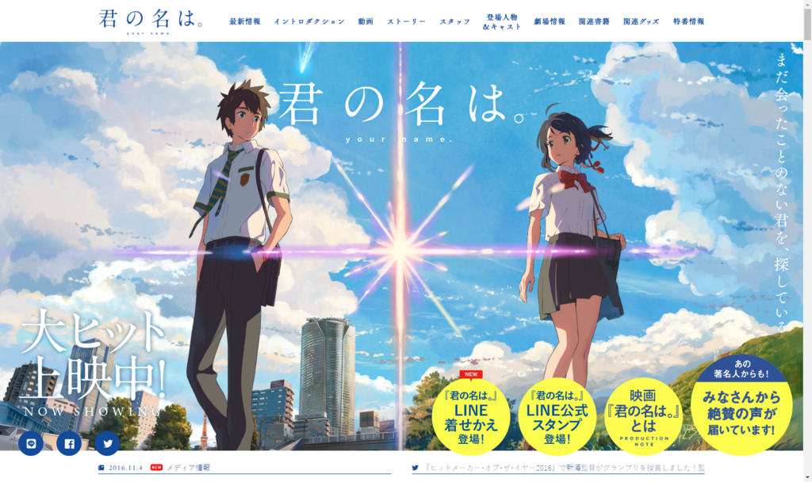

新海誠という監督の存在は前々から知っていたが、なるべく避けていた。自分みたいな青春でやり残したことのある・ヘタレこじらせ系が見ると危険っていうステレオタイプがあったので、なんとなく。『秒速……』をながら見したことしかないんだけど（直視すると死にそうだし。

そんなわけで、この作品も世間で話題になっていることは知っていたが、これまでずっとガン無視していた。でも、これほど話題になると、内容を知らないと話にも加われない。それはそれで悲しいので、とうとう重い腰を上げて独りで見に行った。

<iframe src="//hatenablog-parts.com/embed?url=http%3A%2F%2Fwww.kiminona.com%2F" title="映画『君の名は。』公式サイト" class="embed-card embed-webcard" scrolling="no" frameborder="0" style="display: block; width: 100%; height: 155px; max-width: 500px; margin: 10px 0px;"></iframe>

評判通り、フツーに面白かった。

<ul>
<li>前半の俺 「なんや、とりかえ系か。割とベタな話やなー（ときどき笑い声を上げながら）。ってか、おれも女子高生のおっぱい揉みたいわ(＾ω＾)」</li>
<li>中盤の俺 「ふぁっ(＾ω＾)！？　なんてこった／(^o^)＼　新海誠ってジェノサイド系かよ！」</li>
<li>後半の俺 「未成年が飲酒しやがって！　三葉ちゃんの口かみ酒（三年物）、俺に飲ませろ（#^ω^）」</li>
<li>最後の俺 「オトナの三葉ちゃんもかわいいなー(＾ω＾)」</li>
</ul>
背景がとてもキレイで、それだけでも観にいった価値があったと思った。めんどくさいメッセージがいっぱい詰まったアニメよりも、こういう方がフツーに楽しめていいな。

帰りにお酒飲むつもりだったけど、なんかおなかがいっぱいになってしまったのでそのまま帰宅した。途中、足腰が弱いみたいで信号を渡り切れず困ってたお爺さんがいたので、エスコートしてあげた。少しでも功徳を積んで、来世は女の子と入れ替われるようになりたい。

<blockquote class="twitter-tweet" data-lang="ja">
あぁ、そうそう、シネマサンシャインも Apple Pay 使えるようになってほしいな
&mdash; このだるやなぎには問題がある！ (@daruyanagi) <a href="https://twitter.com/daruyanagi/status/797741754476658688">2016年11月13日</a></blockquote>

