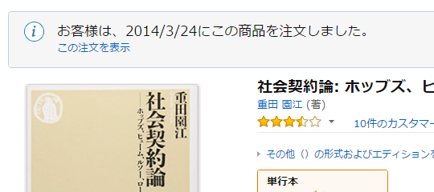

<a href="http://www.amazon.co.jp/exec/obidos/ASIN/4480067426/bestylesnet-22/">社会契約論: ホッブズ、ヒューム、ルソー、ロールズ (ちくま新書 1039)</a>
<ul><li>作者: 重田園江</li><li>出版社/メーカー: 筑摩書房</li><li>発売日: 2013/11/05</li><li>メディア: 単行本</li><li><a href="http://d.hatena.ne.jp/asin/4480067426/bestylesnet-22" target="_blank">この商品を含むブログ (21件) を見る</a></li></ul>

社会契約説というか、それぞれの社会思想家が考えた“自然状態”モデルをざっとまとまってる本がないかなーと思って買ってみた……という記憶がある。

というのも、だいぶ前に買って「ふむふむ」と読んでいたんだけど、そのあと紛失してしまったのだ。半年ほど前、ベッドをひっくり返して大掃除したときにまたこの本を見つけて（おそらく寝落ちしたときにベッドの下へ行ってしまったのだと思われる）また最初から読み直したので、読了までだいぶ時間を食ってしまった。

がっでむ／(^o^)＼

当初の目的とはちょっと離れた本だったけど（内容を確認せずに密林で買ったのだからしょうがない）、とても面白い本だった。なかでも気に入ったのが<i>「ルソーの一般意思の意味はよくわからん」</i>とちゃんと書いてあったところ。思わず「だよねー、だよねー」と口についてでそうだった。そういえばむかし“Google で一般意思がわかる”みたいな謎本（いや、中身なんか読んでないので知らないんだけど）が一時期話題になったけど、速攻滅びたみたいで、買わなくてよかっな。

それはともかく、この本を読んでると読んでると著者と直接対話して疑問を解いてもらいたい――もう少し正確に言うと、疑問を解くヒントを得るためにいろいろぶつけてみたい――という気にさせられた。

でもでも。ヒュームを少し除いては（ヒュームは経済学者の畑に片っぽ足をつっこんでるからね）、やっぱりこのヒトらの話はリクツだよな。僕らの実生活は流れ去る・後戻りのできない時間の中で営まれている。だから、仮定のある話（リクツ）とはどうも相性が悪い。実生活は無知のヴェールのなかにあるわけじゃない。ロールズの第二原理が腑に落ちた、ルソーの一般意思の解釈として優秀なのは理解できた。それが実現された世界が、より公正な社会であることも今は認めることができる。ではだからといって、今手にしている――所有している――“運”を捨てることなんかできやしない（当のロールズもそうはしてないし、たぶんそういう話でもない）。

回転すし屋で独りビールを飲みながら本書を読んでいて、個人的に一番難しく感じたのは、“原初状態”モデルで合意しうる公正な世界（政治の原理）と、勝ち取った“賭けの要素”を自分のモノにできる所有権（経済の原理）は相反するということ、時間と特殊が取り払われた理想の世界と歴史の中で個性が衝突する現実の世界は相反するということだった（ヒュームとルソーがケンカするのも、むべなるかなって感じ）。結局、自分の興味はこの二つのバランスをどうするのかにある、ということを再確認できたかなって気がする。

<ul>
<li>ジョン・ロックを取り上げなかった理由が注にあるが、ちょっと面白かった</li>
<li>とりあげられた思想家のなかではヒュームが断然好きだな</li>
<li>「詐欺と許儀に満ちた社会で不平等が極まると、やがて誰ひとりその不都合を回避できなくなり、社会は破滅する。そしてそこに再び平等が訪れる」「ロールズは、ルソーにおいては、再び訪れた平等から人々が新しく社会をはじめることができるという。その出発点こそ、社会契約が結ばれる『はじまりの場所』なのだ」：ルソーとマキャベリのモーメントの話を思い出した。あと、フランス人が政体をとっかえひっかえするのもこのせいなのかね？　東洋の禅譲・放伐による社会ライフサイクルをも連想させる</li>
<li>本を失くしてる間に、光文社から『リヴァイアサン』の訳が出てたのでボチボチ読んでるけど、この本のおかげで割とスムーズに入れた。ありがとー</li>
</ul>
<iframe src="https://hatenablog-parts.com/embed?url=https%3A%2F%2Fblog.daruyanagi.jp%2Fentry%2F2013%2F09%2F12%2F015252" title="自然状態について、など。 - だるろぐ" class="embed-card embed-blogcard" scrolling="no" frameborder="0" style="display: block; width: 100%; height: 190px; max-width: 500px; margin: 10px 0px;"></iframe><cite class="hatena-citation"><a href="https://blog.daruyanagi.jp/entry/2013/09/12/015252">blog.daruyanagi.jp</a></cite>

