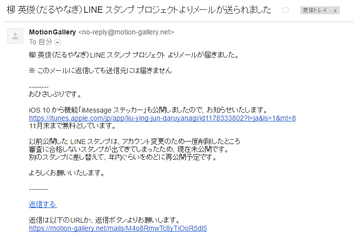

<b>さっきこんなメールがきて、部屋の隅で震えている。</b>いつの間にこんなプロジェクトが進んでいたんだ……orz（「いいよ」って言ったのをすっかり忘れていただけみたいだけど

<a href="https://itunes.apple.com/jp/app/liu-ying-jun-daruyanagi/id1178333802?mt=8&uo=4&at=10lc7c" rel="nofollow" target="_blank">柳 英俊（だるやなぎ）</a>
<ul><li class="itunes-embed-artist">Pronama LLC</li><li class="itunes-embed-genre">ステッカー</li><li class="itunes-embed-price">無料</li><li class="itunes-embed-badge"></li></ul>

よかったら使ってあげてください。11月末までは無料らしいです！　あと、iMessage ってあんまり使ったことないんですけど、便利なの？　優しいお姉さんがいたら教えてくれるとうれしいです。

<blockquote class="twitter-tweet" data-lang="ja">
<a href="https://twitter.com/daruyanagi">@daruyanagi</a> 使えた。便利……なのかな？ <a href="https://t.co/xD2CSdw3Z4">pic.twitter.com/xD2CSdw3Z4</a>
&mdash; 私は穀潰しキラー (@daruyanagi) <a href="https://twitter.com/daruyanagi/status/801397656232693761">2016年11月23日</a></blockquote>

