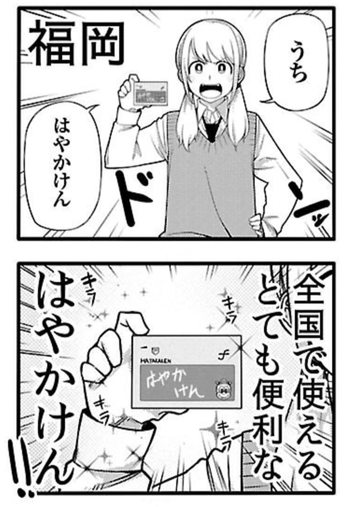

<h3>『博多弁の女の子はかわいいと思いませんか？』</h3>

<a href="http://www.amazon.co.jp/exec/obidos/ASIN/B01M358BL3/bestylesnet-22/">博多弁の女の子はかわいいと思いませんか？　１ (チャンピオンREDコミックス)</a>
<ul><li>作者: 新島秋一</li><li>出版社/メーカー: 秋田書店</li><li>発売日: 2016/11/18</li><li>メディア: Kindle版</li><li><a href="http://d.hatena.ne.jp/asin/B01M358BL3/bestylesnet-22" target="_blank">この商品を含むブログ (1件) を見る</a></li></ul>

<b>かわいいと思います（迫真</b>　まぁ、方言の女の子はどこの子でもかわいいよねー。あれ、なんでだろうねー。京都から東京へでてから初めて関西に帰ったとき、コンビニのお姉さんの関西弁がほんと暖かくて可愛らしくて、危うく恋に落ちそうになったの思い出すわ。東京があかんってわけじゃないけど、あっちのヒトって割りとハキハキしゃべるからね。まぁ、うちのオカン（江戸っ子）がそれなんだけど。父ちゃん（九州）とうまくいかないのも、実はそれなんじゃないか。

愛媛バージョンも作ってほしいけど、伊予鉄の IC カードではこのネタができへんぞ……orz

Web でもタダで読めるっぽいので、気になるヒトは覗いてみてもいいんじゃないかな。

<iframe src="//hatenablog-parts.com/embed?url=http%3A%2F%2Fchancro.jp%2Fcomics%2Fhakataben" title="新島秋一 | 博多弁の女の子はかわいいと思いませんか？ - チャンピオンクロス" class="embed-card embed-webcard" scrolling="no" frameborder="0" style="display: block; width: 100%; height: 155px; max-width: 500px; margin: 10px 0px;"></iframe><cite class="hatena-citation"><a href="http://chancro.jp/comics/hakataben">chancro.jp</a></cite> 

<h3>『中間管理録トネガワ』</h3>

<a href="http://www.amazon.co.jp/exec/obidos/ASIN/B01IUUX6IO/bestylesnet-22/">中間管理録トネガワ（１） (ヤングマガジンコミックス)</a>
<ul><li>作者: 萩原天晴,福本伸行,橋本智広,三好智樹</li><li>出版社/メーカー: 講談社</li><li>発売日: 2016/08/05</li><li>メディア: Kindle版</li><li><a href="http://d.hatena.ne.jp/asin/B01IUUX6IO/bestylesnet-22" target="_blank">この商品を含むブログ (1件) を見る</a></li></ul>

『カイジ』に登場する“利根川”の苦悩を描いた作品。Twitter でみかけてビール吹いてしまったので、カッなってまとめ買いした。後悔はしていない。そういえば『博多弁の……』もキッカケは Twitter だっけ。やっぱちみんなが面白いって話題にしてるときになっちゃうよな。その逆もあるけど……（個人的には『シン・ゴジラ』とか？）

あとこのマンガ、読んでる間ずっと『カイジ』の中のヒトが描いてるとばっかり思っていたんだけど、実はスピンオフなんだな？　すげぇ、ちゃんと作者を確認するまで全然気づかなかったよ。もともとそういうことには鈍い方だけどさ……それだけクオリティが高い。ギャグなんだけど、本家と雰囲気が付かず離れずって感じで。

ちなみに『カイジ』は漫画喫茶で読んだだけで、持ってない。スピンオフの方だけ買ってるなんて、不敬っ！――悪魔的不敬っ！！

<iframe src="//hatenablog-parts.com/embed?url=http%3A%2F%2Fyanmaga.jp%2Fcontents%2Fchukankannriroku_tonegawa%2F" title="漫画『中間管理録トネガワ』公式ページ « ヤングマガジン公式サイト｜無料試し読みと作品情報満載！" class="embed-card embed-webcard" scrolling="no" frameborder="0" style="display: block; width: 100%; height: 155px; max-width: 500px; margin: 10px 0px;"></iframe><cite class="hatena-citation"><a href="http://yanmaga.jp/contents/chukankannriroku_tonegawa/">yanmaga.jp</a></cite>

