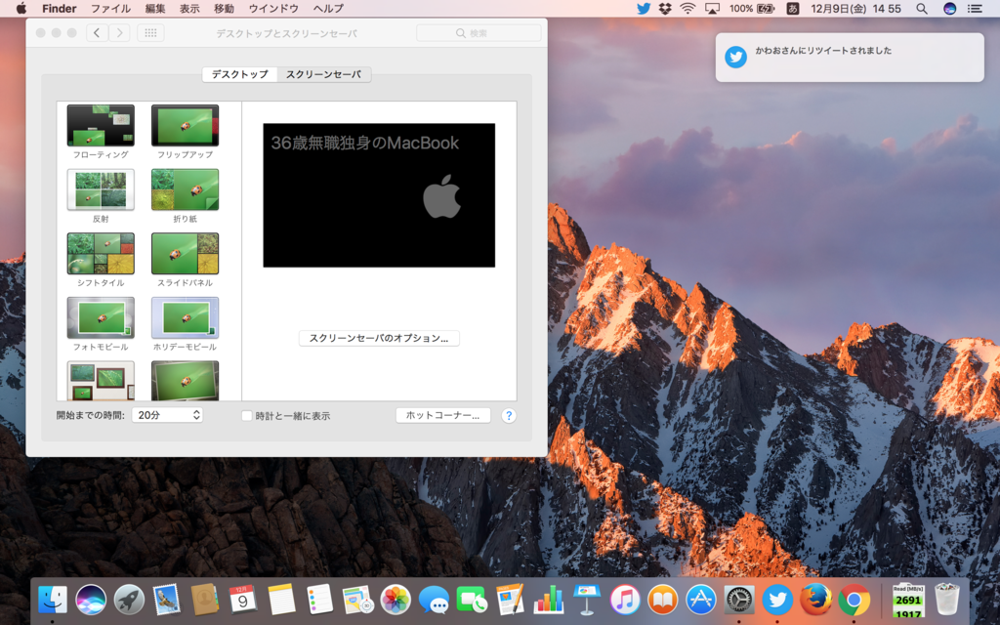

この記事は <a href="http://www.adventar.org/calendars/1621">&#x3060;&#x308B;&#x3084;&#x306A;&#x304E; @daruyanagi Advent Calendar 2016 - Adventar</a> の9日目の記事です。前日の記事は <a href="http://jz5.jp/2016/12/08/best-style-me/">&#x67F3; &#x82F1;&#x4FCA;&#xFF08;&#x3060;&#x308B;&#x3084;&#x306A;&#x304E;&#xFF09;&#x306F;&#x3001;&#x3053;&#x306E;&#x670D;&#x3092;&#x8CB7;&#x3048;</a> でした。正直、あんな服に金を出すのは嫌です。なお、翌日の担当は未定です。

<blockquote class="twitter-tweet" data-lang="ja">
アップルのセンス、たまに謎い <a href="https://t.co/7F3UtpB3ZH">pic.twitter.com/7F3UtpB3ZH</a>
&mdash; だるやなぎ（プレーン味） (@daruyanagi) <a href="https://twitter.com/daruyanagi/status/807097727393755136">2016年12月9日</a></blockquote>

今年、Macbook を購入しました。macOS はジョブズの息吹を感じることのできる素晴らしい OS ですが、一つ欠点があります。デフォルトのスクリーンセーバーがクソダサいことです。あと、日本語入力システムとかもいまいちだと思いますが、もっとも重大な欠点はデフォルトのスクリーンセーバーがクソダサいことです。

なので、ちょっとカッコよくしてみました。

<blockquote class="twitter-tweet" data-lang="ja">
<a href="https://t.co/3o3ITnmSb0">pic.twitter.com/3o3ITnmSb0</a>
&mdash; だるやなぎ（プレーン味） (@daruyanagi) <a href="https://twitter.com/daruyanagi/status/807100634340069376">2016年12月9日</a></blockquote>

macOS はジョブズの息吹を感じることのできる素晴らしい OS なので、環境設定のデスクトップとスクリーンセーバという画面から簡単にスクリーンセーバーをカスタマイズできます。

さすが神 OS ですね。ちなみにいつもは Bootcamp で Windows 10 を入れて使っています。Windows 向けのタッチパッドドライバーも神にしてほしいです。

