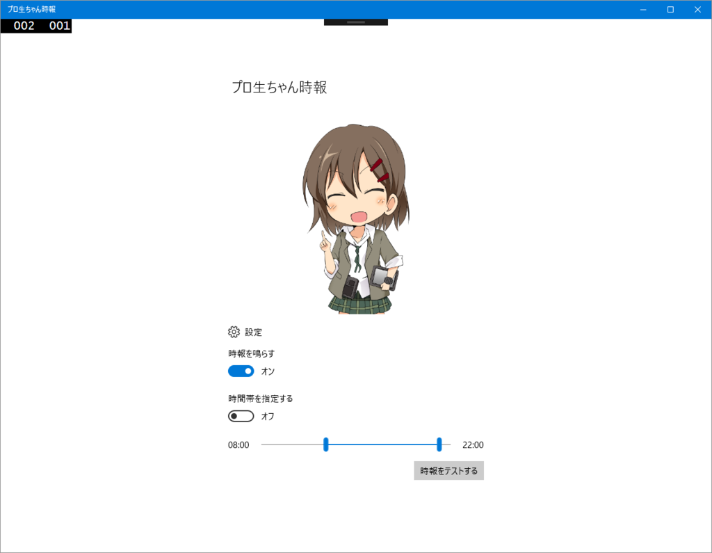

この記事は <a href="http://www.adventar.org/calendars/1631">&#x30D7;&#x30ED;&#x751F;&#x3061;&#x3083;&#x3093; Advent Calendar 2016 - Adventar</a> の14日目の記事です。前日の記事は @saya3633 さんでした。なお、翌日の担当は @kirin_nico さんです。

マジ天使なプロ生ちゃんが時報のメッセージを喋ってくれる神アプリが、「<b>プロ生ちゃん時報</b>」アプリです。

プロ生ちゃんをご存知でない方に少し説明すると、プロ生ちゃんは ニコニコ生放送 でプログラミングをお勉強しているコミュニティ「プログラミング生放送勉強会」のマスコットキャラクター（CV：上坂すみれさん）です。（常識的な範囲で）無償で利用できる素材が充実しているので、キャラクター系のアプリを作りたい場合はもってこいです。マジかわいい、マジ天使ですしね。

本作品も「<a href="https://mascot-apps-contest.azurewebsites.net/">&#x30DE;&#x30B9;&#x30B3;&#x30C3;&#x30C8;&#x30A2;&#x30D7;&#x30EA;&#x6587;&#x5316;&#x796D;</a>」に応募するために作りました。

<iframe src="https://hatenablog-parts.com/embed?url=https%3A%2F%2Fblog.daruyanagi.jp%2Fentry%2F2016%2F10%2F07%2F172125" title="UWP版「プロ生ちゃん時報」アプリを公開しました。モバイルでも使えるよ！ / マスコットアプリ文化祭だるやなぎ賞のお知らせ - だるろぐ" class="embed-card embed-blogcard" scrolling="no" frameborder="0" style="display: block; width: 100%; height: 190px; max-width: 500px; margin: 10px 0px;"></iframe><cite class="hatena-citation"><a href="https://blog.daruyanagi.jp/entry/2016/10/07/172125">blog.daruyanagi.jp</a></cite>

UWP アプリなので、<b>Windows 10</b> と <b>Windows 10 Mobile</b> の両方で動作します。確認はしていませんが、<b>Xbox One</b> と <b>Windows Holographic</b> でも動作するらしいです（アプリの提出時は PC と モバイル のみの対応と書いておいたのですが、Microsoft が勝手に対応プラットフォームを書き足してくれました）。

このアプリの開発については、プロ生熊本でちょっとお話ししました。

<iframe src="https://hatenablog-parts.com/embed?url=https%3A%2F%2Fblog.daruyanagi.jp%2Fentry%2F2016%2F11%2F12%2F074839" title="プログラミング生放送勉強会 第44回@熊本 #マスコットアプリ文化祭 に参加してきました #pronama - だるろぐ" class="embed-card embed-blogcard" scrolling="no" frameborder="0" style="display: block; width: 100%; height: 190px; max-width: 500px; margin: 10px 0px;"></iframe><cite class="hatena-citation"><a href="https://blog.daruyanagi.jp/entry/2016/11/12/074839">blog.daruyanagi.jp</a></cite>

とても単純なアプリなのですけど、ちゃんとストアに出せるクオリティに仕上げるのはわりと面倒臭い。趣味のプログラミングではその辺りをついつい手抜きしちゃって（プロなら逃げられませんけど！）ブレイクスルーできないということが多いと思います。なので、勉強会で耳学問した後は、<b>ちゃんと手を動かしてなんらかの作品を「完成」させる</b>ことが大事なんじゃないかなって思いました。サンプルをたくさん作るのも大事かもですけどね。

<iframe src='https://onedrive.live.com/embed?cid=8D890D7855B010BC&resid=8D890D7855B010BC%21604318&authkey=AN7hJzsClPyXmJc&em=2&wdAr=1.7777777777777777&Embed=1' width='402px' height='327px' frameborder='0'>これは、<a target='_blank' href='https://office.com/webapps'>Office Online</a> の機能を利用した、<a target='_blank' href='https://office.com'>Microsoft Office</a> の埋め込み型のプレゼンテーションです。</iframe>

あと、これは作っているうちに思ったのですが、こうした<i>バックグラウンドタスク＋インターフェイス</i>という形のアプリでは、バックグラウンドタスクをメインに考えて、バックグラウンドタスクのパフォーマンスを落とさない限りでなるべく処理をバックグラウンドタスクに寄せた方がシンプルな設計になるなーって思いました。M-VM-M でいえば、M をバックグラウンドタスクを考える感じでしょうか（インターフェイスプログラムにも薄い M は必要ですが）。まぁ、MVVM なんてよくわかってないですけどね。

来年はトーストに表示されるメッセージをプロ生ちゃんのセリフに合わせたり、細かい不具合を直していきたいと思います。あと、プロ生ちゃん関係のアプリになるかどうかはわかりませんが、もっと本格的なのを作りたいなーと思っています（既存の Windows 8.x アプリの改修もしたいなぁ）。もし勉強会で会うことがあれば、いろいろ教えていただければ幸いです。

そんじゃーね！

