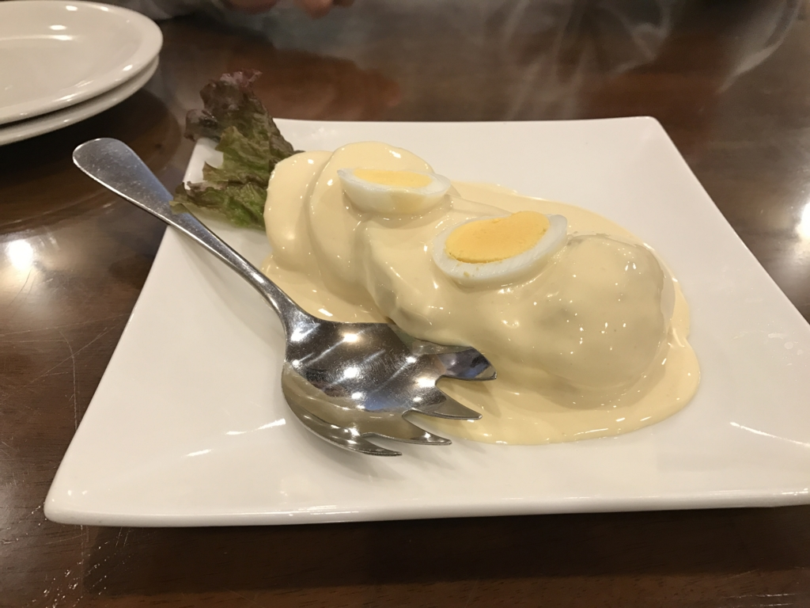
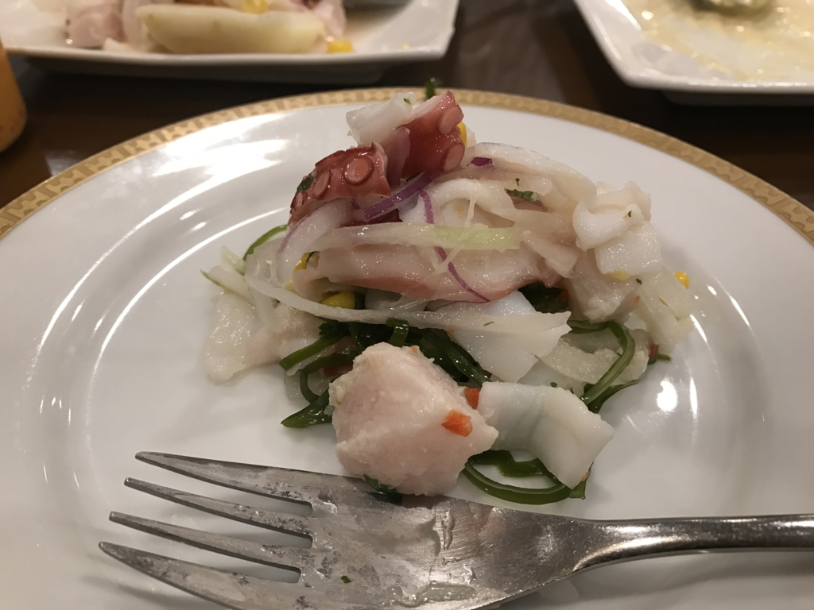
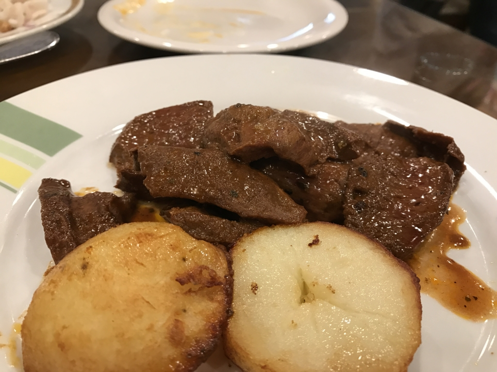
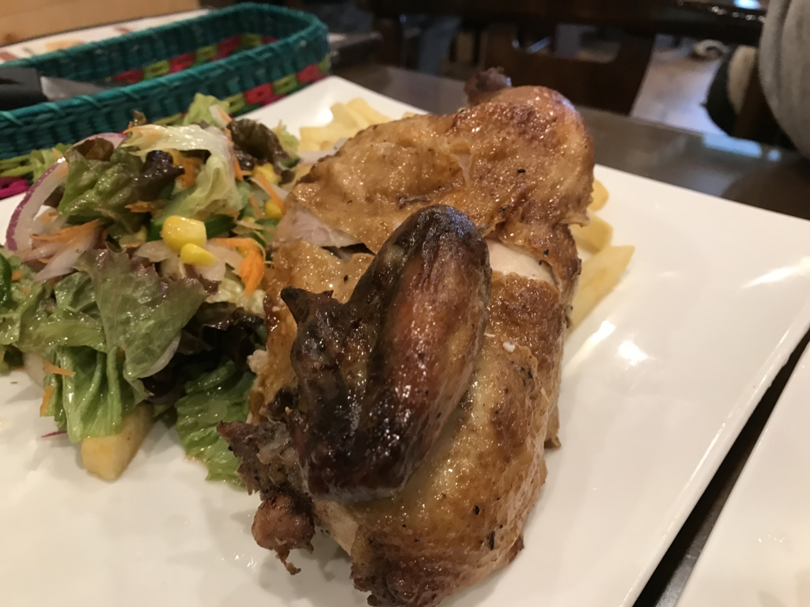
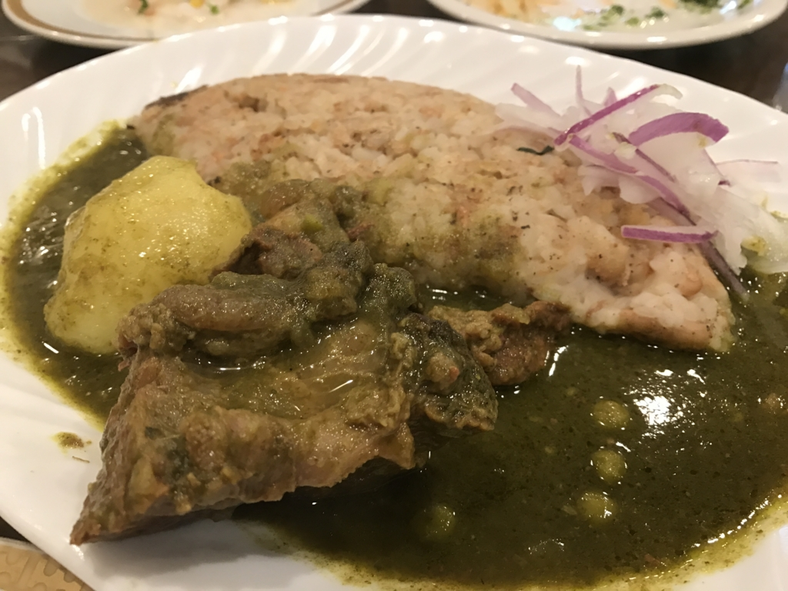
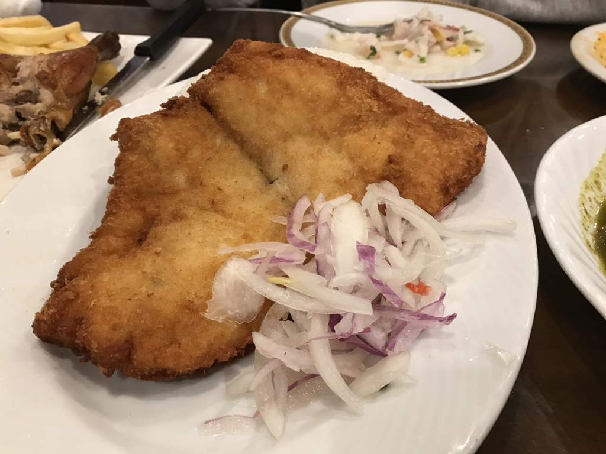

とある週末。友人と映画『世界の片隅に』を見る約束をして、はるばる千葉・市川から川崎へ出かけた。

しかし、割と人気なタイトルのようで、席が劇場の隅っこしか空いていない。個人的には<i>「『世界の片隅に』を“劇場の片隅に”観るのもオツだな（ﾌﾟｰﾌﾟｰｸｽｸｽ」</i>と思っていたのだけど、連れの友人はあまり気が進まなかったようだ。逡巡ののちようやく見る決心がついたものの、そのときにはナケナシの“片隅席”もとられてしまい、結局映画を見逃してしまった。

そんなわけで、ペルー料理を食べることにした。

<iframe src="https://hatenablog-parts.com/embed?url=https%3A%2F%2Fblog.daruyanagi.jp%2Fentry%2F2013%2F07%2F01%2F000542" title="『オブリビオン』 - だるろぐ" class="embed-card embed-blogcard" scrolling="no" frameborder="0" style="display: block; width: 100%; height: 190px; max-width: 500px; margin: 10px 0px;"></iframe><cite class="hatena-citation"><a href="https://blog.daruyanagi.jp/entry/2013/07/01/000542">blog.daruyanagi.jp</a></cite>

以前は『インティライミ』というお店をひいきにしていたのだけど、残念ながら店を移してしまったらしい（お店的には栄転なのかな？　おめでとう！）ので、今回は新しいところを開拓。結果的にはいい感じだった。

<blockquote class="twitter-tweet" data-lang="ja">
ペルー料理やさん (@ アルコ イリス 川崎店 in 川崎市, 神奈川県) <a href="https://t.co/5d5PJOJLD3">https://t.co/5d5PJOJLD3</a>
&mdash; だるやなぎ に天使が舞い降りた！ (@daruyanagi) <a href="https://twitter.com/daruyanagi/status/805261690770169857?ref_src=twsrc%5Etfw">2016年12月4日</a></blockquote>

まずは、いつものジャガイモと謎のホワイトなソース。このソース、どうやって作ってるんかなぁ……ニンニクとか入っていそう。割と癖になる味だと思う。

次はタコのサラダ。タコを食べるひとは少ないらしいけど（ギリシャとか？）、ペルーの人はタコ食べるんだな？

何のお肉か忘れたけど、おいしいお肉。素材を生かした軽い味付け。

お店がクリスマスな雰囲気だったので、チキンもたのんだった。このお店の一押しなのかな？

豆料理も食べたかったので、こっちもチョイス。ペルーの人は豆いっぱい食べるイメージ。

個人的に興味があったので白身魚のフライも頼んでみたけど、思ってたより大きかった。ちょっと後悔した。

二人では食べきれなかったのだけど、なんとかどの皿も7割以上たいらげた。死ぬかと思った。今度来るときはあと何人か援軍がほしいな～

