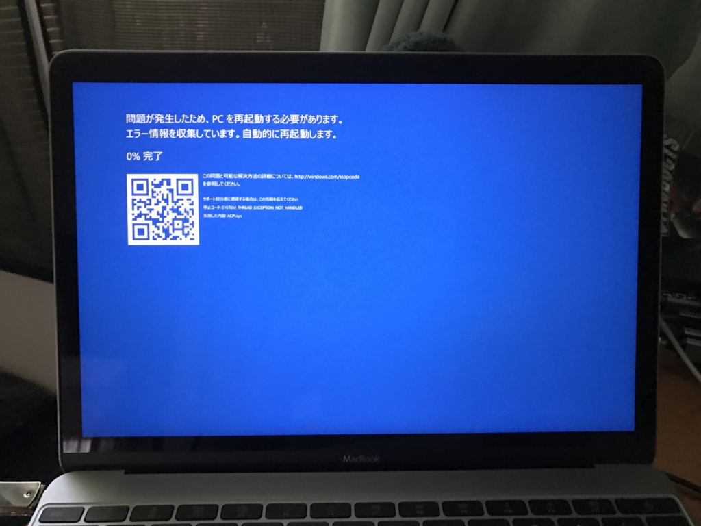
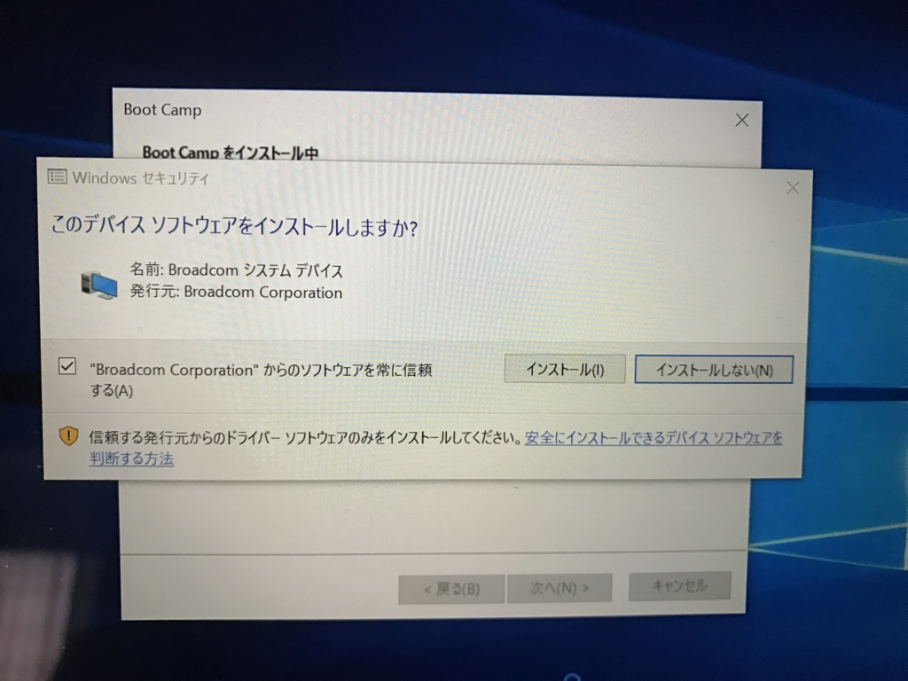
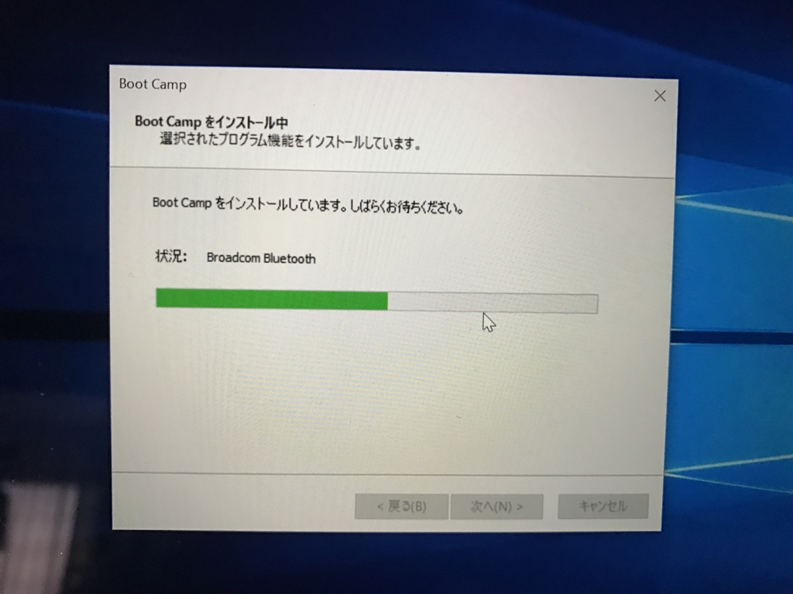
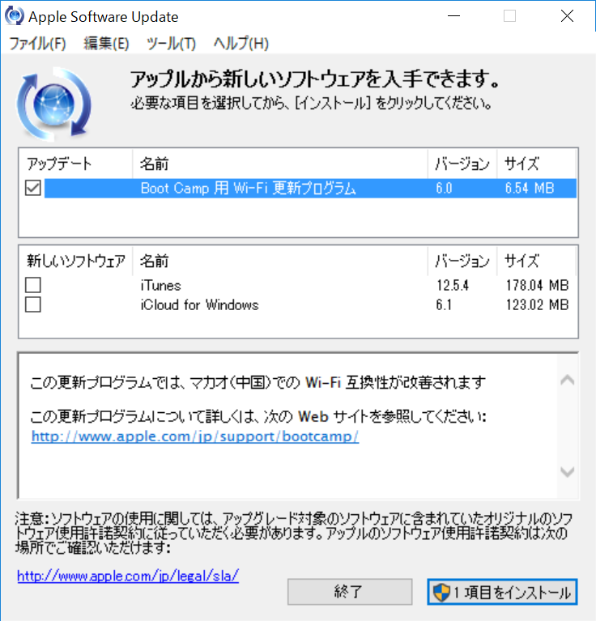

 

<h3>症状</h3>

<h4>2016/12/10</h4>

MacBook に Boot Camp で Windows 10 をインストールしている環境で誤ってドライバーのアップデートをしてしまい（<a href="http://forest.watch.impress.co.jp/docs/news/1034135.html">&#x3053;&#x308C;</a>で遊んでいたのさ）、システムの一部を破損させた（Wi-Fi が繋がらない → 補修するとキーボードが効かなくなった）。

Mac 環境に戻って Boot Camp パーティションを削除＆再セットアップを試みるが――

Broadcom Bluetooth をインストールする段階で SYSTEM_THREAD_EXCEPTION_NOT_HANDLED エラーが発生する。

<a href="http://www.amazon.co.jp/exec/obidos/ASIN/B01CW0PMSU/bestylesnet-22/">HP 16GB USB3.1対応 Type-C + A デュアルUSBメモリ 金属製の360度回転デザイン2in1 OTG フラッシュドライブ (スマートフォン・Mac・タブレット・PCで使える)、Nokia N1、新しいMacBook、GOOGLE PIXEL対応 (16GB, x5000m - シルバー)</a>
<ul><li>出版社/メーカー: ヒューレット・パッカード</li><li>メディア: </li><li><a href="http://d.hatena.ne.jp/asin/B01CW0PMSU/bestylesnet-22" target="_blank">この商品を含むブログを見る</a></li></ul>

せっかく USB-C な USB メモリまで買ったのに（号泣

<h3>対処</h3>

USB メモリのなかにドライバーを見つけたので、手動でひとつずつ入れてみたが、どうもうまくいかない。しょうがないので、数日間 Mac として利用する羽目になった。

<h4>2016/12/14</h4>

<blockquote class="twitter-tweet" data-lang="ja">
<a href="https://twitter.com/daruyanagi">@daruyanagi</a> macOS のアップデートしたら Boot Camp 直るかもしれんで
&mdash; しばやん (@shibayan) <a href="https://twitter.com/shibayan/status/808856435077484544">2016年12月14日</a></blockquote>

macOS Sierra 10.12.2 というのが出ているらしいので、それにアップデートして Boot Camp 環境を再構築してみた。

<iframe src="//hatenablog-parts.com/embed?url=http%3A%2F%2Fjapan.cnet.com%2Fnews%2Fservice%2F35093669%2F" title="「macOS Sierra 10.12.2」がリリース--「Touch Bar」のスクリーンショット撮影など" class="embed-card embed-webcard" scrolling="no" frameborder="0" style="display: block; width: 100%; height: 155px; max-width: 500px; margin: 10px 0px;"></iframe><cite class="hatena-citation"><a href="http://japan.cnet.com/news/service/35093669/">japan.cnet.com</a></cite>

結果的にはこれがビンゴだったらしく、Windows 10 環境を取り戻すことができましたとさ！（仮想環境にしろよという人もいるけど、仮想環境では動かないアプリもあるんだよ）

<h3>教訓</h3>

 

<ul>
<li>Boot Camp ドライバーのアップデートは Apple さまがお恵み下さるものだけにしておく</li>
<li>macOS のアップデートで Boot Camp も新しくなってる可能性がある。試してみよう</li>
</ul>

