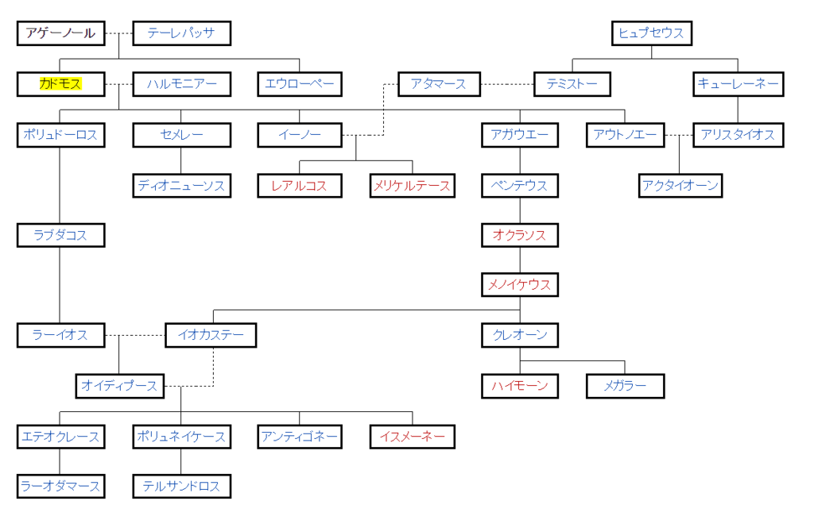

<blockquote>

言い伝えられるところによると、文字を最初にギリシアへ持ち込んだのは、フェニキア王アゲルノの息子カドモスだったという。

文字は有益は発明である。

文字があれば、過去の記憶を保つことができる。 
また、地球上の、遠く隔たった無数の地域に散らばっている人類を、相互に結び付けることができる。

文字は、苦心惨憺の末に発明された。それは、舌・口蓋・唇など発声器官の多様な動きを、注意深く観察することから始まった。そうした観察が行われたからこそ、発声器官の動きに見合った数の文字が作られ、それによって発声器官の動きを覚えて置けるようになったのである。

</blockquote>

<a href="http://www.amazon.co.jp/exec/obidos/ASIN/B00VWP0RY6/bestylesnet-22/">リヴァイアサン１ (光文社古典新訳文庫)</a>
<ul><li>作者: ホッブズ</li><li>出版社/メーカー: 光文社</li><li>発売日: 2015/04/24</li><li>メディア: Kindle版</li><li><a href="http://d.hatena.ne.jp/asin/B00VWP0RY6/bestylesnet-22" target="_blank">この商品を含むブログを見る</a></li></ul>

後半は老子の文字観と逆っぽくてちょっと面白いかなって思わんでもない。

<iframe src="https://hatenablog-parts.com/embed?url=https%3A%2F%2Fblog.daruyanagi.jp%2Fentry%2F2012%2F06%2F19%2F052908" title="第八十章 小國寡民 - だるろぐ" class="embed-card embed-blogcard" scrolling="no" frameborder="0" style="display: block; width: 100%; height: 190px; max-width: 500px; margin: 10px 0px;"></iframe><cite class="hatena-citation"><a href="https://blog.daruyanagi.jp/entry/2012/06/19/052908">blog.daruyanagi.jp</a></cite>

ここででてくる Ἀγήνωρ（アゲーノール）はフェニキアの伝説的な王。海神ポセイドーンとリビュエ（リビア）の子とされる。エウローペー、カドモス、ポイニクス、キリクスの父。

 

<blockquote cite="https://ja.wikipedia.org/wiki/%E3%82%A2%E3%82%B2%E3%83%BC%E3%83%8E%E3%83%BC%E3%83%AB">

このアゲーノールは、エジプト王エパポスの娘リビュエーとポセイドーンの子で、ベーロスと双子の兄弟。アゲーノールはフェニキアのテュロスの王で、テーレパッサ、アルギオペー、あるいはベーロスの娘アンティオペーとの間に、カドモス、キリクス、ポイニクス、タソス、エウローペーをもうけた。

エウローペーがゼウスにさらわれたとき、アゲーノールは息子たちに捜索させ、発見するまで帰るなと命じた。そのため彼らは発見できなかったとき、カドモスはボイオーティアに、キリクスはキリキアに、ポイニクスはフェニキアに、タソスはタソス島に移住した。

<cite><a href="https://ja.wikipedia.org/wiki/%E3%82%A2%E3%82%B2%E3%83%BC%E3%83%8E%E3%83%BC%E3%83%AB">&#x30A2;&#x30B2;&#x30FC;&#x30CE;&#x30FC;&#x30EB; - Wikipedia</a></cite>
</blockquote>

あまり関係ないけど、エウローペー（カドモスの姉妹）は、ヨーロッパの語源にもなった人。

<blockquote>

エウローペーは、テュロスのフェニキア王アゲーノールとテーレパッサの娘で、美しい姫であった。エウローペーに一目ぼれしたゼウスは誘惑するために、自身を白い牡牛に変える。エウローペーが侍女と花を摘んでいる時に、白い牡牛を見つけその背にまたがると、その途端白い牡牛はエウローペーをクレータ島へと連れ去った。そこでゼウスは本来の姿をあらわし、エウローペーはクレータで最初の妃となった。連れ去る際にヨーロッパ中を駆け回ったため、その地域はエウローペーの名前から「ヨーロッパ」 (Europa) と呼ばれるようになった。

</blockquote>

なお、東洋で文字を発見したは 蒼頡（そうけつ） だった。かならずしも文字の発明がプラスに評価されなかったのはちょっと面白いかなって思う（自分がそういうのを好んで読むからなだけかもしれんが）。

<iframe src="https://hatenablog-parts.com/embed?url=https%3A%2F%2Fblog.daruyanagi.jp%2Fentry%2F2014%2F04%2F30%2F202217" title="天雨粟，鬼夜哭。 - だるろぐ" class="embed-card embed-blogcard" scrolling="no" frameborder="0" style="display: block; width: 100%; height: 190px; max-width: 500px; margin: 10px 0px;"></iframe><cite class="hatena-citation"><a href="https://blog.daruyanagi.jp/entry/2014/04/30/202217">blog.daruyanagi.jp</a></cite>

