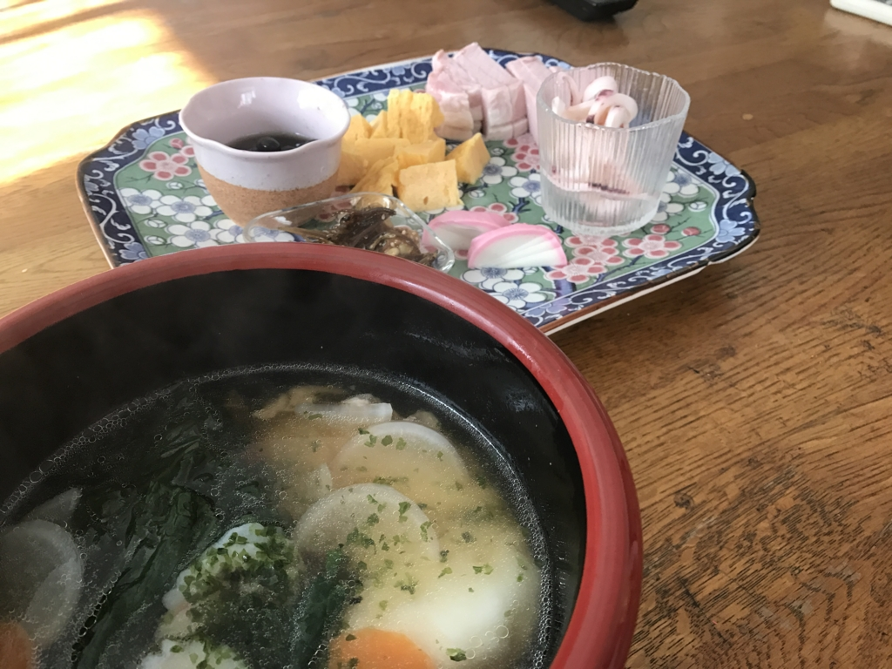

あけましておめでとうございます。今年もよろしくお願いします。

さて、ご存知の方はご存知だと思いますが、12月の最初の金曜日からずっと、市川の実家でごろごろしています。

<blockquote cite="https://blog.daruyanagi.jp/entry/2016/01/12/212126">

去年は弟二人が結婚し、二人とも家を出てしまったので、母ちゃんが一人で寂しくしていないかと心配して長居したのですが、なんだかんだで忙しく、家でゆっくりする暇がなかった感じ。

<cite><a href="https://blog.daruyanagi.jp/entry/2016/01/12/212126">&#x3042;&#x3051;&#x307E;&#x3057;&#x3066;&#x304A;&#x3081;&#x3067;&#x3068;&#x3046;&#x3054;&#x3056;&#x3044;&#x307E;&#x3059;&#xFF01; &#x4ECA;&#x5E74;&#x3082;&#x3088;&#x308D;&#x3057;&#x304F;&#x304A;&#x9858;&#x3044;&#x3057;&#x307E;&#x3059;&#xFF5E;&#xFF08;&#x9045; - &#x3060;&#x308B;&#x308D;&#x3050;</a></cite>
</blockquote>

という去年の反省を生かしたのですが、おかげさまで平均睡眠時間が12時間を超えるという大変有意義な暮らしを送ることができました。

<blockquote class="twitter-tweet" data-lang="ja">
ヤバい、そのまま天に召されそう <a href="https://t.co/ADqZ9ujDMw">pic.twitter.com/ADqZ9ujDMw</a>
&mdash; だるやなぎ に天使が舞い降りた！ (@daruyanagi) <a href="https://twitter.com/daruyanagi/status/812671211498942467?ref_src=twsrc%5Etfw">2016年12月24日</a></blockquote>

もちろん寝てばっかりいたわけではなく、一族や友人、知己と触れ合える時間も十分に持てました。とくに甥っ子・姪っ子のサンタクロースを熱演できたのは楽しかった。

<blockquote class="twitter-tweet" data-lang="ja">
さんだるろーす <a href="https://t.co/lrvo8DlU5F">pic.twitter.com/lrvo8DlU5F</a>
&mdash; だるやなぎ に天使が舞い降りた！ (@daruyanagi) <a href="https://twitter.com/daruyanagi/status/813286285980729344?ref_src=twsrc%5Etfw">2016年12月26日</a></blockquote>

来年もやりたいけど、松山で正月を過ごしたい気分もあり（まだ一度も松山で正月を迎えていない！）、ちょっと悩みどころですね。半々ぐらいの確率でどちらかにいると思うので（シュレーディンガーのだるやなぎ？）、もし見かけたら可愛がってあげてください。

<h3>今年の目標</h3>

去年は申年で年男だったのですが、割といい感じに過ごせたと思います。ここ10年ぐらいの懸案事項のほとんどにカタがついて、ようやく前を向けるようになったなって感じ。頑張った甲斐があった。

というわけで、今年は去年っぽくのんびり暮らしながら、地力を蓄えられたらいいなって思っています。

