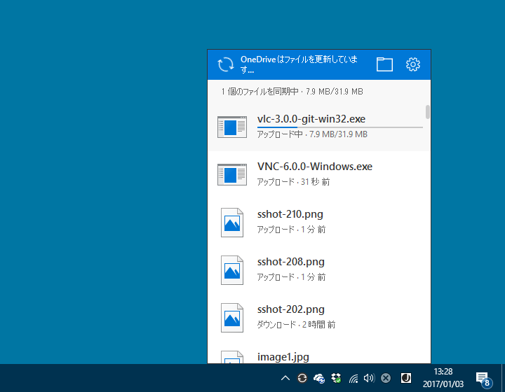
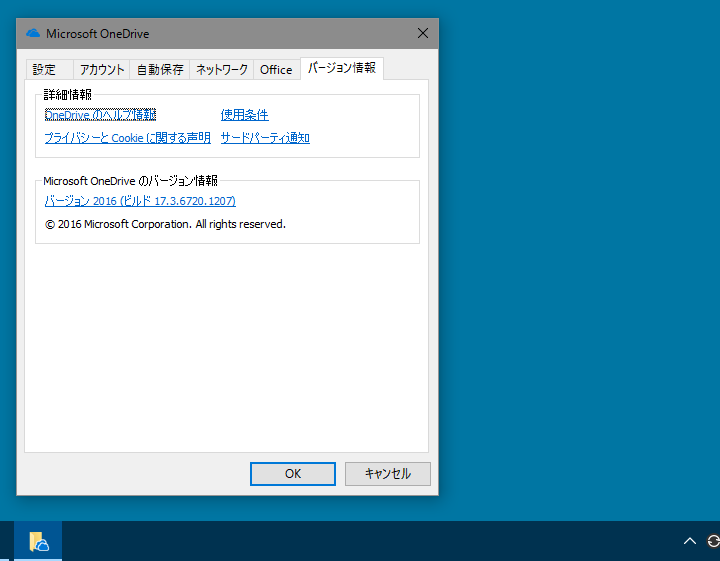

12月中に更新がきて（早い人はもっと早かったのかもしれない）、OneDrive のアクティビティセンター（って呼ぶのだそうな）が新しくなっていた。

<blockquote cite="https://support.office.com/en-us/article/New-OneDrive-sync-client-release-notes-845dcf18-f921-435e-bf28-4e24b95e5fc0">

<h3>Version 17.3.6720.1207 (Released December 14, 2016)</h3>

<h4>New features and updates:</h4>

<ul>
<li>The OneDrive activity center has been improved for vision-impaired users.</li>
<li>Added support for Office 365 operated by 21Vianet.</li>
</ul>

<h3>Version 17.3.6674.1021 (Released November 10, 2016)</h3>

<h4>New features and updates:</h4>

<ul>
<li>Added support for Office 365 Germany.</li>
<li><b>(Rolling out) The OneDrive activity center has been updated to provide information on recent activity.</b></li>
</ul>

<cite><a href="https://support.office.com/en-us/article/New-OneDrive-sync-client-release-notes-845dcf18-f921-435e-bf28-4e24b95e5fc0">New OneDrive sync client release notes - Office Support</a></cite>
</blockquote>

今までのクソの役にも立たない進捗ポップアップは廃止され、Dropbox のようにアップロード・ダウンロード・削除といったアクションがファイル単位でチェックできるようになったみたい。

