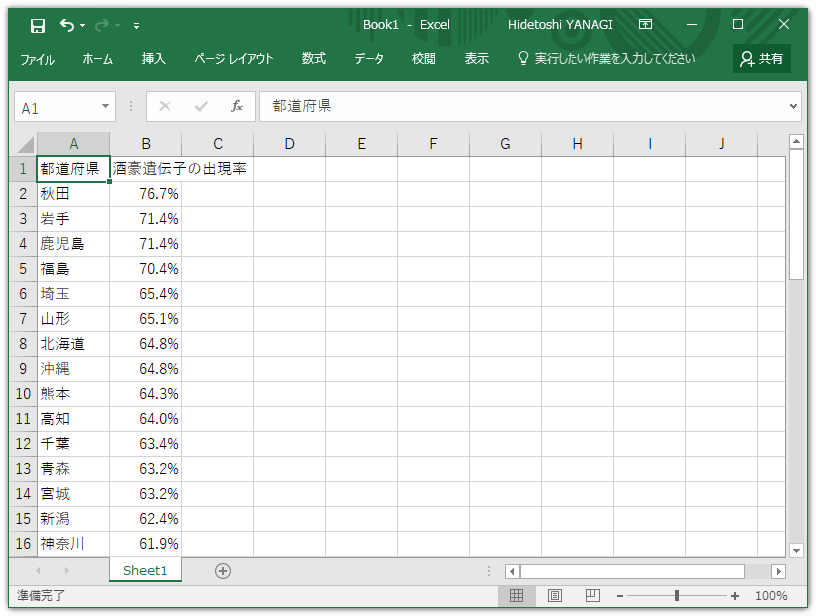
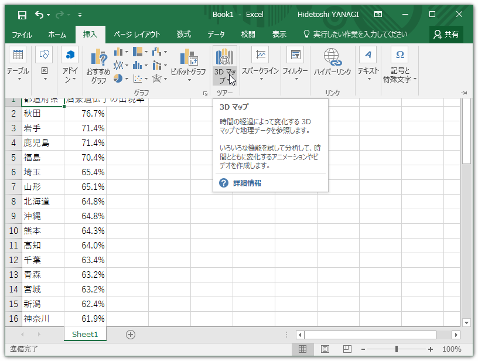
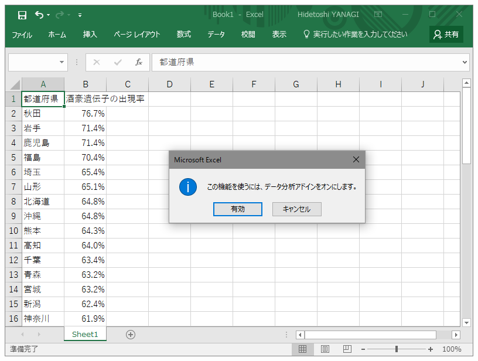
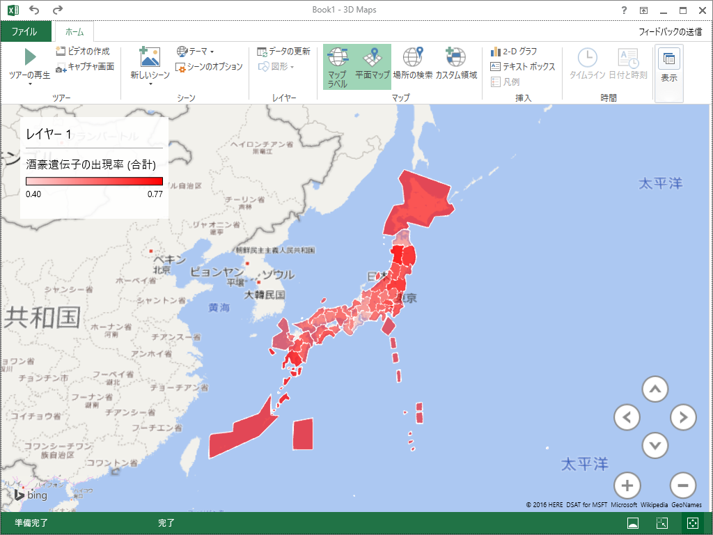

<blockquote class="twitter-tweet" data-lang="ja">
三重県民には無理に飲ませないように。 <a href="https://t.co/M1GUINZlfB">pic.twitter.com/M1GUINZlfB</a>
&mdash; 木ゃなこ (@tierra534) <a href="https://twitter.com/tierra534/status/815368024366514176">2017年1月1日</a></blockquote> 

<h3>Excel の 3D Maps を利用する</h3>

詳しい方法は「<a href="https://dekiru.net/article/13655/">Excel 2016&#x306E;&#x65B0;&#x6A5F;&#x80FD;&#x300C;3D&#x30DE;&#x30C3;&#x30D7;&#x300D;&#x306E;&#x4F7F;&#x3044;&#x65B9;&#x3002;&#x5730;&#x56F3;&#x4E0A;&#x306B;&#x30B0;&#x30E9;&#x30D5;&#x3092;&#x4F5C;&#x6210;&#x3067;&#x304D;&#x308B;&#xFF01; | &#x3067;&#x304D;&#x308B;&#x30CD;&#x30C3;&#x30C8;</a>」で紹介されている。

まずテーブルを作成。

次に［挿入］－［3D マップ］コマンドを選択。

「データ解析アドイン」を有効化するかどうか聞かれるので、［有効］ボタンを押す。

すると 3D Maps の編集画面が現れるので、ごにょごにょイジっていい感じにする。なんか塗りが適当だし、石川県・香川県・福岡県がなぜか欠落しているけど気にしない（詳しい人、直し方教えて）。

<h3>Google Chart を利用する</h3>

JavaScript が書けるならこっちの方が簡単。

<pre class="code lang-javascript" data-lang="javascript" data-unlink>&lt;script src=&quot;https://www.google.com/jsapi&quot;&gt;&lt;/script&gt;
&lt;script&gt;
google.load('visualization', '1', {packages:['geochart']});
google.setOnLoadCallback(graphChart);

function graphChart() {
var data = google.visualization.arrayToDataTable([
[&quot;都道府県&quot;, &quot;データ&quot;],
[&quot;秋田&quot;,  76.7]  ,
：
：
[&quot;三重&quot;,  39.7]
]);
var option = {
region: 'JP',
resolution: 'provinces'
};

var chart = new google.visualization
.GeoChart(document.getElementById('chart'));
chart.draw(data, option);
}
&lt;/script&gt;

&lt;div id=&quot;chart&quot;&gt;&lt;/div&gt;
</pre>
コードを貼り付けると、以下のようにレンダリングされる。

 

ちなみに、下記の記事を参照しました。都道府県名に“県”とかつけちゃうとダメみたい。

<iframe src="//hatenablog-parts.com/embed?url=http%3A%2F%2Fqiita.com%2Fsue738%2Fitems%2F3297c79e62be1cb799c1" title="GoogleChartsのGeochartで都道府県分布マップを簡単作成 - Qiita" class="embed-card embed-webcard" scrolling="no" frameborder="0" style="display: block; width: 100%; height: 155px; max-width: 500px; margin: 10px 0px;"></iframe><cite class="hatena-citation"><a href="http://qiita.com/sue738/items/3297c79e62be1cb799c1">qiita.com</a></cite> 

<h3>雑感</h3>

東海地方はお酒が弱い人が多いみたい。なんとなくだけど記紀によく登場する地域（紀・畿内・吉備・越＋東海）はお酒に弱い感じがあるので、縄文系はお酒に強く、弥生系はお酒に弱いみたいな違いとかあるのかな。

