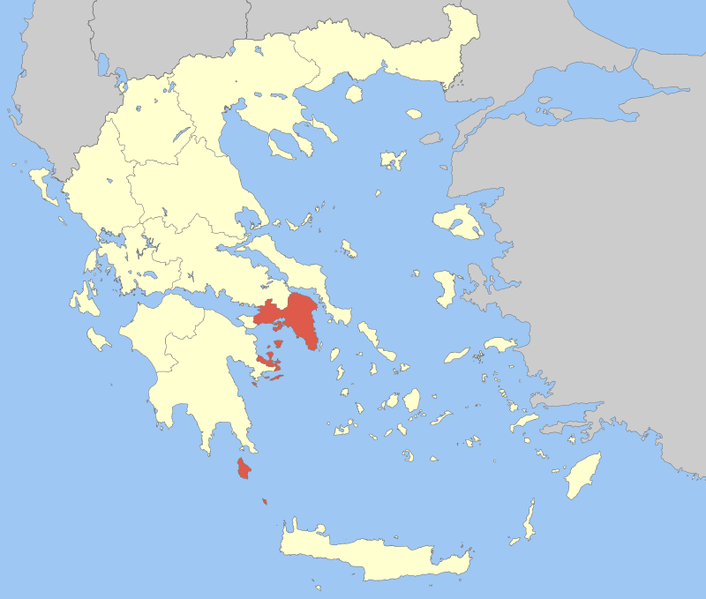

 

<blockquote>

その（ペルシア王）ように自分（ディオゲネス）も、一年の季節に応じて、住まいを変えるのだと言っていた。なぜなら、彼によると、アッティカ地方は、ペロポネソスやテッサリアのような大きな山脈も、貫通する河も持たない、土地は痩せ、空気が軽く（たぶん乾燥しているの意）、降雨も多くないし、降った雨水も滞留しない。ほぼその全土が海に取り巻かれ、そこから、海岸（アクテー）のごときものなので、その名（アッティカ、アッティケー）を得ているのである。

</blockquote>

この語源は今でも正しいとされているらしい。

<a href="http://www.amazon.co.jp/exec/obidos/ASIN/4876989125/bestylesnet-22/">王政論: 弁論集1 (西洋古典叢書)</a>
<ul><li>作者: ディオンクリュソストモス,Dio Chrysostom,内田次信</li><li>出版社/メーカー: 京都大学学術出版会</li><li>発売日: 2015/08/21</li><li>メディア: 単行本</li><li><a href="http://d.hatena.ne.jp/asin/4876989125/bestylesnet-22" target="_blank">この商品を含むブログを見る</a></li></ul>

アッティカは、アテナイやその外港ピレウスを擁する地方。“ほぼその全土が海に取り巻かれ”ており（アッティカ半島）、西北隣のボイオティア地方との間にはタイキロン山地が横たわっている。また、西南隣はメガリス（都市国家メガラのある地方）とコリンティア（コリントス市周縁）を介してペロポネソス半島と接続している（コリントス地峡）。

 

<blockquote cite="https://ja.wikipedia.org/wiki/%E3%82%A2%E3%83%83%E3%83%86%E3%82%A3%E3%82%AB">

プラトンによれば、古代アッティカの領域は、西はコリントス地峡、北はキタイローンの山々やパルニサ山によって画され、オロプスとアソポス川で海に至ったという。

<cite><a href="https://ja.wikipedia.org/wiki/%E3%82%A2%E3%83%83%E3%83%86%E3%82%A3%E3%82%AB">&#x30A2;&#x30C3;&#x30C6;&#x30A3;&#x30AB; - Wikipedia</a></cite>
</blockquote>

“マラトンの戦い”で知られるマラトンはアテナイの北東。“降った雨水が滞留しない”ので、現在では人造湖（マラトン湖）が造られ、同地方の水がめとなっている。予讃地方で言うところの早明浦ダムやな。古代はどうしてたんだろうとちょっと気になるのだけど、香川県民みたいに渇水時にうどんを茹でたりはしないだろうし、なんとかなってたのかもしれん。

あと、この地方は大理石の産地（だからあんな豪華な神殿が造れるんやの）。また、アッティカ半島南部のラウリウムには銀鉱山がある。

<iframe src="https://hatenablog-parts.com/embed?url=https%3A%2F%2Fblog.daruyanagi.jp%2Fentry%2F2015%2F05%2F12%2F214025" title="古代ギリシア - だるろぐ" class="embed-card embed-blogcard" scrolling="no" frameborder="0" style="display: block; width: 100%; height: 190px; max-width: 500px; margin: 10px 0px;"></iframe><cite class="hatena-citation"><a href="https://blog.daruyanagi.jp/entry/2015/05/12/214025">blog.daruyanagi.jp</a></cite>

