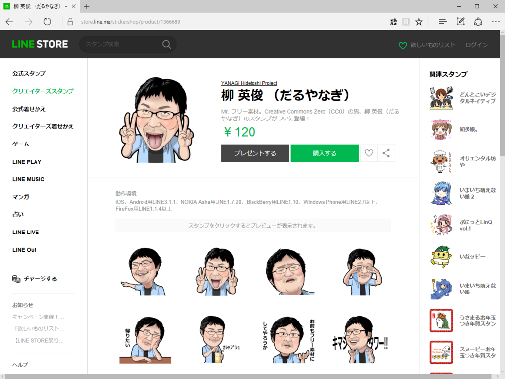
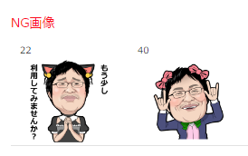
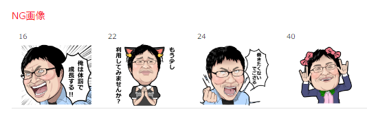

お待たせしました！　アカウント移行の関係で一時的に購入できなかった「柳 英俊 （だるやなぎ）」LINE スタンプが再び購入できるようになっています。

<iframe src="//hatenablog-parts.com/embed?url=https%3A%2F%2Fstore.line.me%2Fstickershop%2Fproduct%2F1366689" title="YANAGI Hidetoshi  (Daruyanagi) - Creators&#39; Stickers" class="embed-card embed-webcard" scrolling="no" frameborder="0" style="display: block; width: 100%; height: 155px; max-width: 500px; margin: 10px 0px;"></iframe><cite class="hatena-citation"><a href="https://store.line.me/stickershop/product/1366689">store.line.me</a></cite>

もう持っている方は買わなくていいのですが、2点ほど素材が入れ替わっています（どれだかわかるかな？）。買いなおしてくれると、僕の財布におカネがチャリンチャリンでうれしいです（前のバージョンは僕の懐には入っていないんだな）。

それにしても毎回、ダメだしを食らうスタンプが変わるように思えたのは気のせいかな。とても面倒くさかった。

あと、インドネシアでは販売できなくなりました。インドネシアのだるやなぎファンの方がいたら本当にすみません。俺の顔、インドネシアでは文化的に NG なのかもしれん……（震え声

