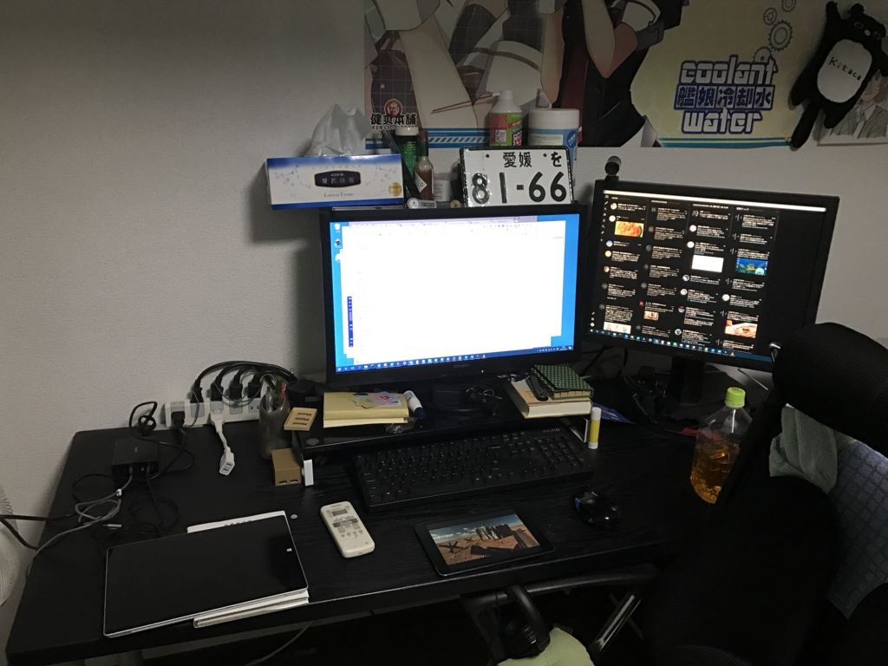
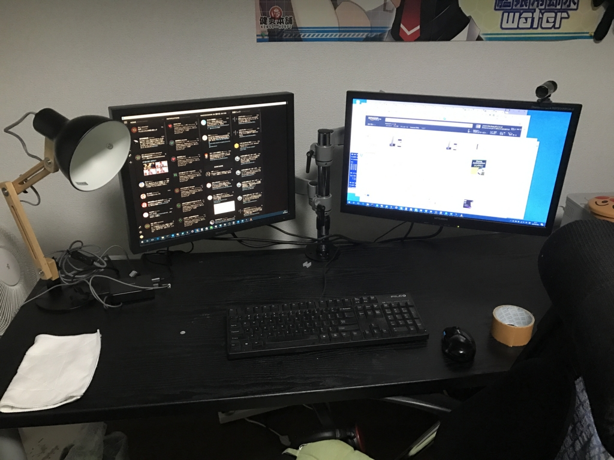
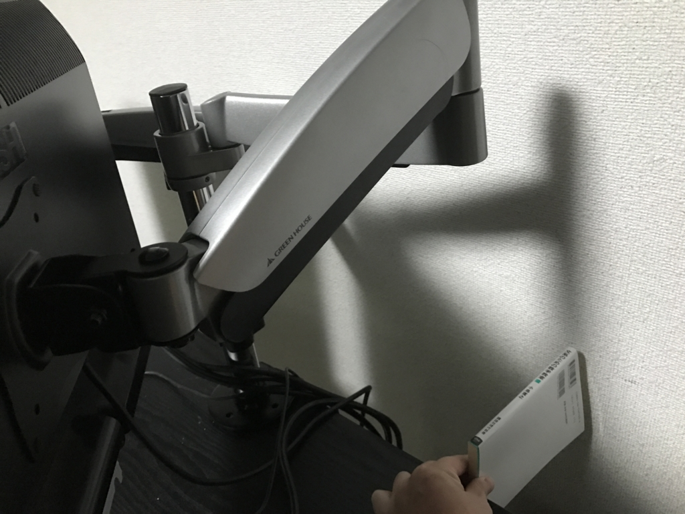
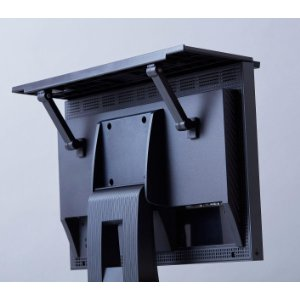
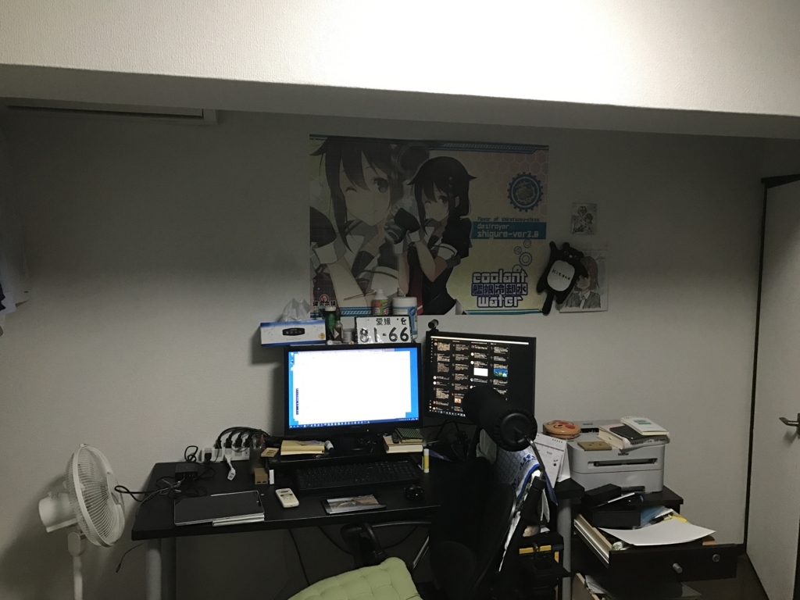

ちょっとこれを見てくれ。どう思う？　今年はこの状況を少しずつマシにしていきたい！　――ということで、今回はディスプレイアームを買ってみた。

<h3>なぜディスプレイアームなのか</h3>

うちの PC は

<ul>
<li>5年ぐらい前に買った MITSUBISHI 製の24インチワイドモニター</li>
<li>いつ買ったのか思い出せないぐらい古い SHARP 製の22インチ（？）モニター</li>
</ul>
でデュアルディスプレイをしているんだけど、とくに古い方のモニターがクソ重い。そのせいかスタンドもめちゃくちゃガッシリしていて、無駄にデカい。おかげで割と広いはずの机が妙に狭く感じる。MITSUBISHI のモニターはそうでもないのだけど、この二つをディスプレイアームで保持するようにすれば、机が少し広く使えるのではないだろうか。ほら、モニターがアームで宙に浮いてたらその下に物が置けるし。

というわけで、今回はあくまでも「試してみる」という感覚で導入してみることにした。

<h3>ディスプレイアームの種類</h3>

ディスプレイアームにはいろいろあるけど、

<ul>
<li>エルゴトロン</li>
<li>サンコー</li>
</ul>
が二大勢力らしい。<b>お金持ちはエルゴトロン</b>、<b><s>貧乏</s>コスパ重視ならばサンコー</b>を買うのがいいみたい。

自分はエルゴトロンなんか買えない。なのでサンコーにするつもりで Amazon を探索していたのだけど、結局これがコスパいいかなーと思ってポチった。

<a href="http://www.amazon.co.jp/exec/obidos/ASIN/B00NFELXSQ/bestylesnet-22/">グリーンハウス 2つのディスプレイを取り付けられる 液晶ディスプレイ用アーム 2アーム 4軸モデル GH-AMCA03</a>
<ul><li>出版社/メーカー: グリーンハウス</li><li>発売日: 2014/10/01</li><li>メディア: Personal Computers</li><li><a href="http://d.hatena.ne.jp/asin/B00NFELXSQ/bestylesnet-22" target="_blank">この商品を含むブログを見る</a></li></ul>

グリーンハウス製です（白目

軸（アームの関節）の数は迷ったけど、<b>柔軟性の高そうな 4 軸</b>をチョイスしてみました。たぶん軸が多ければ多いほど、前後上下左右の調整がやりやすくなるんだろうね。デメリットは機構が複雑になり、重量が増す点か。

<h3>ディスプレイアームの設置</h3>

部品が一点足りなかった！　でも、ポールのベースにかぶせるカバーだったので、機能的にはなくても問題はない。そのまま30分ぐらいで軽く組み上げてみた。

やっぱりモニターのスタンドがないだけでもかなりの解放感だなー。机もキレイに拭いて、いい気分になった。

Amazon のレビューでも指摘されていたけど、三角レンチ3本（付属）にドライバー（付属しない）が必要なところは<b>少し面倒くさい</b>。けれど、心配していたモニターのたれ（とくに古くて重い SHARP 製）はない。六角レンチでボルトを適度にしめればアームの稼働もスムーズだ。ただし、どちらかというと固定して使う方が向いている。縦横の回転や手元への引き出しを頻繁に行う場合は、<b>ガス圧式</b>なんかの方がいいんだろうね。

<h3>問題点</h3>

ちょっと誤算だったのは、自分なりの理想の配置にすると奥行きがかなり必要になったころ。今まで机を壁にピッタリ付けていたのだけど、新書一冊分前に引き出さないといけなくなった。おかげで机に置いていた USB 充電器などが机の裏に落ちちゃったので、ちょっと対策を考えないといけないな（両面マジックテープを買って、机に引っ付けられる＋いざというときは剥がして持ち運べるようにしようかと思っている）。あと、部屋が若干狭くなったが、もともと10畳あるのでとくに問題はない気がする。

無理しないで ポール2本＋アーム2本 の構成にするのもアリだったかな？　まぁ、これはポールを買い足せばいいわけで、まったく問題ない。

あと、これまで愛用していたキングジムのディスプレイボードが使えなくなった。いや、無理すれば使えないこともないけど、アームの耐荷重的にやめといた方がいいなーって感じ。

<a href="http://www.amazon.co.jp/exec/obidos/ASIN/B01D19QKFU/bestylesnet-22/">キングジム ディスプレイボード 黒 DB-500クロ</a>
<ul><li>出版社/メーカー: キングジム</li><li>発売日: 2016/03/24</li><li>メディア: オフィス用品</li><li><a href="http://d.hatena.ne.jp/asin/B01D19QKFU/bestylesnet-22" target="_blank">この商品を含むブログ (2件) を見る</a></li></ul>

これは液晶モニターの上に乗せて小物置きを作れるスグレモノ。

工具いらずっていうところもすごく良いので、もしモニター＋スタンドを使っていて机の上が散らかって困るという人は試してみてほしいかも。

最後に、これは割とくだらないことだけど、貧乏ゆすりでモニターが振動するようになった。はやく石油王女と結婚するか totoBIG 当てて貧乏ゆすりを直したいなーと思った。

<h3>次回の予定</h3>

天井にあるでっぱりのおかげで机の周りが暗い（ので、布団で寝転んで本を読む癖がついてしまった）。シャレオツなデスクスタンドを買って、手元を明るくするやで。

