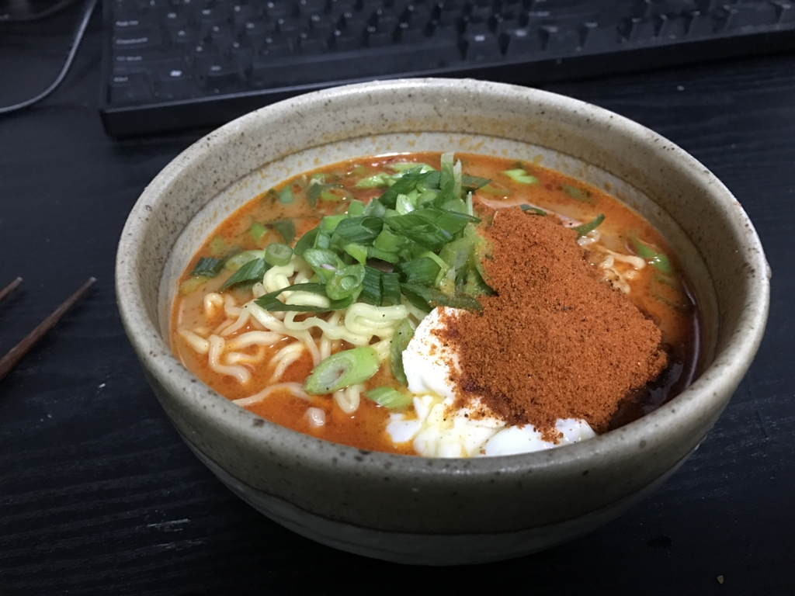
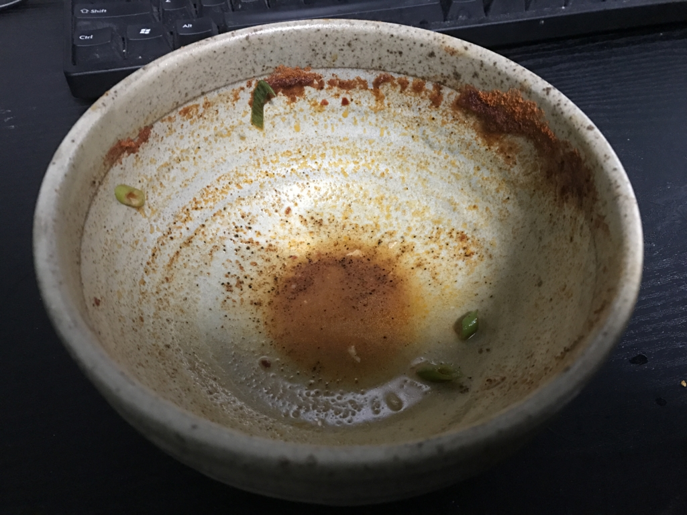

今週はずっと風邪気味。頭はしっかりしているのだけど、6度8分程度の微熱（平熱は5度台）と咳が止まらない。体も動くし食欲はあるのでご飯は作るけれど、外に出るほどの元気はなく、冷蔵庫の在庫でレシピをやりくりする毎日だった。そこへ、ヤツが現れた。

<blockquote class="twitter-tweet" data-lang="ja">
<a href="https://twitter.com/daruyanagi">@daruyanagi</a> 今日家におんの？
&mdash; しばやん (@shibayan) <a href="https://twitter.com/shibayan/status/818668334157705216">2017年1月10日</a></blockquote>

――嫌な予感しかしない。

数日後、やっぱりロクでもないものが我が家に届いた。

<a href="http://www.amazon.co.jp/exec/obidos/ASIN/B01IQJPE3E/bestylesnet-22/">寿がきや 井の庄監修 辛辛魚ラーメン 辛辛MAXバージョン 135g×10袋</a>
<ul><li>出版社/メーカー: 寿がきや食品</li><li>メディア: 食品&飲料</li><li><a href="http://d.hatena.ne.jp/asin/B01IQJPE3E/bestylesnet-22" target="_blank">この商品を含むブログを見る</a></li></ul>

<blockquote class="twitter-tweet" data-lang="ja">
なんやこれ生命の危険感じる <a href="https://t.co/Gm3VUY6Iz4">pic.twitter.com/Gm3VUY6Iz4</a>
&mdash; だるやなぎ（プレーン味） (@daruyanagi) <a href="https://twitter.com/daruyanagi/status/819535220638482432">2017年1月12日</a></blockquote>

冷蔵庫の中身が心もとなくなってきていたので、ありがたくはあるのだが……。

<blockquote class="twitter-tweet" data-lang="ja">
風邪でしんどいのに辛辛魚たべなきゃいけないなんて、俺の運命も過酷やな
&mdash; だるやなぎ（プレーン味） (@daruyanagi) <a href="https://twitter.com/daruyanagi/status/819534660510171137">2017年1月12日</a></blockquote>

というわけで、早速昨日食べてみた。

チャーシューなんかないので、ベーコンで代用。あとはネギを刻み、タマゴをぶち込んだ。後入れの粉を忘れてて、具材をトッピングした後に入れざるを得なかったので、見栄えは悪い。しっかりかき混ぜて、粉をスープになじませると、鼻孔をえもいわれぬカラカラ臭が突き刺す。後入れの粉は入れずに食べたほうが幸せだったかもしれんな。

でも、味はまぁまぁ。とくに麺は好きかも。スープが無駄に辛いせいか、すごく甘みを感じるよね。ベーコンをもしゃもしゃするときも、オアシス感がある。あと、もやしとか入れてみてもいいなと思った。辛味から逃避先をたくさんトッピングしないと、途中から食べるのが辛くなる。

それでもなんとか完食。その日の間は大丈夫だったけど、翌朝早く飛び起きて、トイレでうんうん唸る羽目になりました。お尻の穴が熱いでござる……熱いでござる……。

あと9袋あるんだけど、ほんと死にたい。

