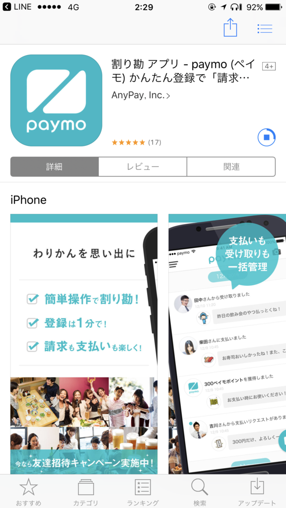
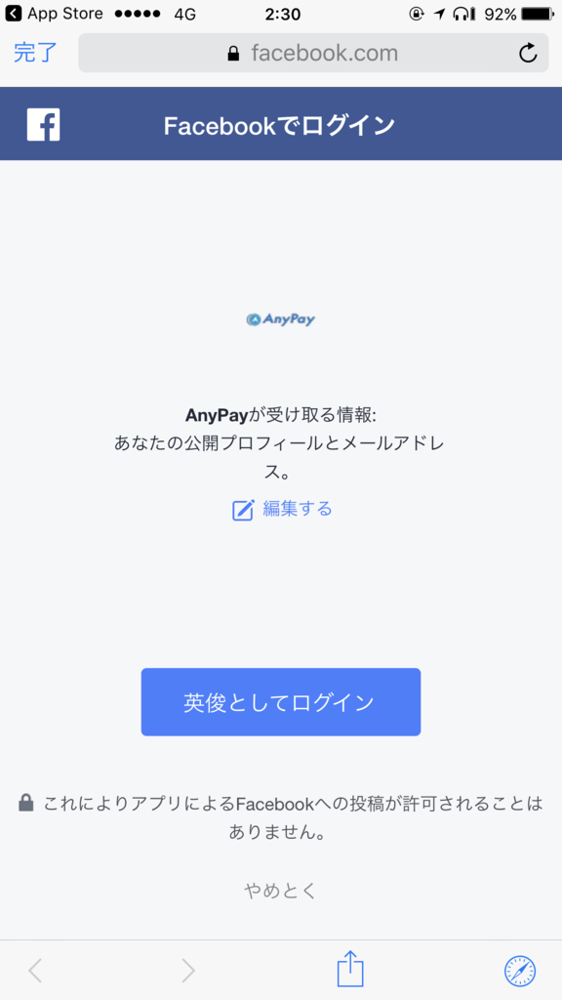

<blockquote cite="http://japan.cnet.com/news/service/35095219/">

オンライン決済サービスを提供するAnyPay（エニーペイ）は1月19日、飲み会やランチなどの代金を簡単に“割り勘”できる決済アプリ「paymo（ペイモ）」を公開した。当初は、モバイル決済利用率の高い20～30代の社会人をターゲットにし、公開から1年で700万ダウンロードを目指す。

<cite><a href="http://japan.cnet.com/news/service/35095219/">&#x53CB;&#x3060;&#x3061;&#x306E;&#x53E3;&#x5EA7;&#x3092;&#x77E5;&#x3089;&#x306A;&#x304F;&#x3066;&#x3082;&#x652F;&#x6255;&#x3048;&#x308B;&ldquo;&#x5272;&#x308A;&#x52D8;&rdquo;&#x30A2;&#x30D7;&#x30EA;&#x300C;paymo&#x300D;--&#x5143;&#x30B0;&#x30CE;&#x30B7;&#x30FC;&#x4EE3;&#x8868;&#x306E;&#x6728;&#x6751;&#x6C0F;&#x304C;&#x5275;&#x696D; - CNET Japan</a></cite>
</blockquote>

へぇ、便利そうだな～と思ってたら、なぜか 443 円の請求がきた。

記憶にはないが、きっとなにかを割り勘で購入したんだと思う。仕方ないので、かの邪智暴虐の請求を払わねばならぬとケツ意した。

リンクを踏むと、こんな画面が出てきた。iOS/Android アプリのインストールが必要らしい。Windows 10 Mobile なら払わなくて済む。

しかし、たまたま手にしていたのは iPhone 7 Plus。アプリを入れて、先に進まねばならぬ。

iOS アプリのメイン画面。なんかアカウントを作らねばならないらしい。リア充だらけで不快感を誘うデザインは割りと秀逸。

登録は面倒なので Facebook を使うことにした。［（ユーザー名）としてログイン］ボタンを押すと――

メイン画面に戻ってくるだけでなにも起こらなかった。しょうがないので、請求はブッチすることにした。すまん。 

