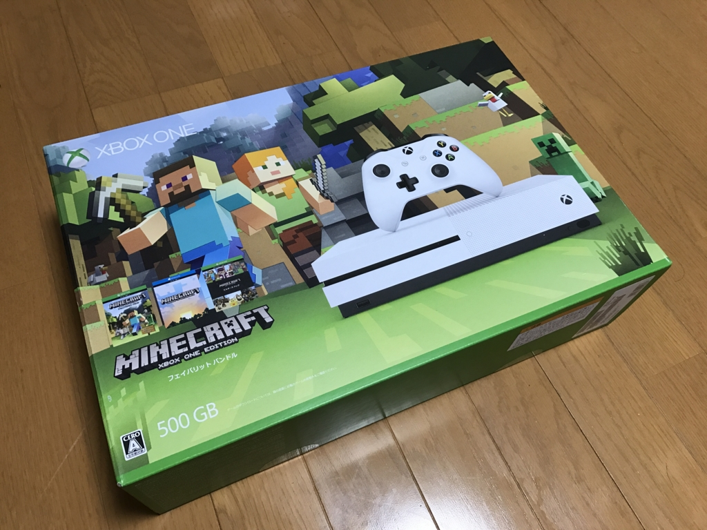
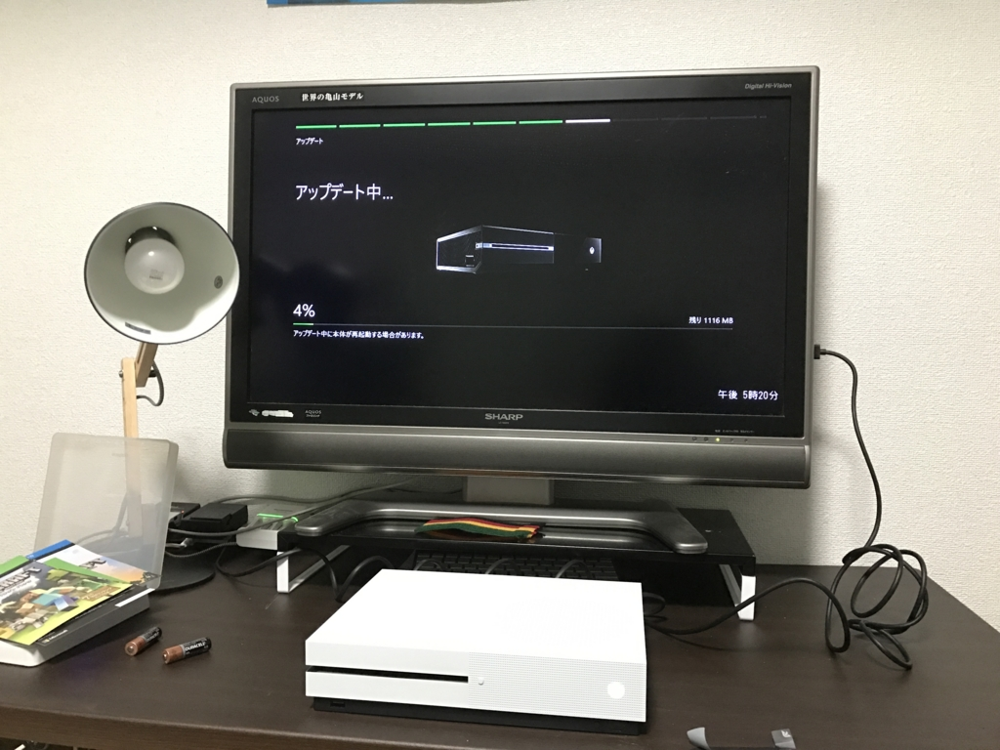
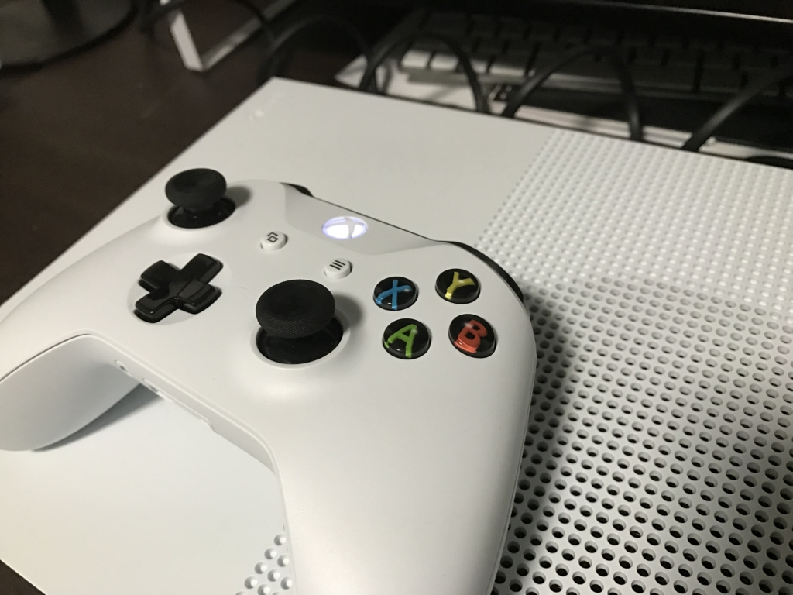
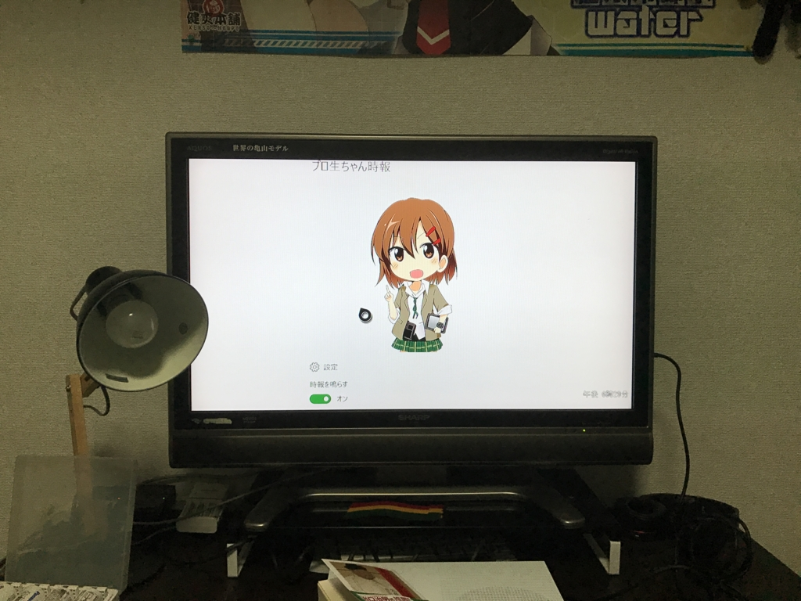

1月26日に「Xbox One S 500GB Minecraft 同梱版」が発売されたので買っちゃいました。

<a href="http://www.amazon.co.jp/exec/obidos/ASIN/B01MYUZDKY/bestylesnet-22/">Xbox One S 500GB Ultra HD ブルーレイ対応プレイヤー Minecraft 同梱版 (ZQ9-00068)</a>
<ul><li>出版社/メーカー: 日本マイクロソフト</li><li>発売日: 2017/01/26</li><li>メディア: Video Game</li><li><a href="http://d.hatena.ne.jp/asin/B01MYUZDKY/bestylesnet-22" target="_blank">この商品を含むブログ (3件) を見る</a></li></ul>

ぶっちゃけ<b>ゲームにはほとんど興味がない</b>のですが、最近の Xbox One は Windows 10 とのプラットフォーム共通化が進んでいて、Windows 10 向けの UWP アプリが Xbox で動いたり、Xbox にと買ったゲームが Windows 10 でも動いたり（Xbox Play Anywhere というやつです）します。まぁ、そういうのを試すためというのが購入の主な理由です。

ちなみに据え置きゲーム機を買うのは、弟1号がやってるのをみてプレイしたくなった『ヴァルキリープロファイル』をやるためだけに買った PS one 以来。今回買った Xbox One S が人生で2台目です<a href="#f-4a653223" name="fn-4a653223" title="実家にはファミコン、ツインファミコン、スーパーファミコンがありましたけど">*1</a>。まぁ、好きなゲームが Civilization だったり、Diablo だったりなんでね。どうしても PC がメインになるよね。

パッケージを開くと、マインクラフトをあしらった箱がぽろぽろ出てきました。かわいい。本体と電源ケーブル、HDMI ケーブル、無線コントローラー、そして Windows 10 版と Xbox 版「Minecraft」のライセンスコードが付属していました。

筐体とコントローラーは白で統一。初代 Xbox ってすげえデカいイメージだったんですけど、これは割とコンパクトでいいですね。ファンの音は……まぁ、ウチのメイン PC（CPU 以外はファンレス）よりはちょっとうるさい感じですけど、そんなに気にならないかも。

セットアップ（物理）も簡単でした。ゲーム機と TV の接続といえば、なんか赤・黄・黒のケーブルをぷちぷち刺していくイメージだったのですが、最近は HDMI ケーブル1本で済むんだなぁ……楽でいいぜぇ。ただ、ウチの TV が古いせいか、刺しただけでは HDMI と認識してもらえず、初期状態では低解像度 & 音無しでした。これは設定画面で DVI → HDMI にかえてあげれば OK。音はコントローラーにヘッドフォンを刺して聞くこともできるみたいですね。

起動するとアップデートが始まったので、放置してスーパーへ買い物に行きました。帰ってきたら処理は終わっていたのですが、こんどは Bluetooth コントローラーのアップデートをさせられました。なかなかゲームを始められなくて、割とうっとうしい。しょうがないとは言え、ユーザー体験（笑）をだいぶ損なっていると思います。

あと、コントローラーのボタンのフォントがダサいと思いました。ふぉんとにダサい。

<h3>プロ生ちゃんアプリが動いた！</h3>

そのあとは「Minecraft」のインストールをしたり（これがまた時間かかるし）、コントローラを操作しながらホーム画面を探検していたのですが――ストアにわしが作ったアプリがある！！

<iframe src="https://hatenablog-parts.com/embed?url=https%3A%2F%2Fblog.daruyanagi.jp%2Fentry%2F2016%2F10%2F07%2F172125" title="UWP版「プロ生ちゃん時報」アプリを公開しました。モバイルでも使えるよ！ / マスコットアプリ文化祭だるやなぎ賞のお知らせ - だるろぐ" class="embed-card embed-blogcard" scrolling="no" frameborder="0" style="display: block; width: 100%; height: 190px; max-width: 500px; margin: 10px 0px;"></iframe><cite class="hatena-citation"><a href="https://blog.daruyanagi.jp/entry/2016/10/07/172125">blog.daruyanagi.jp</a></cite>

ストアにアプリが少なすぎて、こんなアプリでも目に付くところに置いてやがる。早速インストールしました。

ちょっとホワイトバランスがおかしいのか、色が飛んでる感じがしますが、ちゃんと動きました。ただ、メイン画面の下が見切れていてすべての設定オプションにアクセスできない。ちょっとアプリに手を入れなきゃいけないですね。Xbox One S を買わないと気付かなかったろうバグなので、さっそく役に立ってちょっとうれしい。

<h3>劣化 FireTV として使っている</h3>

「Minecraft」は10分ぐらい遊んで「もういいや」って感じ。そのあとは「Netflix」と「niconico」のアプリを入れて動画見てました。完全に劣化 FireTV ですな。残念ながら「Hulu」アプリは Xbox 向けに配信されていないみたいなので、こっちは解約して、「Netflix」に移住することにしました。あとは「Amazon プライムビデオ」アプリがあればうれしいんですけど、まぁ、たぶん無理でしょうな。

今のところはそんな感じ。気が向いたら ふぁいふぁん 15 を買うかもしれません<a href="#f-e5649e19" name="fn-e5649e19" title="そういえば最後にプレイした ふぁいふぁん は 8 だった気がします。DVD 四枚組で PC 向けにリリースされていました">*2</a>。

<a href="#fn-4a653223" name="f-4a653223" class="footnote-number">*1</a>:実家にはファミコン、ツインファミコン、スーパーファミコンがありましたけど

<a href="#fn-e5649e19" name="f-e5649e19" class="footnote-number">*2</a>:そういえば最後にプレイした ふぁいふぁん は 8 だった気がします。DVD 四枚組で PC 向けにリリースされていました

