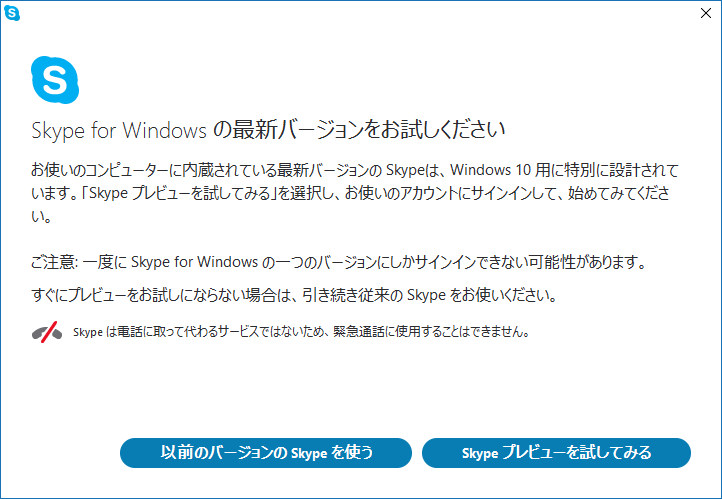
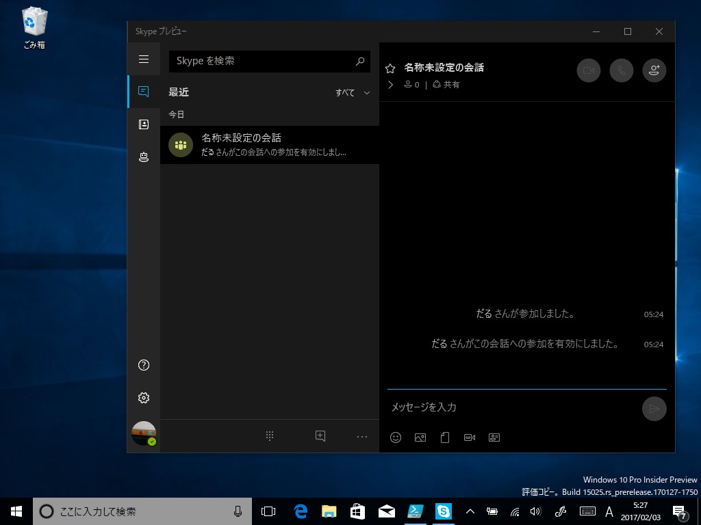
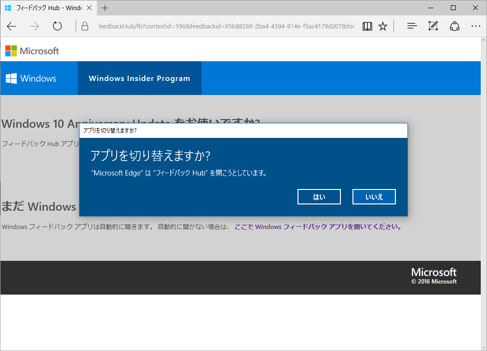
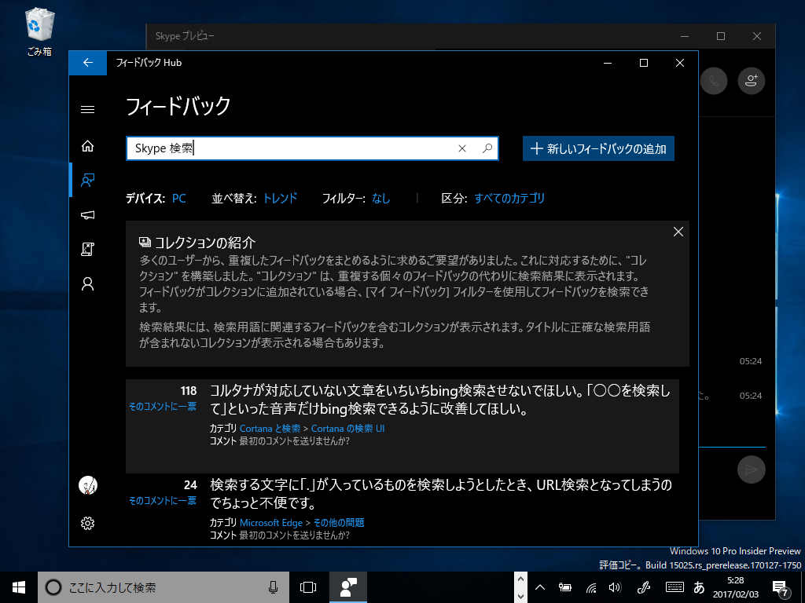

メイン PC をクリーンアップしてデスクトップ版 Skype を起動したら、こんなメニューが表示された。「Skype UWP プレビュー」を使ってくれとの由。

実は Windows 10 Insider Preview をいれた Surface Pro 3 ではメイン PC との簡単なテキストのやり取りに「Skype UWP プレビュー」を常用しているのだけど、一つ、大きな不満がある。<i><b>［Ctrl］＋［F］キーで会話ログの検索ができないんだよ。</b></i>ふぁっきゅー。

直近の会話をちょろっと確認できればいいモバイルならともかく、スマートな方々が ChatOps とか言ってるこの時代に、デスクトップアプリで会話ログの検索もできないなんてウンコ of ウンコでしょう？　「Slack」みたいにコメントへ絵文字リアクションをつけられるようにとか、コルタナか［共有］コマンドかなんかで選択テキストをタスク登録できるようにしてくれとか、そういうのは会話ログがちゃんと扱えてからの話だ。ここ数年の「Skype」の進歩のなさには、どちらかというと Microsoft 贔屓なわしでも愛想が尽きそう（いつからかデスクトップアプリのバージョンアップを Windows 版だけ公式ブログで告知しなくなったのもどうかと思う）。

<a href="https://aka.ms/W1gogr">https://aka.ms/W1gogr</a>

フィードバックを投げておいたので、もしよければ賛同してほしい。ちょうど日本時間で今日か明日あたりからバグバッシュをやるみたいなので、溜まっていた鬱憤をまとめて晴らしてこようかと思う。みんなも週末はフィードバックやりまくろうぜ！

<h3>追伸その 1</h3>

個別フィードバックの Web 画面も作ってほしい。んで、<i><b>「こんなこともできないの、Windows m9(^Д^)ﾌﾟｷﾞｬｰ」</b></i>とかはてブ付きまくって、フィードバックを盛り上げてほしい（炎上ともいう）。

今のフィードバックの仕組みでは、「フィードバック Hub」以外から他の人のフィードバックを知る手段に乏しすぎると思う。知らないものは、主観的に存在しえない。

<h3>追伸その 2</h3>

コレクション機能が付いたのはうれしい。ちゃんと役に立つかまでは試せてないけれど。

<h3>追伸その 3</h3>

以前に“Windows Insider Meetup”というイベントに参加して、中のヒトのお話を聞けたのだけど、あれ、またやってくんないかな。あのとき、IME がらみのテキストでは表現するのが面倒な不具合を直接フィードバックしたら、そのあとちゃんと直っててうれしかった。

あと、ああいうイベントはフィードバックのモチベーションにもなると思う。日本人って（※主語が大きい）、「あ、ほかの人も困ってたんだ」って思わないとアクション起こさないところあるじゃん？　「自分だけかもしれないから、我慢しておけばいいや」みたいなメンタリティ（炎上しないと自分からは動かないとも言う）。直に集まってワイワイやれば、そういう引っ込み思案が少なくなって、もう少しフィードバックの機運が高まる気もする。

<h3>追伸その 4</h3>

そのときに聞いた話なのだけど、やっぱり日本はフィードバックの数が少ないみたい（フィードバックの採用率ではほかの国と差はないようだ）。

これはさっき挙げたメンタリティの問題も多少あると思うけれど、基本的に余暇が少ないのが最大の原因だと思う。社畜なのにフィードバック投げるの、おでさんぐらいやろ。日本の労働環境はあらゆるところに負の遺産を建立しまくっているので、早くなんとかすべき。

<h3>追伸その 5</h3>

変な文字化けが実は“プレースホルダ”（あとで直すっていう目印）だって知ったの、その“Windows Insider Meetup”でだった。ドヤ顔で<i><b>「ローカライズミス残ってやんの m9(^Д^)ﾌﾟｷﾞｬｰ」</b></i>してたオレ、恥ずかしい。

