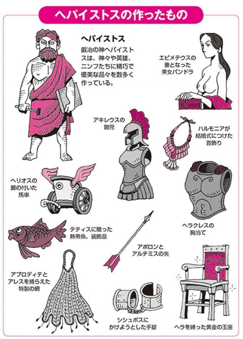

<a href="http://www.amazon.co.jp/exec/obidos/ASIN/B00JAEEDB4/bestylesnet-22/">図解　ギリシア神話 歴史がおもしろいシリーズ</a>
<ul><li>出版社/メーカー: 西東社</li><li>発売日: 2014/02/07</li><li>メディア: Kindle版</li><li><a href="http://d.hatena.ne.jp/asin/B00JAEEDB4/bestylesnet-22" target="_blank">この商品を含むブログを見る</a></li></ul>

前回読んだ本は図版が豊富だったけど少し物足りなかったので、密林を探索。ギリシア神話の本って玉石混交っぽくて、オンラインではなにを選んでいいかよくわかんないな。とはいえ、いきなりヘシオドスとか読んでも挫折しそう。――そう思っていた矢先に、これを見つけた。

買うときは内容薄そうだなーと思ってたんだけど、割とコンパクトにまとまっていて便利だと思った。あと、堅苦しい本にはない面白い切り口もある。

たとえば、鍛冶の神・ヘパイストスが作ったアイテム集とか（笑

あとは、ゼウスの浮気相手一覧みたいなのもあった。それ以外にも、関連書籍がたくさん挙げられているのもいい。古典文学や絵画、音楽はもちろん、SF 小説、ハリウッド映画まで幅広く取り上げられてて、ちょっと感心した。

<h3>追伸</h3>

個人的にはどの部族がどんな神さまを奉じていて、どういう過程で現在のギリシア神話に統合されたのかなという点に興味があった。

<iframe src="https://hatenablog-parts.com/embed?url=https%3A%2F%2Fblog.daruyanagi.jp%2Fentry%2F2017%2F02%2F04%2F183944" title="『ギリシア文明―神話から都市国家へ』 - だるろぐ" class="embed-card embed-blogcard" scrolling="no" frameborder="0" style="display: block; width: 100%; height: 190px; max-width: 500px; margin: 10px 0px;"></iframe><cite class="hatena-citation"><a href="https://blog.daruyanagi.jp/entry/2017/02/04/183944">blog.daruyanagi.jp</a></cite>

前回読んだ本だと、ミノア文明では海の神・ポセイドンが優勢だったけど、ギリシア（アカイア）人の南下とともにゼウスが浸透してきたみたい（うろ覚えだけど）。そういう話を聞くと、ティタン神族も古い民の神話なんじゃないかって想像したりするのだが……そこまでは触れられていなかった。

でも、エロスが当初は観念的な存在だったのが、古典期にはアプロディテに付きまとってる小さな天使みたいな感じになり、時代を追うにつれてキューピッドと同一視されていったみたいな話は載っていて、割と興味深い。“神話”が芸術を生み、芸術が“神話”を塗り替えていくみたいな。

<iframe src="https://hatenablog-parts.com/embed?url=https%3A%2F%2Fblog.daruyanagi.jp%2Fentry%2F2017%2F02%2F02%2F070244" title="『中国の神話』 - だるろぐ" class="embed-card embed-blogcard" scrolling="no" frameborder="0" style="display: block; width: 100%; height: 190px; max-width: 500px; margin: 10px 0px;"></iframe><cite class="hatena-citation"><a href="https://blog.daruyanagi.jp/entry/2017/02/02/070244">blog.daruyanagi.jp</a></cite>

その点、中国の“死んだ神話”との対比で考えてみても面白い。

