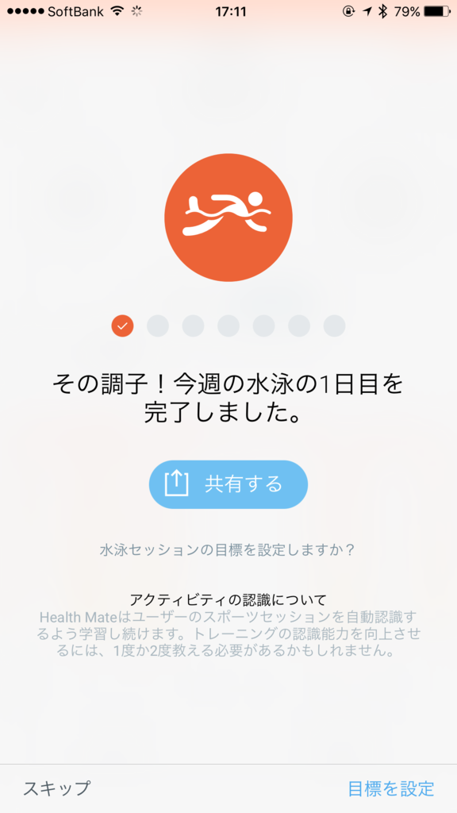
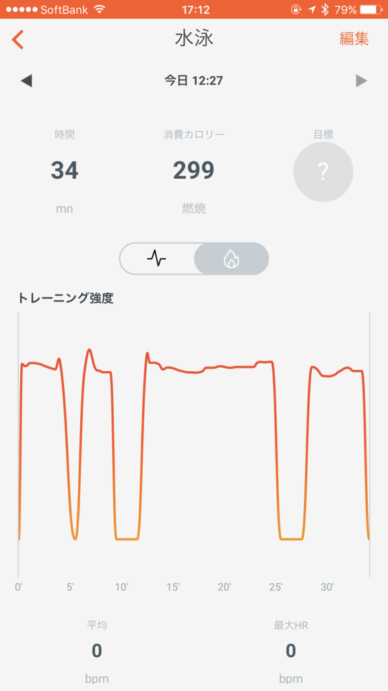

ずっとやるやる詐欺だったジム通い、とうとう始めました。小岩時代以来だなー。

ジムといってもマシンには全く興味なくて、泳げればそれでいい。デブがいきなり走るとヒザを痛めるからね、まずはプールからだよね。あと、運動はあまり好きじゃないけれど、水泳は割と得意でもある。淡々と泳ぐのは暇だけど（マシンなら音楽聞きながらってのも可能なんだろうけど）、ぼんやりモノを考えるいい時間になることにも気づいた。

<blockquote class="twitter-tweet" data-lang="ja">
今日は歩いてきた (@ レフコ松山 in 松山市, 愛媛県) <a href="https://t.co/U3EX5OcGNy">https://t.co/U3EX5OcGNy</a> <a href="https://t.co/6KIn6RdkAt">pic.twitter.com/6KIn6RdkAt</a>
&mdash; だるやなぎ に天使が舞い降りた！ (@daruyanagi) <a href="https://twitter.com/daruyanagi/status/829148515116863488?ref_src=twsrc%5Etfw">2017年2月8日</a></blockquote>

場所は、ココ。徒歩5分以内のところにも別にジムがあるのだけど、そこはシャワーだけで、お風呂がないみたい。どうせなら運動のあとはゆっくりお風呂に浸かりたいので、少し遠いけれど、徒歩15分から20分ほどのところにあるこのジムを契約した。歩くのも運動になるから問題ないね（バイクで行かないとは言っていない）。

ここはプールだけを利用できる会員が設定されていないし、プールとジムの施設は 8:30 まで（お風呂はそのあとも大丈夫）なのでナイト会員も微妙。なので、ちょっと割高感を感じるけど（近くのジムは 5,000 円ぐらいで済む）、月額 9,000 円のコースを選択するしかない。それでもお風呂があるのは魅力だった。うちのお風呂、追い炊きなくて冬は寒いんよねー……。

ちなみに、今はなんかのキャンペーン中っぽくて、月会費が 9,000 円 → 約 2,000 円なんだそうな。自分は知らなくて、契約のときに勝手に割り引いてもらった。その代わり、6カ月間やめられない（辞められるけど、罰金がある）。

<h3>Activité Pop でスイミング時間を測るやで！</h3>

<iframe src="https://hatenablog-parts.com/embed?url=https%3A%2F%2Fblog.daruyanagi.jp%2Fentry%2F2015%2F12%2F20%2F045240" title="ランニング三日坊主を脱するため、ヘルスウォッチ Withings Activite Pop を買った。 - だるろぐ" class="embed-card embed-blogcard" scrolling="no" frameborder="0" style="display: block; width: 100%; height: 190px; max-width: 500px; margin: 10px 0px;"></iframe><cite class="hatena-citation"><a href="https://blog.daruyanagi.jp/entry/2015/12/20/045240">blog.daruyanagi.jp</a></cite>

さて、今回はスマートウォッチ Activité Pop の反省会もするやで。早いもので、使い始めて1年以上経ったんだなー。

こいつの魅力は、睡眠時間・歩数を測れるヘルスウォッチでありながら、ボタン電池一つで稼働するバッテリーのもちの良さにある。某リンゴの時計なんか毎日充電しなきゃいけないらしいけど、それでどうやって睡眠時間を測るんだろうね。充電ケーブルつないだまま寝るのかな。まぁ、ブルジョワは2個買って、代わる代わる使うんだろうが――自分は貧乏なのでそんなことできないし、Activité Pop の電池の持ちの良さは本当にありがたい。

バッテリー持続時間は、公称8カ月。この前、いつの間にか止まっちゃってて2回目の電池交換をしたが、計算上はだいたい6カ月ほど電池が持っていることになる。まぁ、ぴったりカタログスペック通りではないけれど、十分許容範囲だな。電池もコンビニで簡単に手に入る<a href="#f-e0f1bc4a" name="fn-e0f1bc4a" title="ただし、付属の工具がないと交換できないので、結局家で交換作業をすることになるのだが">*1</a>。

<a href="http://www.amazon.co.jp/exec/obidos/ASIN/B010UV1M6O/bestylesnet-22/">Withings スマートウォッチ Activité Pop Shark Grey【日本正規代理店品】</a>
<ul><li>出版社/メーカー: Withings</li><li>発売日: 2015/07/30</li><li>メディア: エレクトロニクス</li><li><a href="http://d.hatena.ne.jp/asin/B010UV1M6O/bestylesnet-22" target="_blank">この商品を含むブログを見る</a></li></ul>

値段もこなれてきたし、割とお勧めできると思う。不満点は、

<ul>
<li>暗いと針が見えない（蛍光塗料とか塗ってくれていればいいんだけど、ダサいからしないのかな？</li>
<li>よく時刻がズレる</li>
</ul>
あたりかな。とくに時刻のズレはちょっと致命的。時計のカタチをしたヘルスセンサーだとはいえ、時計の役割は果たしてほしいかな。気づいたときに針の調整をしている（スマホで針から操作できるの、たのしー！）。あと、

<ul>
<li>日時も見れたらいいなー</li>
</ul>
とは思った（元号がわかるとなおよしｗ）。逆に言えば、不満点・要望点はそれぐらいなので、評価は ★★★★☆ ってところか。辛口な人なら ★★★☆☆ かもしれんね。

 

最近はジムで泳いだのを記録できるのが結構気に入っている。これ、どうやって検知してるんやろうな……謎の技術やと思うわ。

残念なのは脈拍が取れないところ。これは下位版の制限なので仕方がない。というわけで、脈拍もとれる Steel HR が気になっている。

<a href="http://www.amazon.co.jp/exec/obidos/ASIN/B01N9HFSFH/bestylesnet-22/">Withings スマートウォッチ Steel HR 40mm ブラック 【日本正規代理店品】 HWA03-Black40-Asia</a>
<ul><li>出版社/メーカー: Withings</li><li>発売日: 2017/01/20</li><li>メディア: エレクトロニクス</li><li><a href="http://d.hatena.ne.jp/asin/B01N9HFSFH/bestylesnet-22" target="_blank">この商品を含むブログを見る</a></li></ul>

バッテリーが25日間しか持たないのが痛い（十分長持ちだけど！）が、Activité Pop と併用すれば問題になることはなさそう。お値段も2.5万円ほどで、Activité Pop と同じぐらい満足できるならそんなに高くない（と思うｗ）し、財政に余裕があれば今年の誕生日にでも買ってあげようかと思っている。まずはそれまでジムを継続せなな……。

最初にリンゴ時計2台持ちをディスっておきながら、自分もスマートウォッチ2台持ちになりそうだというオチでした。

<a href="#fn-e0f1bc4a" name="f-e0f1bc4a" class="footnote-number">*1</a>:ただし、付属の工具がないと交換できないので、結局家で交換作業をすることになるのだが

